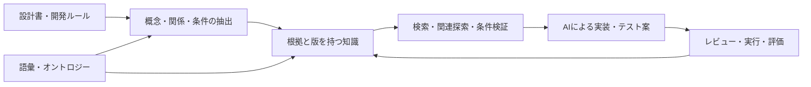

# 全体像と学習計画

## 解きたい問題

単一の画面設計には「承認権限があるとき承認できる」と書かれていても、承認権限を持つテストユーザの作り方、ログイン方法、申請データの準備、画面への到達方法は別の設計にある。これは応用課題の一つである。学習全体では、要件と成果物の追跡、用語と分類の統一、制約検証、実装・テストへの文脈提供まで扱う。

ナレッジグラフは、対象とその関係を意味付きで管理する。オントロジーは、その対象・関係をどの意味で使うかを定義する。本資料では、厳密なOWL実装より前に、共通語彙と関係の定義から始める。

## 題材の選び方

入門には[題材別ミニ例](../examples/learning-examples.md)を用いる。要件→API→テストで関係探索、成果物の分類で意味と推論、必須参照でデータ検証を学ぶ。権限・ログインは、これらに状態と計画を加える応用例として扱う。

## まず分ける五つの仕事

1. **検索**：関連する記述を見つける。
2. **関係探索**：権限からロール、ユーザ、認証方式までたどる。
3. **推論**：明示した規則から導ける事実を求める。
4. **計画**：前提条件を満たす操作順を組み立てる。
5. **検証**：案が仕様やデータ制約を満たすか確かめる。

グラフを作っただけでは、この五つは完成しない。特に「つながっている」ことは「実行できる」ことの証明にならない。

## 段階ごとの到達点

| 段階 | 学ぶこと | 自分で説明・作成できれば完了 |
|---|---|---|
| A 基礎 | グラフ、RDF、オントロジー、開世界 | 未知と禁止の違いを説明できる |
| B モデル | 概念・条件・根拠・版 | 問いに応じた小さな関係図を手で描ける |
| C 構築 | 文書抽出・照合・更新 | 誤抽出を確定知識に混ぜない流れを設計できる |
| D 技術 | DB、検証器、構築ツール、AI連携 | 各ツールの担当と不足部分を説明できる |
| E 応用 | 前提探索・計画・期待結果 | 根拠付きの結合テスト案を作れる |
| F 実証 | ベースライン比較 | 品質向上と運用コストを測定できる |

## グラフが有用になりやすい条件

多段の関係探索を繰り返す、同じ概念が複数文書に現れる、変更影響や根拠を追いたい、といった場合。文書数が少なく安定しているなら、ID付きMarkdownと対応表でも同じ問いに答えられることがある。グラフDBの導入を学習の前提にしない。

## 復習

- 共通語彙、知識の保存、探索、実行計画は別の役割。
- 今回の主な価値仮説は「設計をまたぐテスト前提の欠落を減らす」。
- 導入効果は、文書検索・対応表との比較で判断する。

## 演習

手元の設計を想定し、「操作できる人」「準備すべきデータ」「期待結果」がどの文書にあるか、三つ挙げる。
