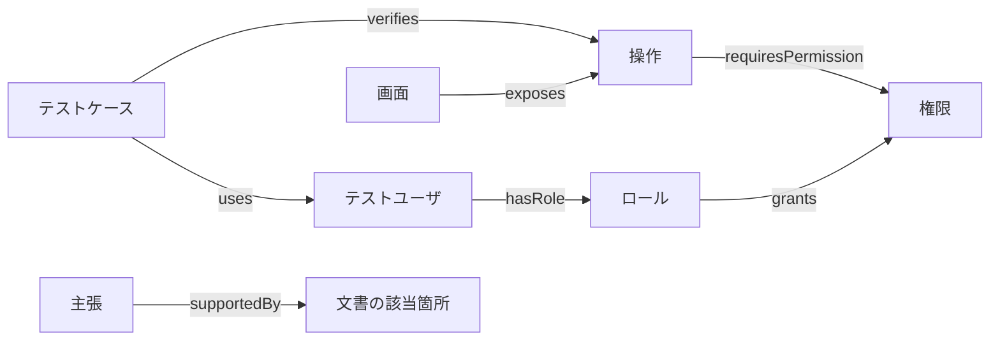

# 設計知識をモデル化する

## 答えたい問いから始める

オントロジーの範囲を決める問いをコンピテンシー・クエスチョンと呼ぶ。本資料では次を出発点にする。

1. この操作には、どの権限とデータ状態が必要か。
2. その権限を持ち、対象環境で利用できるテストユーザは誰か。
3. そのユーザで認証し、対象画面に到達する手順は何か。
4. 成功時と拒否時に何が観測されるべきか。
5. 判断の根拠はどの文書のどの版か。
6. 権限ルールの変更で、どのテストを見直すべきか。

## 小さな語彙から始める

| 型 | 意味 | 架空の例 |
|---|---|---|
| Requirement / Rule | 必要な振る舞い・制約 | 自部署の申請のみ承認可 |
| Screen / Operation / API | UI・操作・サービス契約 | 承認画面、承認操作 |
| Role / Permission | 権限をまとめる役割・許される行為 | 承認者、申請承認 |
| TestUser / Fixture | 環境別のテスト用主体・データ | U-01、申請REQ-01 |
| State / Transition | 状態と変化 | 申請中から承認済みへ |
| TestCase / Assertion | 手順を持つ検証・観測すべき条件 | 成功後に状態を確認 |
| SourceFragment / Claim | 根拠位置・抽出した主張 | 設計AUTH第3節の主張 |

関係も定義する。`requiresPermission`はOperation→Permission、`grants`はRole→Permission、`hasRole`はTestUser→Role、`exposes`はScreen→Operation、`supportedBy`はClaim→SourceFragmentとする。矢印の逆向きや「関連する」だけの万能エッジを増やさない。



## 条件付きの事実は条件を落とさない

「承認者は承認できる」では、別部署の申請まで許可してしまうかもしれない。ユーザ、操作、対象資源、テナント、有効期間、状態などが関わる場合は、関係一本よりも**認可規則ノード**を使う。

```text
認可規則 RULE-01
  主体条件: approval権限を持つ、アカウント有効
  対象条件: 同一部署、申請中
  効果: 承認を許可
  適用版: release-1
  根拠: AUTH-01 §3
```

ロール中心のRBACから、属性条件を含むモデルへ拡張する場面である。複数ルールが競合する場合の優先順位も仕様で確定する。ここで示すのは教育用の設計案であり、実システムの認可実装ではない。

## 主張と根拠を一体にする

関係ごとに、出典、出典の版、抽出方法、確認状態、適用環境を保持する。複数根拠や条件を扱うなら、主張を独立したレコードにすると管理しやすい。由来を標準語彙で扱う場合は、Entity・Activity・Agentを軸とするPROV-Oが参考になる。[W3C PROV-O](https://www.w3.org/TR/prov-o/)

`asserted`（原文に明記）、`derived`（規則で導出）、`proposed`（推測候補）は別の軸として記録する。さらにレビュー状態を `unreviewed / accepted / rejected` で持つ。LLMの確信度が高くても、明記された事実には変わらない。

## 版と環境

開発環境のU-01と検証環境のU-01を同一視しない。設計のrevision、業務上の有効期間、取り込み日時も別の情報である。まずは単一リリースのスナップショットから始め、過去版との混合を防ぐ。

コードが実装していることと、仕様が要求していることも区別する。実装から抽出した挙動だけで期待結果を決めると、実装の誤りを正解としてテストしてしまう。

## 復習

- 問いに必要な概念だけから始める。
- 条件・根拠・環境・版は、業務上の意味の一部。
- 仕様と実装、明記と推測を分ける。

## 演習

「自分が申請した案件は承認不可」を追加したとき、必要な属性・規則・テスト観点を書き出す。
