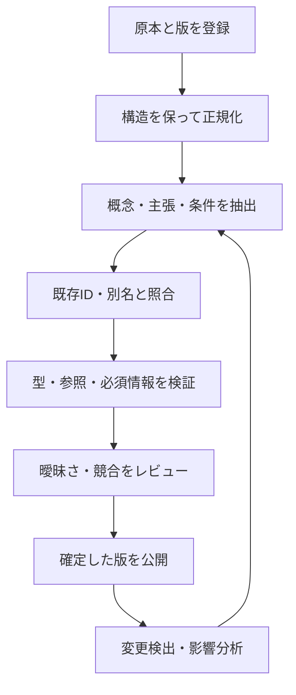

# 文書からの構築と更新

## Markdown化で得られるものと残る問題

Markdownは差分管理、見出し単位の参照、機械処理に適している。ただし、形式変換だけで用語統一や関係の明示が終わるわけではない。Excelの結合セルや脚注、Wordの図、PDFの注釈が条件を表している場合、本文だけの抽出で意味を失う。

| 入力 | 保持する情報 | 注意点 |
|---|---|---|
| Excel | ブック・シート・セル範囲・表見出し | 結合セルと注記の適用範囲 |
| Word / PDF | 節・表・図・ページ・原本 | OCR誤り、図中の条件 |
| Markdown | 文書ID・節ID・コミット | 見出し名だけでは改名に弱い |
| OpenAPI / DDL | 操作ID・スキーマ・制約 | 業務条件のすべては含まれない |
| ソースコード | シンボル・ファイル・コミット | 静的解析では動的呼出しに限界がある |

## 推奨パイプライン

API定義やDDLなどの構造化情報はパーサで取り出し、自然言語からの候補抽出にLLMを使う。出力スキーマを固定し、原文の位置を要求する。もっともらしい関係を補った出力は、候補のままにする。

## IDがないとき

原本にIDがなくても、知識側で文書ID・断片ID・概念IDを発行できる。例えば `DOC-AUTH`、`FRAG-AUTH-003`、`PERM-APPROVE`。元文書の名称と位置を別に保存する。

内容ハッシュは変更検知に使えるが、内容変更で変わるため恒久IDの代用にはしない。概念の改名でもIDは維持する。名称一致だけで統合せず、「申請者」と「ログインユーザ」のような役割の違いも確認する。判断できなければ別ノードのまま同一候補を付ける。

## 更新と削除が難所になる

文書の改訂時は、その断片を根拠とする主張を再評価する。主張に依存した導出結果・テスト案も古くなる。別の有効な根拠が残っていれば、関係そのものを即削除してはならない。

最初は全件再構築で再現性を確保し、必要になってから差分更新へ進む。取り込み元の版、抽出器、モデル、プロンプト、オントロジーの版を記録する。検索インデックスもグラフと同じ版を参照させる。

## 品質のチェックポイント

- 主張から原文へ戻れるか。
- 条件、例外、否定、適用範囲を落としていないか。
- 型と関係の向きは定義どおりか。
- 未定義の参照先、重複概念、競合する主張がないか。
- 撤回された仕様を回答の根拠にしていないか。

チェック結果は抽出の正しさを完全に保証しない。重要な業務規則は、レビュー済みの小さな正解集合と照合する。

## 復習

- Markdownは整理の器であり、意味の統一は別作業。
- IDは安定させ、版と原文位置は別に保持する。
- 構築だけでなく、撤回・再計算・更新を設計する。

## 演習

画面名が変わった場合と権限ルールが変わった場合で、どのIDを維持し、どの主張やテストを再評価するか考える。
