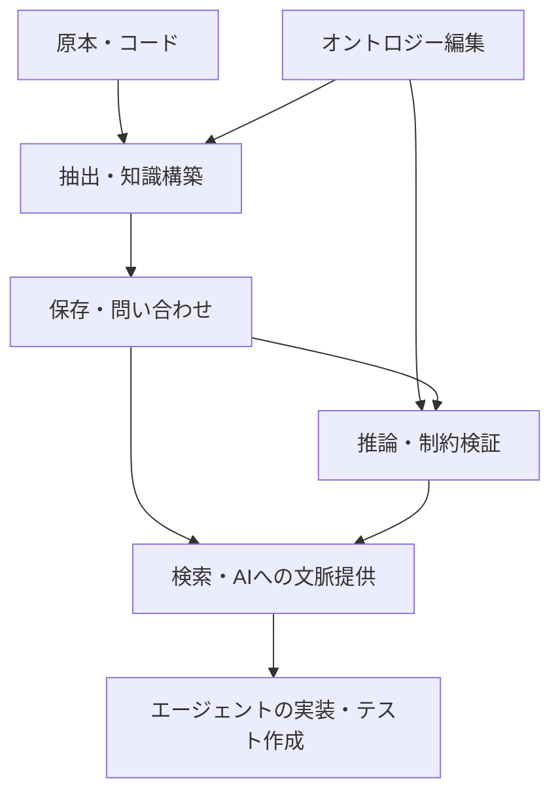

# DB・構築・検証・AI連携ツールの地図

確認日：2026-09-26。製品紹介の事実と、今回の用途への適合性についての考察を分ける。以下は役割の異なる代表的な候補の整理であり、市場シェア順位や網羅的な採用実績の調査ではない。価格、エディション差、ライセンス、最新版の細部は選定時に再確認する。

## 比較する層をそろえる

GraphifyとNeo4jは担当範囲が違う。前者のような構築・利用支援ツールとDBは併用し得るが、接続や形式変換の可否を確認せずに組み合わせられるとは判断しない。

## 保存・問い合わせ

| 候補・一次資料 | モデル・主な接点 | 学ぶ意味と確認事項 |
|---|---|---|
| [Neo4j](https://neo4j.com/docs/getting-started/appendix/graphdb-concepts/) | プロパティグラフ、Cypher | 関係探索と開発資産のモデル化を学ぶ。OWL推論を当然の標準機能とは考えない |
| [Ontotext GraphDB](https://graphdb.ontotext.com/documentation/11.0/) | RDF、SPARQL、推論 | 標準語彙と意味を使う知識管理。推論規則・検証機能の対象版を確認する |
| [Apache Jena / TDB / Fuseki](https://jena.apache.org/) | Java RDF API、永続化、HTTP SPARQL | ライブラリ・ストレージ・サーバの役割を分けて学べる |
| [Eclipse RDF4J](https://rdf4j.org/) | JavaのRDF処理・保存・問い合わせ | 組み込みと外部RDFストア接続の選択肢 |
| [Stardog](https://docs.stardog.com/inference-engine/) | 意味モデルと問い合わせ時推論 | 推論を事前保存せず問い合わせ時に扱う方式の学習にも有用 |
| [Amazon Neptune Database](https://docs.aws.amazon.com/neptune/latest/userguide/intro.html) | PGはGremlin/openCypher、RDFはSPARQL | AWSのマネージド運用。モデル間の自動変換を意味しない。Neptune Analyticsとは区別する |
| [JanusGraph](https://docs.janusgraph.org/) | 分散グラフ、TinkerPop/Gremlin | 分散ストレージを含む構成を検討するときの候補。小さな教材では運用構成が重くなり得る |
| [Memgraph](https://memgraph.com/docs) | プロパティグラフ、Cypher | 別実装での比較候補。同じ言語名でも互換範囲や拡張を確認する |

Ontotextは提供元の名称で、ここで比較するDB製品はGraphDBである。Apache JenaとRDF4Jは、完成品DBだけを指す名称ではない。

## モデル編集・処理・検証

| 候補・一次資料 | 担当 | 今回の用途 |
|---|---|---|
| [Protégé / WebProtégé](https://protege.stanford.edu/) | OWLオントロジー編集、共同編集 | 概念・公理を整理する。業務設計書の自動抽出器ではない |
| [RDFLib](https://rdflib.readthedocs.io/en/stable/) | PythonでのRDF入出力・SPARQL | DB導入前の小さな教材や変換処理 |
| [pySHACL](https://github.com/RDFLib/pySHACL) | RDFへのSHACL検証 | 根拠・型・必須関係の欠落検出 |
| [Apache TinkerPop](https://tinkerpop.apache.org/) | グラフ処理フレームワーク、Gremlin | 複数の対応DBにまたがる探索の考え方 |
| [NetworkX](https://networkx.org/documentation/stable/) | Pythonのグラフ構造・アルゴリズム | 小規模な関係探索や分析。永続DBや意味論の代替とは別 |

OWL推論器は、使用するOWLプロファイルと必要な公理に対応するものを編集環境・DBに合わせて選ぶ。SHACL検証との機能混同に注意する。

## 知識構築・AI利用

| 候補・一次資料 | 公式資料で確認できた担当 | 今回の課題に対する検討点 |
|---|---|---|
| [Neo4j LLM Graph Builder](https://github.com/neo4j-labs/llm-graph-builder) | 非構造化データからのグラフ構築 | 指定語彙、原文根拠、条件・例外を保てるか |
| [Neo4j GraphRAG for Python](https://neo4j.com/docs/neo4j-graphrag-python/current/) | Neo4jを使う検索・生成のPythonライブラリ | DBとアプリをつなぐ層として比較 |
| [Microsoft GraphRAG](https://microsoft.github.io/graphrag/) | グラフ構築・要約などを使う検索拡張 | 文書群の概観と、厳密なテスト前提検索の評価を分ける |
| [LlamaIndex Property Graph Index](https://developers.llamaindex.ai/python/framework/module_guides/indexing/lpg_index_guide/) | 抽出器、グラフストア、検索の組合せ | 抽出と検索を構成するフレームワークとして比較 |
| [Graphiti](https://github.com/getzep/graphiti) | AIエージェント向けの時間を扱う知識グラフ | 変化する事実・記憶の管理。承認済み設計の正本管理との違いを検討 |
| [Graphify](https://graphify.net/) | コード・文書等からの知識構築とAIコーディング支援を掲げる | コード構造と設計意味の対応を調べる候補 |

これらが出力する関係は、業務上の正しさが検証済みとは限らない。オントロジー準拠、主張単位の根拠、版管理、未知の報告は個別に評価する。

## Graphifyについて確認できたこと

指定サイトは、静的解析とLLMによる抽出を組み合わせる構成、グラフやレポートの出力、AIアシスタントからの利用を紹介している。一方、同ページにはPython 3.10+という記述とPython 3.12の導入例、graphify系コマンドとprivate-context-mcpというパッケージ名が併記されていた。[指定サイト](https://graphify.net/)

現時点ではサイトの説明を確認した段階であり、対応する配布物・リリースとの整合や実装は検証していない。コマンドの転記による導入は保留し、次段階でサイトと公式リポジトリ・パッケージ・タグの対応を確定する。削減率や安全性に関する宣伝値は比較指標として採用しない。

## 選定を進めるときの問い

1. 探索が中心か、標準語彙・形式的推論が中心か。
2. 根拠と履歴をどの粒度で保持できるか。
3. 自社の語彙と制約を適用できるか。
4. 再構築・撤回・差分更新を再現できるか。
5. エージェントへ必要な部分だけ返せるか。
6. 手元の環境・運用能力・費用に合うか。

学習ではまず小さなデータをPGとRDFの両方で表現し、その違いを確かめる。製品選定はその後でよい。これは学習順序の提案であって、特定製品の採用推奨ではない。

## 復習・演習

DB、オントロジーエディタ、検証器、GraphRAG、エージェント向け記憶は役割が異なる。表から三つ選び、「組み合わせると何ができ、何がまだ不足するか」を説明する。
