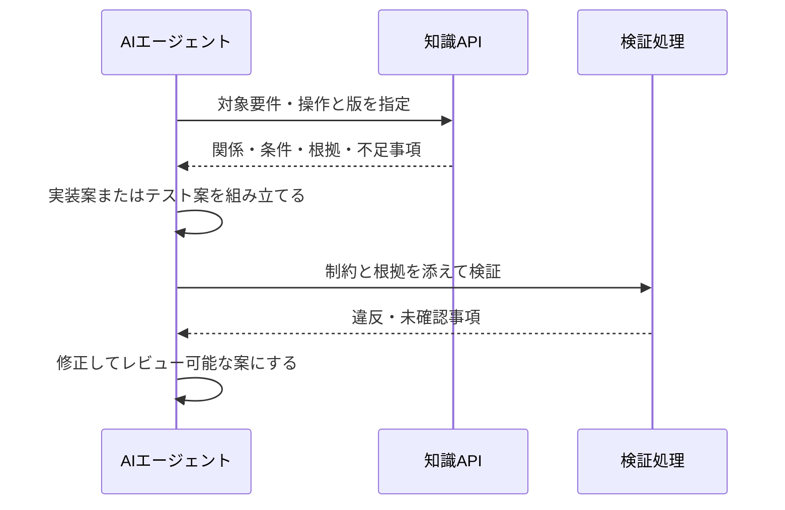

# AIエージェントから利用する

## 検索方式を問いに合わせる

| 方式 | 向いている問い | 不足しやすいもの |
|---|---|---|
| 全文・キーワード検索 | IDやAPI名の記述はどこか | 表記ゆれ、多段の関連 |
| ベクトル検索 | この要望に近い説明は何か | 正確な条件結合、否定・例外 |
| グラフ問い合わせ | この要件に対応するAPIとテストは何か | グラフ化されていない情報 |
| ハイブリッド | 文書を見つけ、概念を起点に関連を集めたい | 同期、ID対応、ランキングの設計 |

本資料ではGraphRAGを「グラフを使って生成に必要な情報を取得する方式」の広い意味で使う。Microsoft GraphRAGという固有の実装名とは区別する。[Microsoft公式ドキュメント](https://microsoft.github.io/graphrag/)

## エージェントに渡すもの

全文を一括投入する代わりに、目的に関係するノード・主張・原文・制約・未解決事項をまとめる。ただし情報量を減らすときに例外条件を落とさないことが重要である。

以下は本資料で提案するAPIであり、既製品にそのまま存在するAPIではない。

```text
find_related_artifacts(requirement_id, revision)
get_operation_preconditions(operation_id, environment, revision)
get_evidence(claim_ids)
find_test_fixture_candidates(constraints, environment)
get_change_impact(changed_ids, from_revision, to_revision)
```

応答には対象ID、適用版、根拠、確認状態、未知の項目を含める。結果が空のときは「存在しない」か「登録不足」かを区別できる情報を返す。

MCPはツールやリソースをAIアプリに公開する接続方式の一つである。接続しただけで意味モデルや回答品質が保証されるわけではない。[MCPアーキテクチャ](https://modelcontextprotocol.io/docs/learn/architecture)

## 生成までの流れ



自由なText-to-Cypher / Text-to-SPARQLは柔軟だが、対象範囲や版の指定を誤る可能性がある。初期の実証では、引数を検証する読み取り専用の定型APIを使うと、どの問いに答えたかを評価しやすい。アクセス権のある原文だけを返す設計も知識APIの責務に含める。

## ソースコード生成への適用

要件からAPI契約、データ制約、開発ルール、既存実装の関連部分を取得する。例えば「新APIを実装する」際に、認可ルール、エラー応答規約、トランザクション境界、関連テストをまとめて渡す。

生成コードは型検査・ビルド・静的解析・テストで確認する。知識グラフは必要情報の収集と追跡を助けるが、コードの正しさを証明するものではない。生成物から根拠の要件へ逆参照を残すと、変更時に再確認しやすくなる。

## テスト生成への適用

目標操作から必要条件を後ろ向きに集め、条件を満たすユーザ・データと、その状態に到達する操作を選ぶ。その後で期待結果を仕様から取得する。手順が実行できても、期待結果が不明なら完成したテストとは扱わない。

## 復習・演習

「知識を検索する」「手順を計画する」「コードを生成する」「正しさを検証する」の入出力をそれぞれ書く。同じLLMが担当しても責務を分けて評価する。
