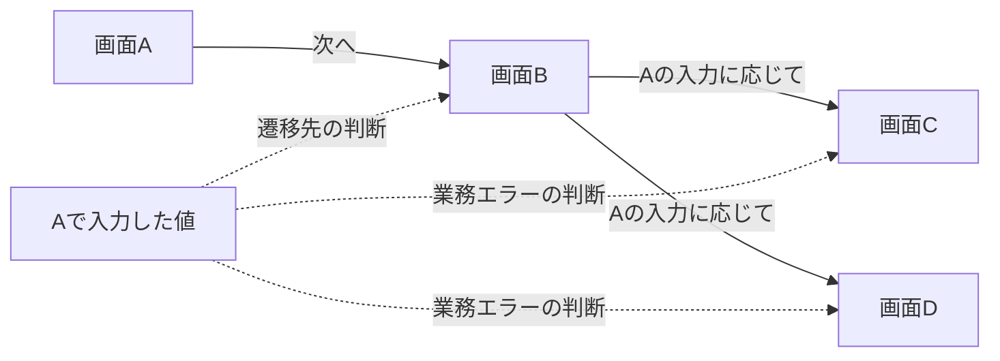

# 序章：この資料の目的と読み方

更新日：2026-10-01。構成は[合意済み目次](../../OUTLINE.md)に従う。本文の確認状況は[README](../../README.md)に記録する。

## この章の到達点

この資料で学ぶことと応用課題を知り、「知識の関係を整理すること」と「条件を判断して操作すること」を分けて考えられるようになる。専門用語はここで必要な範囲を説明し、詳細は本編で学ぶ。

## 学習の目的

この資料では、知識をどのように表現し、関係を調べ、意味や制約を確かめるかを学ぶ。その後、設計書・開発ルールを、AIエージェントによる実装やテスト作成に利用する方法を考える。ここでいうAIエージェントは、与えられた目的に合わせて情報を取得し、ツールを使って作業を進める仕組みである。

中心となる二つの言葉を、まず大まかに押さえる。**ナレッジグラフ**は、対象とその関係を意味付きで結んだ知識の表現である。**オントロジー**は、そこで使う概念や関係の意味を明示した定義である。本資料では、まず共通の言葉と関係の定義から考え、必要に応じて機械で推論できる厳密な表現を学ぶ。

例えば「要件R-01をテストT-01が検証する」という記録がある。「要件」「テスト」「検証する」の意味をそろえることと、特定の要件とテストを結ぶことは、異なる役割を持つ。定義と記録を合わせると、要件を変更したときの見直し候補をたどれる。ただし、記録が漏れていれば候補も漏れる。関係があることだけで、テストが十分かどうかまでは判断できない。

## AIを活用した開発での問題意識

実装やテストに必要な知識は、Excelの一覧、Wordの設計書、Markdownで書いたルール、外部から呼び出す機能の仕様書、データベースの構造定義、コードなどに分散している。Markdownは、この資料にも使っている、見出しや表をテキストで記述する形式である。

同じ名前が別の意味で使われる場合も、同じ対象が別名で現れる場合もある。文書間で共通の識別子（ID）がなければ、「この設計の項目は、別の設計のどの項目に対応するか」を判断する必要がある。関連文書が見つかるだけでなく、どの記述をどの条件で組み合わせるかが課題になる。

## 応用題材：前の画面の入力が、経路と結果に影響する

応用編では、ログイン画面と画面A・B・C・Dを持つ、架空の業務フローを扱う。

- ログインするユーザによって、保有する権限が異なる。権限XとYが存在し、画面A〜Dはいずれも権限Yが必要である。
- 画面Aの次は画面B。画面Bからは、Aで入力した値に応じてCまたはDへ進む。
- CまたはDでは、Aで入力した値によって業務上のエラーが起こることもある。これは、例えば業務規則に反する値を受け付けられない場合を指す。具体的な規則は今後定める。

実線は画面の遷移、点線は入力値の参照を表す。権限YはA〜Dすべてに必要だが、図では省略している。ログイン成功後にAへ到達する経路は未定なので、この図には含めていない。C/Dそれぞれの具体的なエラー条件も未定である。

この題材では、次の三つを結び付けて考える。

| 判断 | 集める情報 | 区別すること |
|---|---|---|
| 画面にアクセスする条件 | ユーザの保有権限、画面の必要権限 | Yは必要な条件。Yがあれば他の条件なしに入れる、とは決めない |
| 次の画面を選ぶ条件 | Aの入力項目と値、Bの分岐規則 | C/Dへの経路と、到達先での処理結果は別 |
| 到達先での業務判断 | Aの入力項目と値、C/Dの業務規則 | 正しい経路で到達しても、業務エラーになり得る |

例えば「Cで業務エラーになるテストを作る」には、必要権限を持つユーザを選び、Cへ進む条件とCでエラーになる条件を同時に満たす入力を用意する必要がある。これらが別々の設計書にあれば、Cの画面設計だけでは準備条件がそろわない。

ただし、条件の組み合わせがすべて実現可能とは限らない。具体的な分岐・エラー規則が未定の間は、入力値や期待するメッセージを確定できない。権限Xの用途、入力値を引き継ぐ仕組み、エラー時のデータ更新なども、推測で補わず確認事項にする。設定と未定義事項は[応用題材の整理案](../../examples/conditional-screen-flow.md)にまとめている。

## 関係の整理と、判断・実行を分ける

ナレッジグラフで、画面・入力項目・権限・規則・出典の対応を整理することは考えられる。一方、「AからB、BからCへつながる」と記録するだけでは、Cへ進む入力値も業務エラーの条件も分からない。

関係をたどって必要な情報を集め、その条件を評価し、操作の順番を組み立て、実行した結果を仕様と照合する。それぞれの仕事に何が必要かを学ぶ。グラフの採用は前提にせず、文書検索や対応表でも同じ問いに答えられるか比較する。

## 学習の流れと表現方式

第Ⅰ部は、一般的な知識表現・整理・意味の基礎から始める。第Ⅱ部では、答えたい問いに合わせて知識を設計し、構築・更新する方法を学ぶ。第Ⅲ部は表現技術とツール、第Ⅳ部は開発への応用、第Ⅴ部は比較評価と小さな実証を扱う。

基礎編では図書室や成果物の分類など、小さな題材を使う。画面・権限・業務エラーを一度に扱う応用題材は、必要な概念を学んだ後で組み立てる。

途中で学ぶ表現方式に、**プロパティグラフ（Property Graph、PG）**と**RDF（Resource Description Framework）**がある。グラフは、対象を表す点と関係を表す線で構成される。

| 用語 | 最初に押さえる意味 | 「田中さんは開発部に所属する。年齢は30歳」の表し方 |
|---|---|---|
| PG | 点や線に、名前や年齢などの属性を付けるグラフの表現 | 田中さんの点に年齢30を付け、所属の線で開発部の点につなぐ |
| RDF | 「主語・述語・目的語」の組で知識を表す。この組をトリプルと呼ぶ | 「田中さん・所属する・開発部」と「田中さん・年齢は・30」を記録する |

これは概念的な表記であり、実行用の構文ではない。技術的な構造は[Neo4jのPG概説](https://neo4j.com/docs/getting-started/appendix/graphdb-concepts/)と[W3CのRDF入門](https://www.w3.org/TR/rdf11-primer/)を参照できる。具体的な比較は第3章で学ぶ。今は同じ知識でも組み立て方が異なると押さえ、表現方式を選ぶ前に、何を表し何を知りたいかを考える。

## 読み方と到達点

| 目的 | 読む順序 | 到達点 |
|---|---|---|
| 基礎から体系的に学ぶ | 序章 → 1〜5章 → 6〜8章 → 9〜17章 | 用語、方法、技術、応用の役割を区別できる |
| 既にデータベース（DB）や検索を知っている | 序章 → 1〜5章の復習 → 6〜12章 | 保存するデータの構造と知識の意味を分けて設計できる |
| 開発課題との関係を先に見る | 序章 → 応用題材の整理案 → 第1章から本編 | 問いと不足情報を把握し、基礎へ戻れる |

新本文は順次執筆している。現在の一覧は[README](../../README.md)、未執筆の章と執筆順は[編集計画](../EDITORIAL_PLAN.md)で確認できる。

## 説明の読み分け

本資料の小例は、特記がなければ架空の教材である。技術仕様に関する説明には一次資料を付ける。一次資料とは、標準の策定元や製品の提供元が公開する仕様・公式文書などである。

「前提やエラー条件の欠落を減らせる」といった導入効果は、検証すべき仮説として扱う。明示した定義や規則に従って結果を導けても、元の知識が現実や業務に合っているかは別に確認する。学習資料の理解、文書レビュー、製品での実証は、異なる確認である。

## 復習

- 画面へのアクセス、経路の分岐、到達先の業務判断は、どの情報に依存するか。
- 関係がたどれるだけでは、なぜ実行可能なテストにならないか。
- 未定義の仕様と、検証すべき効果の仮説はどう違うか。

## 演習と解答例

「画面Cで業務エラーが発生するテストを作りたい」とする。必要な情報を三つ以上挙げ、今の設定だけで確定できない期待結果を一つ挙げる。

解答例：必要な情報は、テストユーザの保有権限、Cへ進むAの入力条件、Cでエラーになる業務条件、ログイン後の操作経路。Cへの分岐条件とエラー条件を同時に満たす入力を作れるかも確認する。具体的なエラーメッセージやデータ更新の有無は未定なので、期待結果として決めつけない。

次：[第1章 知識を表現するとは](01-knowledge-representation.md)
