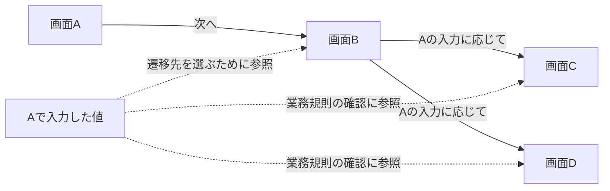
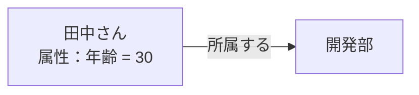
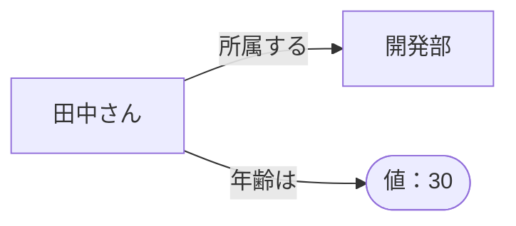

# 序章：この資料の目的と読み方

更新日：2026-10-05。構成は[合意済み目次](../../OUTLINE.md)に従う。執筆とレビューの状況は[README](../../README.md)で確認できる。

## この章の到達点

この資料で何を学び、どのような開発課題に応用するかを知る。ナレッジグラフとオントロジーの役割を具体例でつかみ、学習の順序を確認する。

## 学習の目的

設計書に書かれた知識を、実装やテストに使いやすい形で整理したい。そのためには、用語の説明をそろえ、設計書どうしの対応を明らかにする必要がある。この資料では知識の表し方と整理の方法を学び、AIエージェントによる開発への応用を考える。AIエージェントとは、与えられた目的に合わせて情報を取得し、ツールを使って作業を進める仕組みである。

まず、本資料で中心となる二つの言葉を紹介する。

- **ナレッジグラフ**は、対象どうしを「所属する」「検証する」などの関係で結んだ知識の表現である。
- **オントロジー**は、扱う概念と関係が何を意味するかを明示した定義である。例えば「テストには何を含めるか」「検証するとはどのような関係か」を定める。

要件とテストの対応を整理する例で考えよう。次の要件とテストがあるとする。

| 種類 | ID | 内容 |
|---|---|---|
| 要件 | R-01 | 権限Yを持たないユーザは画面Aを開けない |
| テスト | T-01 | 権限Yを持たないユーザで画面Aを開こうとし、アクセスが拒否されることを確認する |

この資料でいう「要件」はシステムが満たすべき条件、「テスト」はその条件を確かめるための手順と期待結果を指す。「テストが要件を検証する」は、その要件を確認するためにテストを用意したという対応を表す。これが概念と関係の意味を定める作業である。

次に、個別の要件R-01とテストT-01を「検証する」という関係で結ぶ。ナレッジグラフでは、このような具体的な対応を表せる。R-01を変更するときには、その関係をたどってT-01を見直し候補として取り出せる。

用語や関係の定義だけでは、R-01に対応するテストは分からない。R-01とT-01の対応も必要になる。また、この対応はテストが成功したことや、必要なテストをすべて用意したことまでは示さない。テストの実行結果と網羅性は別に確かめる。

## AIを活用した開発での問題意識

開発者が実装やテストを準備するとき、必要な仕様が一つの文書にまとまっているとは限らない。仕様はExcelの一覧、Wordの設計書、コード、データベースの構造定義などに分散している。Markdownで書かれた開発ルールもある。Markdownは、見出しや表をテキストで記述する形式であり、この資料にも使っている。

文書をまたいで仕様を読むときには、名前だけで対応を判断できない場合がある。次の表は架空の例である。

| 二つの文書の記述 | 名前だけで判断できない理由 | 開発者が確認すること |
|---|---|---|
| 画面設計の「ユーザ」と権限設計の「利用者」 | 別の名前が同じ人を指している可能性がある | どちらもログインする人を指すか |
| ログイン仕様の「状態」と申請仕様の「状態」 | 同じ名前でも意味が違う | ログインの成否か、申請の進行状況か |
| 画面Aの「申請額」と画面Cの「金額」 | 項目名が違い、対応するIDもない | Cの業務判断にAの入力値を使うか |

開発者やAIエージェントは、関連しそうな文書を検索するだけではテストを作れない。どの項目が同じ対象を指すかを確認し、必要な仕様を組み合わせてテストの入力と期待結果を決める必要がある。本資料では、この対応付けをどう支援できるかを考える。

## 応用題材：前の画面の入力が、経路と結果に影響する

応用編では、ログイン画面と画面A・B・C・Dがある架空の業務フローを扱う。設定は次のとおりである。

- ユーザが持つ権限は人によって異なる。権限にはXとYがあり、画面A〜Dにはいずれも権限Yが必要である。
- ユーザは画面Aで値を入力し、画面Bへ進む。Bからの遷移先はAの入力値によってCまたはDに分かれる。
- 画面CまたはDでは、Aの入力値が業務規則に反するとエラーになる場合がある。

実線は画面の遷移、点線は各画面の判断がAの入力値に依存することを表す。図は教材用に依存関係をまとめたものである。C/Dの設計では、処理に渡されたデータに対する業務条件を記述できる。そのデータがAのどの入力から来るかは、受け渡しの設計などをたどって確認する。権限Yの確認は図から省いている。ログイン成功後にAへ進む経路と、C/Dでエラーになる具体的な条件はまだ決めていない。

「画面Cで業務エラーが起こるテスト」を作るなら、テスト作成者は次の情報を集める。

| 確かめること | 必要な情報 |
|---|---|
| テストユーザが画面を開くための条件を満たすか | ユーザが持つ権限、各画面に必要な権限、ほかにアクセス条件があるか |
| 画面BからCへ進むには何を入力するか | Aの入力項目、BがC/Dを選ぶ条件 |
| 画面Cで業務エラーを起こすには何を入力するか | Cが参照するAの入力項目、Cの業務規則 |

テスト作成者は、Cへ進む条件とCでエラーになる条件の両方を満たす入力を用意する。正しい経路でCに到達しても、入力値によっては業務エラーになる。このため、画面の遷移先と到達先の処理結果を分けて考える。

現時点では具体的な条件が未定なので、両方を満たす入力が存在するかも確認できない。権限Xの用途、画面間で値を引き継ぐ方法、エラー時の表示やデータ更新も未定である。確定した設定と確認事項は[応用題材の整理案](../../examples/conditional-screen-flow.md)にまとめている。

## 関係を調べた後に必要なこと

ナレッジグラフには、画面・入力項目・権限・業務規則と、その仕様が書かれた文書の対応を表せる。例えば「Cの業務規則がAの入力項目を参照する」という関係をたどれば、Cのテストに必要なAの設計を探せる。

ただし、対応が分かっただけではテストは完成しない。テスト作成者は仕様を読んで入力の条件を確認し、操作の順番と期待結果を決める。実行した後には、実際の結果を期待結果と照合する。AIエージェントに任せる場合も、それぞれの作業を行う仕組みが必要になる。

この資料では、文書検索や対応表を使う方法とも比較する。ナレッジグラフの採用を先に決めず、どの方法で必要な情報を集められるかを確かめる。

## 学習の流れと表現方式

本編は次の順に学ぶ。

1. 第Ⅰ部：知識の表し方、整理方法、意味や規則の基礎を学ぶ。
2. 第Ⅱ部：知りたいことに合わせて知識を設計し、構築・更新する方法を学ぶ。
3. 第Ⅲ部：表現技術とツールの役割を比べる。
4. 第Ⅳ部：実装やテスト作成への応用を考える。
5. 第Ⅴ部：方法を比較評価し、小さな実証へ進む。

基礎編では図書室や成果物の分類などの小さな例を使う。画面・権限・業務エラーを組み合わせる応用題材は、基礎を学んだ後で扱う。

知識をグラフで表す代表的な方式に、**プロパティグラフ**（Property Graph、PG）と**RDF**（Resource Description Framework）がある。グラフとは、対象を点で表し、対象どうしの関係を線で表したものである。二つの方式を「田中さんは開発部に所属する。年齢は30歳」という同じ架空の例で比べよう。

### プロパティグラフ（PG）

PGでは点や線に属性を付けられる。この例では田中さんを表す点に年齢を付け、所属先を線で結ぶ。

### RDF

RDFでは「主語・述語・目的語」の三つの組で知識を表す。この組をトリプルと呼ぶ。所属と年齢を次の二組で表せる。

| 主語：何について | 述語：どのような関係か | 目的語：何と結ぶか、どの値か |
|---|---|---|
| 田中さん | 所属する | 開発部 |
| 田中さん | 年齢は | 30 |

PGの図では年齢を点の中に書き、RDFの図では年齢も主語から値への矢印で表した。RDFの目的語には、開発部のような対象だけでなく数値も使える。

これらは表し方を比べるための図であり、実行用の構文ではない。詳細な比較は第3章、技術的な構文は第9章で学ぶ。出典は[Neo4jのPG概説](https://neo4j.com/docs/getting-started/appendix/graphdb-concepts/)と[W3CのRDF入門](https://www.w3.org/TR/rdf11-primer/)を参照できる。

## 読み方

| 読む目的 | 読む順序 |
|---|---|
| 基礎から学びたい | 序章 → 1〜5章 → 6〜8章 → 9〜17章 |
| データベースや検索の知識を生かしたい | 序章 → 1〜5章で知識表現の基礎を確認 → 6〜12章 |
| 開発課題との関係を先に知りたい | 序章 → 応用題材の整理案 → 第1章から本編 |

本文は順次執筆している。現在読める章は[README](../../README.md)、未執筆の章と執筆順は[編集計画](../EDITORIAL_PLAN.md)で確認できる。

## 説明の読み分け

本資料の例は、特記がなければ架空の教材である。技術仕様の説明には、標準の策定元や製品の提供元が公開する一次資料を付ける。

「仕様の見落としを減らせる」といった導入効果は、これから検証する仮説として扱う。例を説明できることと、実際の開発で効果が出ることは別である。また、規則どおりに判断できても、元の仕様やデータが正しいかは確認が必要になる。文書レビューの結果と製品での実証結果も分けて記載する。

## 復習

- 用語や関係の意味を定めることと、R-01とT-01の対応を表すことはどう違うか。
- 画面Cで業務エラーを起こすテストには、なぜAとBの設計も必要か。
- PGとRDFの例では、田中さんの年齢をそれぞれどこに表したか。

## 演習と解答例

画面Cで業務エラーが発生するテストを準備している。テスト担当者は、ログインするユーザと画面Aに入力する値を選ぶ必要がある。

テストを準備するために、どのような情報を調べればよいだろうか。必要な情報を三つ以上挙げよう。また、本文にある設定だけでは確定できない期待結果を一つ挙げ、何を確認すれば決められるか説明しよう。

### 解答例

まず、画面Cへ進む操作経路と、各画面に必要な権限を確認する。次に、権限を持つテストユーザを選び、BからCへ進む分岐条件とCでエラーになる業務条件を調べる。

テスト担当者は、データの受け渡しも確認する。Cが条件の確認に使う値とAの入力項目との対応をたどり、Cへ進む条件とエラーになる条件を同時に満たす入力を用意する。

具体的なエラーメッセージは本文の設定では決まっていない。Cのエラー仕様で表示内容を確認してから期待結果に記述する。

次：[第1章 知識を表現するとは](01-knowledge-representation.md)
