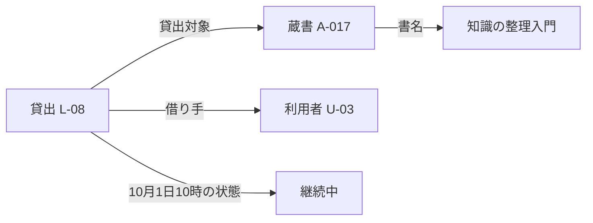

# 第1章：知識を表現するとは

更新日：2026-10-01。本文の確認状況は[README](../../README.md)に記録する。

## この章の到達点

対象、概念、名前、識別子を区別し、短い文章から属性・関係・事実・規則を取り出せるようになる。また、規則の条件、判断する時点、結果を落とさずに整理できるようになる。図書室を架空の題材とし、データベースへの保存方法や推論言語の詳細にはまだ踏み込まない。

## データ・情報・知識と文脈

本資料では、記録された値をデータ、値を文脈に沿って解釈した内容を情報、判断や説明に使えるよう整理された内容を知識と呼ぶ。この区分は学習用の整理であり、すべての分野に共通する唯一の定義ではない。

「42」というデータだけでは、冊数なのか温度なのか分からない。「図書室Aの貸出中の蔵書が、10月1日の集計時点で42冊」とすれば、対象・単位・時点が分かる。さらに「貸出中の蔵書は、返却確認が済むまで再貸出できない」という規則があれば、貸出可否を考える材料になる。ただし、集計値から個々の蔵書の状態は分からない。

知識を表現するとは、何について、何を、どの条件で述べているかを、再利用できる形で明示することである。

## 対象・概念・名前・識別子

架空の図書室に、同じ書名の本が2冊あるとする。この章では、貸出対象となる物理的な一冊を「蔵書」と呼ぶ。

| 区別 | 例 | 注意点 |
|---|---|---|
| 現実の対象 | 棚にある特定の一冊 | 同じ書名でも別の対象がある |
| 概念 | 貸出用資料、印刷資料 | 何を含むか定義する |
| 名前 | 「知識の整理入門」 | 名前だけでは一冊を特定できない |
| 識別子（ID） | 図書室Aの蔵書ID A-017 | 発行範囲も含めて識別する |

「本」という語も、作品、出版された版、手元の一冊のどれを指すかで意味が変わる。また、図書室Bの台帳にもA-017があれば、同じ文字列でも別の蔵書かもしれない。名称やIDの一致だけで記録を統合せず、発行元と対象を確認する。

名前を変えても同じ対象を指す場合がある。一方、同じ名前のまま別の対象へ差し替わる場合もある。表示に使う名前と、対象を識別するIDを分けるのは、このような混同を減らすためである。

## 属性・関係・事実・規則

次の文章を整理する。

> 図書室Aの蔵書A-017の書名は「知識の整理入門」である。貸出L-08の対象はA-017で、借り手は利用者U-03である。10月1日10時現在、L-08は継続中である。この図書室では、継続中の貸出の対象は再貸出できない。

| 要素 | 教材内での表現 | 意味 |
|---|---|---|
| 属性 | A-017の書名は「知識の整理入門」 | 対象に値を対応付ける |
| 関係 | L-08の貸出対象はA-017 | 対象同士を結び付ける |
| 関係 | L-08の借り手はU-03 | 貸出と利用者を結ぶ |
| 個別の事実の記録 | L-08は10月1日10時現在継続中 | 特定の対象について主張する |
| 規則 | 継続中の貸出対象は再貸出不可 | 条件に応じた判断を定める |

属性や関係を記述すると、個別の事実を表せる。この表の区分は互いに排他的ではない。「L-08の借り手はU-03」は、関係によって表した個別の事実でもある。

属性と関係の使い分けは、答えたい問いによる。図書室の名称だけを保存したいなら文字列の属性でよい。図書室の所在地や担当者もたどりたいなら、図書室を独立した対象として扱い、蔵書と結ぶ方法が考えられる。

貸出を独立した対象にしたのは、借り手、開始日、返却日などを一つの出来事にまとめるためである。「蔵書 → 利用者」だけでは、過去と現在の貸出を区別しにくい。

これは概念的な整理である。値も四角で描いているが、すべてをデータベースの対象として保存する指定ではない。矢印には「何の関係か」を付け、単に「関連する」とだけ書かない。

## 条件・時点・結果を分ける

もう一つ、教材用の規則を加える。

> この図書室では、利用者ごとの同時貸出上限は3冊である。貸出確定の直前に、現在の貸出冊数と今回借りる冊数を合計する。3冊を超える場合は今回の貸出を受け付けない。

| 整理するもの | この規則での内容 |
|---|---|
| 対象 | 今回の貸出申込みと、その申込者 |
| 判断に使う値 | 申込者の現在の貸出冊数、今回借りる冊数 |
| 判断時点 | 貸出を確定する直前 |
| 条件 | 二つの冊数の合計が3冊を超える |
| 結果 | 今回の貸出を受け付けない |

利用者U-03が現在2冊を借りていて、今回2冊を申し込むなら、合計4冊でこの規則に該当する。これは条件を満たす記録と規則から得た判断であり、受付が実際に動作したことの観測ではない。

ここで区別したいのは、申込みを入力できることと、その申込みが業務規則を満たすことである。冊数として有効な「2」という値でも、他の情報と組み合わせると貸出を受け付けられない場合がある。形式が正しい値と、業務上認められる値は別に確認する。

逆に合計が3冊以下でも、この規則だけから必ず貸出可能とは言えない。対象の蔵書が貸出中か、館内閲覧専用かなど、ほかの規則が関係する可能性がある。「ある拒否条件に当てはまらない」ことと「許可条件をすべて満たす」ことを分ける。

## 文脈と根拠を残す

「現在2冊」という値には時点が必要である。申込みを入力した後、確定する前に別の貸出が成立したなら、判断に使う値も変わり得る。入力時の値と判定時の値を、同じものとして扱ってよいか確認する。

また、誰の値かも必要である。同じ端末を別の利用者が使う場合、前の利用者の冊数を次の利用者の判断に混ぜてはいけない。対象・時点・適用する規則をそろえて初めて、判断を再現する材料になる。

さらに、個別の状態を台帳から得たのか、貸出上限を利用規約から得たのかを記録する。根拠を分けると、状態の更新と規則の改訂で、何を見直すべきか考えやすくなる。出典・版の管理は第8章で詳しく扱う。

## 明示化の限界と応用へのつながり

記録は現実についての主張である。返却済みなのに台帳が更新されていなければ、規則を正しく適用しても判断を誤る。また、貸出中という記載がないだけでは、返却済み、未入力、取得漏れのどれかは決まらない。不明な条件は、不明なまま残す。詳しい扱いは第5章で学ぶ。

序章の画面フローでも同じ区別が必要になる。Aで入力した値、Bが使う分岐規則、C/Dが使う業務規則は、別の情報である。どのユーザの一連の操作で得た値か、どの時点の値を参照するかを対応付ける。ただし、これらの具体的な保持・判定方法はまだ未定義なので、本章の図書室の規則をそのまま当てはめない。

知識の表現には範囲を選ぶ必要がある。貸出可否を調べたいなら蔵書・利用者・貸出・必要な規則を整理する。すべての印刷所や設備の情報まで含める必要はない。必要な情報と省いた情報を説明できることも設計の一部である。

## 復習

- 同じ名前の対象をまとめると、どのような誤りが起こるか。
- 属性・関係と、事実・規則の区分は、なぜ排他的ではないか。
- 「入力として有効」「ある拒否条件に該当しない」「業務上実行できる」はどう違うか。
- 判断する時点と対象者が違う値を混ぜると、何が起こるか。

## 演習と解答例

### 演習1：同名の対象

図書室AのA-021とA-022は、どちらも書名が『分類の基礎』である。A-021はU-07に貸出中、A-022は棚にある。

対象、名前、IDを分け、「『分類の基礎』は貸出中」とだけ保存した場合の問題を説明する。

解答例：対象は二冊と利用者。書名は表示名、蔵書IDは図書室AのA-021とA-022である。書名だけでは二冊の状態を混同する。棚にあることだけで貸出可否を確定せず、時点と関係する規則も確認する。

### 演習2：条件付きの判断

本文の同時貸出上限3冊の規則を使う。判定時点で、U-03は2冊、U-07は1冊を借りており、それぞれ今回2冊を申し込む。誰がこの上限に違反するか。誰が必ず貸出可能と言えるか。

解答例：U-03は合計4冊なので、この規則によって受け付けられない。U-07は合計3冊なので、この拒否条件には該当しない。ただし、ほかの貸出条件はまだ確認していないため、U-07が必ず貸出可能とは言えない。この規則だけから、具体的なエラー文言や記録の更新方法も決められない。

前：[序章](00-introduction.md) ／ 次：[第2章 知識を整理するさまざまな方法](02-knowledge-organization.md)
