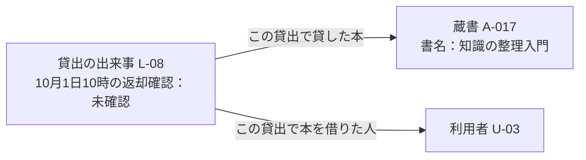

# 第1章：知識を表現するとは

更新日：2026-10-05。執筆とレビューの状況は[README](../../README.md)で確認できる。

## この章の到達点

文章から「何について述べているか」「どんな値や関係があるか」「どの規則を使うか」を取り出せるようになる。図書室を題材に、対象と名前、事実と規則を区別する。さらに、規則を使うときに必要な値と、その値を確認するタイミングを整理する。

## データ・情報・知識と文脈

図書室の貸出受付で、利用者がもう2冊借りようとしている。受付担当者は貸出数の上限を確かめたい。手元には「2」という数値があるとする。

| 呼び方 | この例で表す内容 | 受付担当者に何が分かるか |
|---|---|---|
| データ | 数値「2」 | 数値だけでは、誰の何の数か分からない |
| 情報 | 利用者U-03は、10月1日10時現在2冊借りている | 誰が、いつ、何冊借りているかが分かる |
| 知識 | 同時に借りられるのは3冊まで。現在の冊数と今回借りる冊数の合計が3冊を超えれば、今回の貸出を受け付けない | 現在2冊借りているU-03がさらに2冊申し込むと、合計4冊になるため受け付けられないと判断できる |

数値「2」に「誰の値か」「何を数えたか」「いつの値か」を添えると、受付担当者は利用者の貸出状況を読み取れる。このように値の意味を理解するための背景を**文脈**と呼ぶ。この例では「U-03の貸出冊数」「10月1日10時現在」が文脈に当たる。

本資料では、値や文字列などをデータ、その意味や状況を読み取った内容を情報、判断や説明に使えるよう整理した内容を知識と呼ぶ。これは学習のための区分であり、すべての分野で共通する定義ではない。知識には規則だけでなく、対象の特徴や関係を整理したものも含む。情報と知識は、使う目的によって重なることがある。

「U-03が10月1日10時に借りている冊数は2冊」は、この区分では情報の例である。値に意味や日時を添えただけで、貸出可否まで分かるわけではない。受付担当者が今回の申込みを判断するには、今回借りる冊数と貸出上限の規則も必要になる。

例えば、U-03がさらに2冊借りようとしているなら合計は4冊になる。受付担当者は「合計が3冊を超える申込みは受け付けない」という規則を使い、今回の申込みは受け付けられないと判断する。この例では、貸出状況を伝える内容を情報、申込みの判断に使う規則を知識の例として示している。知識を表現するときは、こうした事実や規則を整理し、どの事実にどの規則を適用するかも明らかにする。

## 対象・概念・名前・識別子

図書室には、同じ書名の本が2冊あるとする。この章では図書室が所蔵する物理的な一冊を「蔵書」と呼ぶ。例えば、棚に並ぶ二冊は書名が同じでも別々の蔵書である。

| 区別するもの | この例での意味 | 具体例 |
|---|---|---|
| 対象 | 個別に扱いたいものや出来事 | 棚にある一冊の蔵書 |
| 概念 | 対象をまとめて考えるための意味や区分 | 「印刷書籍」や「貸出用資料」 |
| 名前 | 対象を呼ぶための表記 | 書名「知識の整理入門」 |
| 識別子（ID） | 対象を区別するために割り当てる値 | 図書室Aが一冊に割り当てた蔵書ID「A-017」 |

「本」という言葉は、作品そのものを指す場合も、出版された版を指す場合も、手元の一冊を指す場合もある。貸出状況を管理するなら、どの一冊を貸したかまで区別する必要がある。書名だけでは二冊の貸出状況を分けられない。

IDについても、どの図書室が割り当てたものかを確認する。図書室Aと図書室Bがそれぞれ「A-017」を使っていても、同じ一冊を指すとは限らない。この例では「図書室AのA-017」と「図書室BのA-017」を区別する。

名前は表示に使い、IDは対象の識別に使う。書名の誤字を訂正しても、同じ蔵書のIDは変えずに扱える。

## 属性と関係で個別の事実を表す

次の三つを区別して、貸出の例を整理する。

| ID | 何を識別するか |
|---|---|
| A-017 | 図書室Aにある一冊の蔵書 |
| U-03 | 図書室Aの一人の利用者 |
| L-08 | U-03にA-017を貸した一回の出来事 |

L-08は本や人のIDではない。貸し出してから返却されるまでの一回の貸出を識別するIDである。同じ人が同じ本を後日もう一度借りれば、別の貸出IDを付ける。

この例について、次の内容が台帳に書かれているとする。

> 蔵書A-017の書名は「知識の整理入門」である。貸出L-08では、利用者U-03に蔵書A-017を貸した。10月1日10時現在、この貸出ではまだ返却を確認していない。

**属性**は、対象の特徴や状態を値で表すものをいう。**関係**は、対象どうしのつながりを表す。この文章を分けると、次のようになる。

| 表し方 | この例での内容 |
|---|---|
| 属性 | 蔵書A-017の書名は「知識の整理入門」 |
| 関係 | 貸出L-08で貸した本は蔵書A-017 |
| 関係 | 貸出L-08で本を借りた人は利用者U-03 |
| 属性 | 貸出L-08の返却確認状況は、10月1日10時現在「未確認」 |

これらはいずれも特定の蔵書や貸出についての事実を表している。属性・関係は「どう表すか」の区別であり、事実は「何を述べているか」の区別である。例えば「L-08で本を借りた人はU-03」は、関係を使って表した個別の事実でもある。

貸出を一つの出来事として表すと、貸した本・借りた人・開始日・返却日などを同じ貸出にまとめられる。「A-017とU-03が関係する」とだけ書くより、いつの貸出について述べているかを区別しやすい。図はこの対応を説明するものであり、データベースへの保存方法を指定するものではない。

属性と関係のどちらで表すかは、知りたいことによって選ぶ。図書室の名前だけを表示したいなら、蔵書の属性として文字列を持たせる方法がある。図書室の所在地や担当者も調べたいなら、図書室を別の対象として表し、蔵書と結ぶ方法がある。

## 事実と規則を組み合わせる

個別の事実は、特定の本や人の状態を述べる。一方、**規則**は、条件に応じてどう扱うかを定める。例えばこの図書室に「返却を確認するまでは、その本をほかの人に貸さない」という規則があるとする。

台帳では、L-08で貸したA-017の返却はまだ確認されていない。この事実に規則を当てはめると、A-017をほかの人に貸してはいけないと判断できる。台帳が古ければ判断を誤る可能性があるため、規則を使う前に状態の更新も確認する。

次に、利用者ごとの貸出上限を考える。この図書室では次の規則を使う。

> 同時に借りられる本は一人3冊までとする。受付担当者は貸出を確定する直前に、利用者が現在借りている冊数と今回借りる冊数を合計する。合計が3冊を超える場合、今回の申込みは受け付けない。

| 整理すること | この規則での内容 |
|---|---|
| 誰の申込みを確認するか | 今回本を借りようとしている利用者 |
| 何の値を使うか | その利用者が現在借りている冊数と、今回借りる冊数 |
| いつ確認するか | 貸出を確定する直前 |
| どの条件で受け付けないか | 二つの冊数の合計が3冊を超える場合 |
| その場合どうするか | 今回の申込みを受け付けない |

U-03が現在2冊借りていて、今回さらに2冊申し込むなら、合計は4冊になる。受付担当者は上限3冊の規則に従い、今回の申込みを受け付けない。これは例の情報と規則から説明した判断であり、実際の受付やシステムを動かして確認した結果ではない。

## 入力形式の確認と業務規則の確認

利用者が入力した「2」は、冊数を表す整数として使える。しかし、U-03の申込みは貸出上限を超えている。この二つの確認では、調べる内容が違う。

| 確認 | 調べること | 今回の例での結果 |
|---|---|---|
| 入力形式の確認 | 冊数として正の整数を入力したか | 「2」はこの形式を満たす |
| 業務規則の確認 | 現在の冊数と今回の冊数の合計が、上限3冊以内か | 2＋2＝4冊なので上限を超える |

入力形式の確認だけでは、業務上受け付けられる申込みかどうかは分からない。業務規則を確認するには、現在借りている冊数などの情報も必要になる。二つの確認を別の画面やタイミングで行うかどうかは、システムの設計で決める。

また、合計が3冊なら上限以内である。ただし、借りたい本がほかの人に貸出中なら、その本は貸せない。上限の確認だけで貸出可否を決めず、関係するほかの規則も確認する。

## 値の利用者と日時を確かめる

貸出上限の確認には、その利用者が貸出確定の直前に借りている冊数を使う。申込みを入力したときに2冊でも、確定前に別の貸出が成立すれば冊数は増える。受付担当者が入力時の古い値を使うと、上限を超える申込みを受け付けるおそれがある。

「値が表す日時」と「規則を確認するタイミング」は区別する。例えば、10時に取得した冊数を11時の確定処理で使ってよいかは確認が必要になる。この規則を11時に確認するなら、貸出を確定する直前の冊数を調べ直す。

利用者も取り違えてはいけない。同じ端末を続けて使っていても、U-03の冊数をU-07の申込みに使うことはできない。値には利用者IDを対応付け、今回の申込者の値を参照する。

序章の画面フローでも、Aの入力値がどのユーザの操作で得られたかを区別する必要がある。Bの分岐とC/Dの業務判断が、Aのどの値を参照するかも明らかにする。具体的な値の保持方法や確認のタイミングはまだ未定なので、図書室の例から決めつけない。

## 出典を残し、分からないことを区別する

貸出冊数を台帳から得たのか、上限3冊を利用規約から得たのかを残す。台帳の更新と規約の改訂では、見直す内容が違う。出典と版の管理は第8章で詳しく扱う。

台帳の記載は現実と一致するとは限らない。本が返却済みでも台帳が更新されていなければ、受付担当者は貸出中だと判断してしまう。また、貸出状況の欄が空白なら、返却済みなのか、入力漏れなのかは分からない。空白を根拠に「貸せる」と決めず、不明な状態として扱う。こうした不明な情報の扱いは第5章で学ぶ。

すべての情報を整理する必要もない。貸出可否を調べるなら、蔵書・利用者・貸出・関係する規則を扱う。本を印刷した工場の設備まで含める必要はない。知りたいことに合わせて、扱う範囲を決める。

## 復習

- 「2」という値を貸出上限の確認に使うには、どのような文脈が必要か。
- 蔵書A-017、利用者U-03、貸出L-08はそれぞれ何を識別するか。
- 属性や関係で表した内容が、個別の事実でもあるのはなぜか。
- 入力形式が正しい申込みでも、貸出を受け付けられないのはどのような場合か。
- 入力時の冊数と貸出確定直前の冊数が違うと、上限の確認にどう影響するか。

## 演習と解答例

### 演習1：同じ書名の本

図書室Aには『分類の基礎』という書名の本が二冊ある。蔵書IDはA-021とA-022である。A-021は利用者U-07に貸出中で、A-022は棚にある。

二冊の蔵書について、対象・名前・IDに当たるものをそれぞれ挙げよう。「『分類の基礎』は貸出中」とだけ記録すると、何が分からなくなるだろうか。

#### 解答例

対象は、図書室Aが所蔵する二冊の蔵書である。名前に当たる書名はどちらも『分類の基礎』だが、IDはA-021とA-022に分かれる。

書名だけで貸出状況を記録すると、どちらの一冊を貸したか分からなくなる。蔵書IDを使えば、A-021は貸出中で、A-022は棚にあると区別して記述できる。

### 演習2：貸出上限の確認

図書室の同時貸出上限は三冊である。貸出確定の直前に確認したところ、U-03は二冊、U-07は一冊を借りていた。二人とも今回さらに二冊を申し込んでいる。

今回の貸出によって上限を超えるのは誰だろうか。計算を示して説明しよう。また、上限以内の利用者について、この情報だけで貸出を確定できるだろうか。

#### 解答例

U-03の合計は二冊＋二冊＝四冊となり、上限を超える。受付担当者は上限三冊の規則に従い、U-03の今回の申込みを受け付けない。

U-07の合計は一冊＋二冊＝三冊なので上限以内である。ただし、今回借りたい本の貸出状況や、館外へ貸し出せる資料かどうかは分からない。受付担当者は上限以外の条件も確認してから貸出を確定する。

前：[序章](00-introduction.md) ／ 次：[第2章 知識を整理するさまざまな方法](02-knowledge-organization.md)
