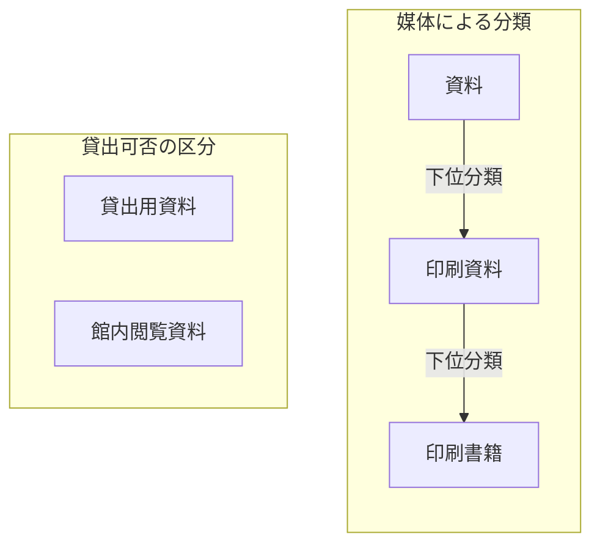
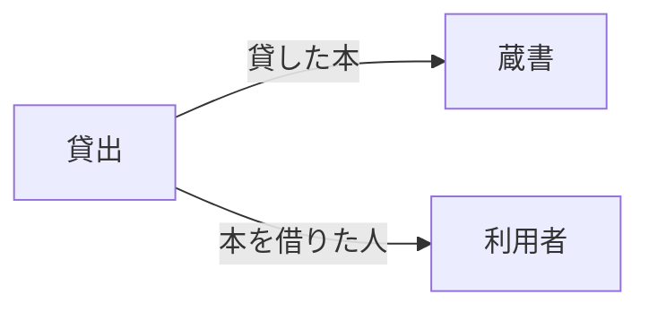
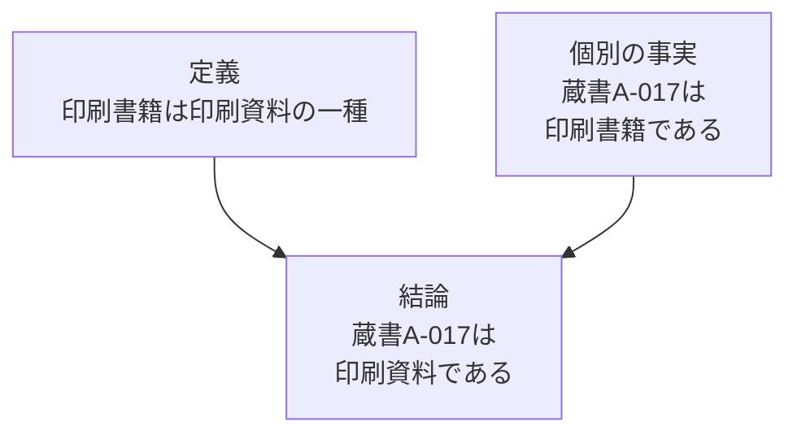
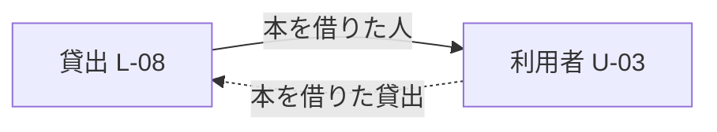

# 第2章：知識を整理するさまざまな方法

更新日：2026-10-05。執筆とレビューの状況は[README](../../README.md)で確認できる。

## この章の到達点

知識の整理には、言葉をそろえる方法、対象を分類する方法、関係や意味を定める方法がある。図書室の例でそれぞれの役割を比べ、目的に合う方法を選べるようになる。貸出可否を確認する場合には、関係図・条件表・手順をどう組み合わせるかも考える。

## 用語集と統制語彙：言葉をそろえる

担当者によって「貸出用資料」の意味が違うと、同じ言葉で話していても認識がずれる。**用語集**は、こうした言葉の意味を説明するために使う。この図書室では「貸出用資料」を「利用者が所定の手続きで館外へ借り出せる資料」と定めることにしよう。

意味が同じでも、担当者によって「貸出資料」「貸出用資料」と違う表記を使うことがある。**統制語彙**は、登録や検索に使う名称を決め、別名との対応を管理する。例えば、登録には「貸出用資料」を使い、「貸出資料」でも検索できるようにする。

| 概念ID | 登録に使う名称 | 検索に使える別名 | この図書室での定義 |
|---|---|---|---|
| K-01 | 貸出用資料 | 貸出資料 | 所定の手続きで館外へ借り出せる資料 |
| K-02 | 館内閲覧資料 | 閲覧専用資料 | 館内で読むための資料。館外へは貸し出さない |

K-01とK-02は概念のIDであり、特定の一冊を表す蔵書IDとは違う。この表は教材用に作った語彙表である。運用では、同じ意味かどうかを担当者が確認してから別名を対応付ける。「参考資料」は用途を示す名称かもしれず、似た言葉というだけで「館内閲覧資料」の別名にはできない。

用語集と統制語彙は併用できる。用語集で意味を定め、統制語彙で登録・検索に使う名称をそろえる。ただし、どちらも特定の蔵書が今貸出中かどうかは示さない。個別の状態は台帳などで確認する。

## 分類体系：対象を分けて探す

**分類体系**は、対象を分ける区分と、その基準を整理したものである。例えば資料を媒体で分けるなら、「資料」の中に「印刷資料」があり、その中に「印刷書籍」があるという階層を作れる。こうした階層的な分類は**タクソノミー**とも呼ばれる。

図は分類体系の一部を示している。「下位分類」は、より範囲の狭い分類を表す。印刷書籍は印刷資料の一種である。一方、貸出可否は別の分類基準である。同じ印刷書籍でも、館外へ貸せる本と館内でしか読めない本がある。一冊を「印刷書籍」と「館内閲覧資料」の両方に分類してもよい。

分類と、本の構成や操作の順番も区別する。

| 表す関係 | 例 | 意味 |
|---|---|---|
| 分類 | 印刷書籍は印刷資料の一種 | 印刷書籍に属する本は印刷資料にも属する |
| 構成 | 目次は本の一部 | 本には目次という部分がある |
| 操作の順番 | 貸出申込みの次に受付内容を確認する | 申込みの後に確認の操作を行う |

「一部」と「一種」を混ぜると、目次まで印刷資料の一種だと扱うおそれがある。図の矢印には、何の関係を表すかを付ける。

## シソーラス：関連する言葉から検索を広げる

**シソーラス**は、検索や索引に使う用語・概念を、階層や関連関係で整理したものである。別名だけでなく、検索を広げるための関係も扱う。例えば「資料保存」で調べる人に、関連する概念として「修復」を示せる。修復は関連する活動だが、資料保存の別名ではない。

**SKOS**（Simple Knowledge Organization System）は、このような概念や名称、上位・下位・関連の関係を機械で共有するための標準的な語彙である。序章で紹介したRDFを使い、主語・述語・目的語の組で表す。[W3C SKOS Primer §2](https://www.w3.org/TR/skos-primer/#secskosessentials)

SKOSの上位・下位関係には、「一種」の関係だけでなく「一部」の関係を使う場合もある。例えば「印刷書籍は印刷資料の一種」は分類を表す。一方、「目次は本の一部」は本の構成を表し、目次を本の一種に分類する意味ではない。どちらも階層として整理できるが、関係の意味は違う。検索用の階層から対象を分類したいときは、その階層が「一種」の関係を表しているか確認する。[W3C SKOS Primer §2.3](https://www.w3.org/TR/skos-primer/#secsemanticrelations)

## 概念・関係の定義と、その表現・保存

貸出業務の知識を整理するには、まず「何を一冊の本、一人の利用者、一回の貸出として扱うか」を決める。次に、貸出と本・利用者がどう関係するかを定義する。これが、概念と関係を使って業務をモデル化する作業である。

ここでは先に貸出のモデルを作る。その後、定義した内容をDBの表・列に反映する例と、OWLという言語で記述する例を示す。何を定義するかという作業と、その定義をどう表し、どう使うかという作業を順に考える。

### 貸出を概念と関係で表す

**概念モデル**は、業務や領域にどのような対象・出来事があり、それらがどう関係するかを表す。図書室の貸出業務を例にすると、蔵書・利用者・貸出の関係を考えられる。「貸出で貸した本」「貸出で本を借りた人」のように、関係が何を意味するかも決める。

第1章では、一冊の本を一人に貸してから返却されるまでを一回の貸出とした。その考え方に沿って、貸出L-08を蔵書A-017と利用者U-03に対応付けている。概念モデルは、この個別例に共通する「貸出には、貸した本と借りた人が対応する」という構造を表す。

この図の箱は「蔵書」「利用者」「貸出」という種類を表す。A-017のような特定の一冊を表す箱ではない。図に添える定義は、例えば次のように書ける。

| 語彙 | この教材での定義 |
|---|---|
| 蔵書 | 図書室が所蔵する物理的な一冊 |
| 利用者 | 図書室を利用する人 |
| 貸出 | 一冊を一人に貸してから返却されるまでの一回の出来事 |
| 貸した本 | 貸出という出来事と、その出来事で貸した蔵書を結ぶ関係 |
| 本を借りた人 | 貸出という出来事と、その出来事で本を借りた利用者を結ぶ関係 |

図と定義を合わせると、貸出業務をどう捉えているかを共有できる。概念モデルを説明するときは、図だけでなく、概念や矢印の意味も示す。

貸出業務の概念モデルを作るときは、何を一回の貸出と数えるかも決める。一冊ごとに分ける方法と、複数冊の申込みを一回にまとめる方法では、本と貸出の対応が変わる。担当者は、どちらの意味で「貸出」を使うかをモデルで共有する。

### オントロジー：何を区別し、何が成り立つかを定める

**オントロジー**は、ある領域の知識を記述するために、概念・属性・関係の意味と、それらについて成り立つ決まりを明示したものである。図書室の例なら、何を一冊の蔵書と数え、何を一回の貸出と数えるかを定める。さらに、貸出と蔵書・利用者の関係や、資料の分類についても定義する。

本資料では、自然言語による語彙の定義から論理的な記述までを含む広い意味で「オントロジー」を使う。これは、オントロジーを概念化の明示的な仕様とする定義に沿っている。定義を書く形式はさまざまだが、知識の記述に使う言葉の意味と決まりを明らかにする点が中心にある。[Tom Gruber：Ontology](https://tomgruber.org/writing/definition-of-ontology.pdf)

#### 貸出について何を定義するか

前の節で定義した「蔵書」「利用者」「貸出」「貸した本」「本を借りた人」を使い、貸出について記述するための小さなオントロジーを考えよう。分類の例として「印刷書籍」と「印刷資料」も加える。

| 定義する内容 | この例での定義 |
|---|---|
| 区別するもの | 蔵書は物理的な一冊、利用者は人、貸出は一回の出来事として扱う |
| 属性の意味 | 蔵書の「書名」は、その本の題名を表す文字列である |
| 関係の意味 | 「貸した本」は貸出と蔵書を結ぶ。「本を借りた人」は貸出と利用者を結ぶ |
| 貸出について成り立つ決まり | 一回の貸出では、一冊の蔵書を一人の利用者に貸す |
| 分類について成り立つ決まり | 印刷書籍は印刷資料の一種である |

「一回の貸出では一冊を貸す」と定義したので、利用者が三冊を同時に借りた場合も、貸出は三回分に分けて記述する。三冊をまとめた申込みを表したいなら、申込みと各貸出の関係も定義する必要がある。定義によって、記録を読む人どうしで「一回」の数え方をそろえられる。

#### 定義を使って個別の事実を書く

定義した言葉を使うと、特定の本や貸出について記述できる。例えば台帳にある内容を、次のように表せる。

| 個別の事実 | 定義との対応 |
|---|---|
| 蔵書A-017は印刷書籍である | 特定の一冊を「印刷書籍」に分類する |
| 蔵書A-017の書名は「知識の整理入門」である | 定義した属性「書名」で題名を記述する |
| 貸出L-08で貸した本は蔵書A-017である | 定義した関係「貸した本」で出来事と本を結ぶ |
| 貸出L-08で本を借りた人は利用者U-03である | 定義した関係「本を借りた人」で出来事と人を結ぶ |

「印刷書籍は印刷資料の一種」は分類の定義であり、「A-017は印刷書籍」は特定の一冊についての事実である。分類の定義は、A-017以外の本にも使える。

オントロジーと個別の事実は、別々に管理する場合も同じ文書に記述する場合もある。ここでは役割を理解するために分けて示している。OWLで記述するオントロジーにも、個別の事実を含められる。[W3C OWL 2 Primer §2](https://www.w3.org/TR/owl2-primer/#What_is_OWL_2.3F)

#### 定義と事実から分かること

分類の定義と個別の事実を組み合わせると、直接書かれていない内容も説明できる。

印刷書籍に属する本は、すべて印刷資料にも属する。A-017は印刷書籍なので、印刷資料でもある。このように定義と事実から結論を導くことを**推論**と呼ぶ。図は人が結論を導く筋道を示している。機械で同じ推論を行う方法は、後の「定義をOWLで表す」で紹介する。[W3C OWL 2 Primer §4.2](https://www.w3.org/TR/owl2-primer/#Class_Hierarchies)

A-017が印刷資料だと分かっても、今貸せるかどうかを決める情報は足りない。貸出状況や館外へ貸し出せる資料かどうかも調べる必要がある。台帳の分類が誤っていれば、推論の結論も現実と食い違う。定義を使って導けることと、現実の本について確認することを分けて考える。

#### 定義を共有する理由

二つの図書室が貸出記録を持ち寄る場面を考えよう。一方が一冊ごとに貸出を数え、他方が複数冊の申込みを一回と数えていると、どちらも「貸出10件」と書いていても同じ内容を表さない。定義を共有すれば、記録を合わせる前に数え方の違いに気づき、対応を決められる。オントロジーは、こうした知識の共有や再利用のために使われる。[Tom Gruber：Ontology](https://tomgruber.org/writing/definition-of-ontology.pdf)

概念モデルでも概念や関係の意味を定義するため、概念モデルとオントロジーは重なる。本資料が採用する広い定義では、前の図と定義表も小さなオントロジーの例として読める。両者を意味の有無で分けず、何を定義し、その定義をどう利用するかに注目する。クラス・属性・関係や定義の詳しい書き方は第4章で学ぶ。

### 関係モデルとDBスキーマ：表と項目で表す

概念モデルで考えた蔵書・利用者・貸出を、DBで扱える構造へ表す方法の一つが**関係モデル**（リレーショナルモデル）である。関係モデルは、データを行と列からなる表として捉え、データの操作や整合性の規則も定める。ここでいう「関係」は数学的な用語で、表として表現できるデータの集合を指す。「蔵書と利用者のつながり」という日常語の関係とは区別する。[Oracle Database Concepts：Relational Model](https://docs.oracle.com/en/database/oracle/oracle-database/19/cncpt/introduction-to-oracle-database.html)

概念モデルと関係モデルは同じものではない。概念モデルでは業務上の対象と関係を考える。関係モデルを使ったDB設計では、それらをどの表・列で表すかを考える。概念モデルの内容は、表以外にグラフなどの構造でも表せる。

**データベース（DB）のスキーマ**は、個々のDBの構造を定めたものである。例えば、関係モデルを使うDBなら「蔵書・利用者・貸出という表を作り、次の列を設ける」と決める。関係モデルという共通の枠組みと、その枠組みで設計した具体的なスキーマを区別する。

| 表 | 列の例 |
|---|---|
| 蔵書 | 蔵書ID、書名 |
| 利用者 | 利用者ID、氏名 |
| 貸出 | 貸出ID、蔵書ID、利用者ID、開始日、返却日 |

貸出の行には、貸した本と借りた人のIDを入れる。どの列で一行を識別するか、返却前は返却日を空欄にできるか、蔵書の表に存在するIDだけを参照できるようにするかも定める。このような、データに必要な項目や値の条件を**データ制約**と呼ぶ。表・列・制約の定義は、スキーマの設計に含まれる。[Oracle Database Concepts：Tables](https://docs.oracle.com/en/database/oracle/oracle-database/19/cncpt/introduction-to-oracle-database.html)

### 定義をOWLで表す

**OWL**（Web Ontology Language）は、オントロジーを表すための言語である。定義をOWLで記述すると、対応する機械の仕組みは、言語の仕様に従って定義を解釈できる。OWLでは、定義や個別の事実として記述した基本的な文を**公理**と呼ぶ。公理から結論を導くソフトウェアを**推論器**と呼ぶ。[W3C OWL 2 Primer §2・§3](https://www.w3.org/TR/owl2-primer/#What_is_OWL_2.3F)

貸出の例に「本を借りた貸出」という関係を加えよう。「本を借りた人」は貸出から利用者へ向かう関係であり、「本を借りた貸出」は利用者から貸出へ向かう関係である。二つは、同じ対応を逆方向から述べるものと定義する。

実線は「L-08で本を借りた人はU-03」という記録を表す。点線は、その記録と二つの関係の定義から「U-03が本を借りた貸出にはL-08がある」と導けることを表す。機械にこの結論を導かせるなら、二つの関係が逆方向の対応であることをOWLで記述し、その定義を扱える推論の仕組みを使う。[W3C OWL 2 Primer §6.1](https://www.w3.org/TR/owl2-primer/#Property_Characteristics)

先ほどの図と文章でも、人は逆方向の対応を読み取れる。OWLで表すと、対応する機械の仕組みも、言語の仕様に従ってこの定義を解釈できる。この図は、定義から導ける内容を説明する概念図であり、実行用のOWL構文ではない。

対象を分類する区分を**クラス**、その区分に属する特定の対象を**個体**と呼ぶ。「印刷書籍」がクラス、蔵書A-017が個体である。前の分類の例も、クラスどうしの関係と個体の所属をOWLで記述すれば、対応する推論器で結論を導ける。推論の仕組みと限界は第5章で学ぶ。

SKOSで検索用の概念どうしを結ぶことと、OWLで個体の分類を導くことは役割が違う。SKOSの上位・下位関係を登録しただけで、この例のクラスの定義と同じ推論ができると考えない。[W3C SKOS Primer §5.2](https://www.w3.org/TR/skos-primer/#secskosowl)

### 分類・データの検査・業務上の判断

「定義に従って分類する」「データの不足を検査する」「申込みを受け付けるか決める」は、何を確かめるかが違う。

| 作業 | 確かめること | 例 |
|---|---|---|
| 分類の推論 | 定義から、対象がどのクラスに属するかを導く | 印刷書籍のA-017は印刷資料でもある |
| データの検査 | 保存したデータが必要な条件を満たすか調べる | 貸出の行に利用者IDが入っているか |
| 業務上の判断 | 申込みが業務規則を満たすか確認する | 現在の冊数と今回の冊数の合計が上限以内か |

定義を使う推論と、記載されたデータを検査する処理では、情報が欠けているときの扱いにも違いがある。例えばOWLで「どの貸出にも借り手がいる」と定義しても、借り手のIDが書かれていないだけでは、その定義に反するとは限らない。借り手はいるが、誰なのかまだ書かれていない可能性が残るからである。「貸出の行に利用者IDが記載されているか」を確かめたいなら、その記載を検査する条件と処理を用意する。[W3C OWL 2 Primer §2](https://www.w3.org/TR/owl2-primer/#What_is_OWL_2.3F)

貸出上限の確認では、さらに現在の冊数と今回借りる冊数を使う。何を分類したいのか、何の記載を検査したいのか、どの業務条件を確認したいのかを決め、それぞれに必要な定義・データ・処理を用意する。

## 関係図・条件表・手順を組み合わせる

貸出上限の確認では、必要なデータの対応、上限の条件、受付作業の順番を説明する。

- **関係図**は、対象どうしがどのようにつながるかを図で表す。第1章の図は、貸出・本・利用者の対応を示している。
- **条件表**は、判断に使う値と、条件ごとの結果を対応付けた表である。
- **手順**は、誰が何をどの順番で行うかを示す。

第1章の上限3冊の規則を条件表にすると、次のようになる。

| 確認する値 | 条件 | 上限の確認結果 |
|---|---|---|
| 貸出確定直前に借りている冊数＋今回借りる冊数 | 合計が3冊を超える | 上限を超えるので、今回の申込みを受け付けない |
| 貸出確定直前に借りている冊数＋今回借りる冊数 | 合計が3冊以下 | 上限以内。借りたい本の貸出状況など、ほかの条件も確認する |

関係図では、どの貸出で誰がどの本を借りたかを示す。条件表では、冊数の合計によって結果がどう変わるかを示す。手順では、受付担当者が「申込者を確認する → 必要な冊数を取得する → 確定前に上限を確認する」という順序で作業することを示す。

序章の画面フローでは、C/Dの業務規則は、その処理に渡されたデータに対する条件として記述できる。テスト作成者は、そのデータがどこから来るかを、受け渡しの設計や入力項目の対応からたどる。Aで生まれた値でも、C/Dの設計書での項目名がAと同じとは限らない。途中で値が変換されるなら、その変換も確認する。

関係図で整理したいのは、入力項目、受け渡すデータ項目、業務規則の対応である。設計書から確認した対応をたどり、C/Dのエラー条件を満たすためにAで何を入力する必要があるか考える。条件表には、Bの遷移先を選ぶ条件やC/Dでエラーになる条件を示す。手順には、ログインから画面操作までの順番を示す。具体的なデータの受け渡し、分岐・エラー条件、ログイン後の経路は未定なので、今は実行できるテスト手順を完成させられない。

関係や規則を定義した後には、それを使う検索・判定・操作の仕組みが必要になる。また、定義した手順どおりにシステムが動くかは、実際に操作して確認する。

## 目的に応じて整理方法を選ぶ

表現や意味の決まりを明示し、機械でも扱える形にしていくことを**形式化**と呼ぶ。どこまで細かく定めるかは、知りたいことや任せたい処理に合わせて決める。

本章で説明した方法を、整理する内容と用途で一覧にする。概念モデルとオントロジーは、意味を定義するモデルとして一行にまとめる。OWLは、その定義を記述する言語として別に示す。各方法は併用できる。

| 方法 | 整理する内容 | 図書室での用途の例 |
|---|---|---|
| 用語集 | 言葉の意味 | 「貸出用資料」が何を指すか説明する |
| 統制語彙 | 登録名と別名の対応 | 「貸出資料」でも「貸出用資料」でも検索できるようにする |
| 分類体系・タクソノミー | 分類基準と区分・階層 | 印刷書籍などの分類から資料を探す |
| シソーラス | 検索に使う用語・概念の階層や関連 | 「資料保存」から「修復」にも検索を広げる |
| 概念モデル・オントロジー | 知識を表す概念・関係と、その意味や決まり | 何を一回の貸出と数え、本・人とどう対応付けるか定義する |
| OWLによる記述 | 概念や関係の定義を、仕様で意味が定まった言語で表す | 逆方向の関係や分類の定義を、対応する推論の仕組みで使う |
| 関係モデル | 表として表せるデータの構造・操作・整合性の規則 | 蔵書・利用者・貸出を表で扱う設計の基礎にする |
| DBスキーマ | 個々のDBの表・列・制約などの定義 | 貸出の表にどのIDや日付の列を設けるか決める |
| データ制約 | 必須項目や値・参照先の条件 | 貸出の行に利用者IDが必要と定め、欠落を検査する |
| 関係図 | 対象どうしの対応 | どの貸出で、誰がどの本を借りたか示す |
| 条件表 | 判断に使う値と、条件ごとの結果 | 冊数の合計による上限の確認結果を示す |
| 手順 | 作業の担当者・内容・順番 | 利用者を確認し、確定直前の冊数で上限を確認する |

例えば貸出業務では、まず本・人・貸出の意味と関係を定義する。その内容を図と文章で共有し、保存するデータについてはDBスキーマを設計する。定義から関係や分類を機械に導かせたいなら、OWLによる記述と対応する推論の仕組みを検討する。受付の条件や操作順は、条件表と手順で説明できる。

## 復習

- 用語集と統制語彙は、それぞれ何をそろえるために使うか。
- 「印刷書籍」と「館内閲覧資料」の両方に一冊を分類できるのはなぜか。
- 一回の貸出を一冊ごとに扱う場合と、複数冊の申込みとして扱う場合では、本との対応がどう変わるか。
- 貸出の意味を定義すること、DBの表・列を設計すること、定義をOWLで記述することは、それぞれどのような作業か。
- 「印刷書籍は印刷資料の一種」と「A-017は印刷書籍」は、それぞれ何を述べているか。二つを組み合わせると何が分かるか。
- 分類の推論、データの検査、業務上の判断では、それぞれ何を確かめるか。
- 関係図・条件表・手順は、貸出上限の確認でどのように役割を分担するか。

## 演習と解答例

### 演習1：別の名称でも検索できるようにする

図書室の担当者は、館外へ貸し出さない資料を「館内閲覧資料」として登録している。利用者は同じ意味で「閲覧専用資料」と入力することがある。

どちらの名称でも同じ資料を検索できるようにするには、どの整理方法を使うとよいか。二つの名称を対応付ける前に確認することも説明しよう。

#### 解答例

統制語彙を使い、登録に使う名称を「館内閲覧資料」、検索に使える別名を「閲覧専用資料」と定める。検索の仕組みがこの対応を使えば、利用者はどちらの名称でも資料を探せる。

担当者は、二つの名称が同じ範囲の資料を指すか確認する必要がある。似た言葉であっても、片方が特定の部屋に置いた資料だけを指すなら、同じ意味の別名としては扱えない。

### 演習2：定義と個別の事実を組み合わせる

図書室では「印刷書籍は印刷資料の一種」と定義している。台帳には「蔵書A-024は印刷書籍」と記録されている。

二つの文のうち、分類の定義はどちらで、個別の事実はどちらか。両方を使ってA-024について言えることを説明しよう。その結論を機械に導かせたい場合は、どのような記述と仕組みが必要だろうか。

#### 解答例

「印刷書籍は印刷資料の一種」が分類の定義であり、「蔵書A-024は印刷書籍」が個別の事実である。印刷書籍はすべて印刷資料でもあるため、A-024も印刷資料に属すると分かる。

機械で結論を導く方法の一つは、分類の定義とA-024の所属をOWLで記述し、それらを扱える推論器を使うことである。分類の定義だけを記述しても、A-024が印刷書籍だという事実がなければ、この結論は導けない。

### 演習3：必要な項目が空欄のデータを見つける

貸出データには、貸出ID・蔵書ID・利用者IDを記録することにした。次の二行について、利用者IDが空欄の行を見つけたい。

| 貸出ID | 蔵書ID | 利用者ID |
|---|---|---|
| L-21 | A-031 | U-05 |
| L-22 | A-032 | （空欄） |

検査のためにどのようなデータ制約を設ければよいか。制約を満たさない行を挙げ、空欄から借り手について何が分かるかも説明しよう。

#### 解答例

「貸出の行には利用者IDを記載する」というデータ制約を設け、各行の利用者ID欄を調べる。L-22の行は空欄なので、この制約を満たしていない。L-21の行には利用者IDが記載されている。

検査で分かるのは、L-22の借り手のIDが記録されていないことである。空欄だけを根拠に、借り手が存在しないとは判断できない。IDが記載されていても、正しい利用者を指すかは別に確認する必要がある。

### 演習4：貸出上限を確認するための情報をそろえる

利用者U-07が二冊の貸出を申し込んだ。貸出確定の直前に確認したところ、U-07はすでに一冊を借りていた。図書室の同時貸出上限は三冊である。

上限を確認するために、関係図・条件表・手順で何を示すとよいか。それぞれの役割を説明しよう。今回の申込みが上限以内か計算し、この情報だけで貸出を確定できるかも考えよう。

#### 解答例

関係図では、利用者と貸出・蔵書の対応を示す。上限の確認に使う冊数は、U-07の貸出状況から調べる。条件表には「現在借りている冊数＋今回借りる冊数」と上限三冊との比較結果を示す。手順には、受付担当者が申込者を確認し、確定直前の冊数を調べ、合計を上限と比べる順番を書く。

U-07の合計は一冊＋二冊＝三冊なので上限以内である。ただし、今回借りたい二冊が貸出中か、館外へ貸し出せる資料かは分からない。受付担当者は本の状態やほかの規則も確認してから貸出を確定する。

前：[第1章](01-knowledge-representation.md) ／ 次：[第3章 ナレッジグラフの基礎](03-knowledge-graphs.md)
