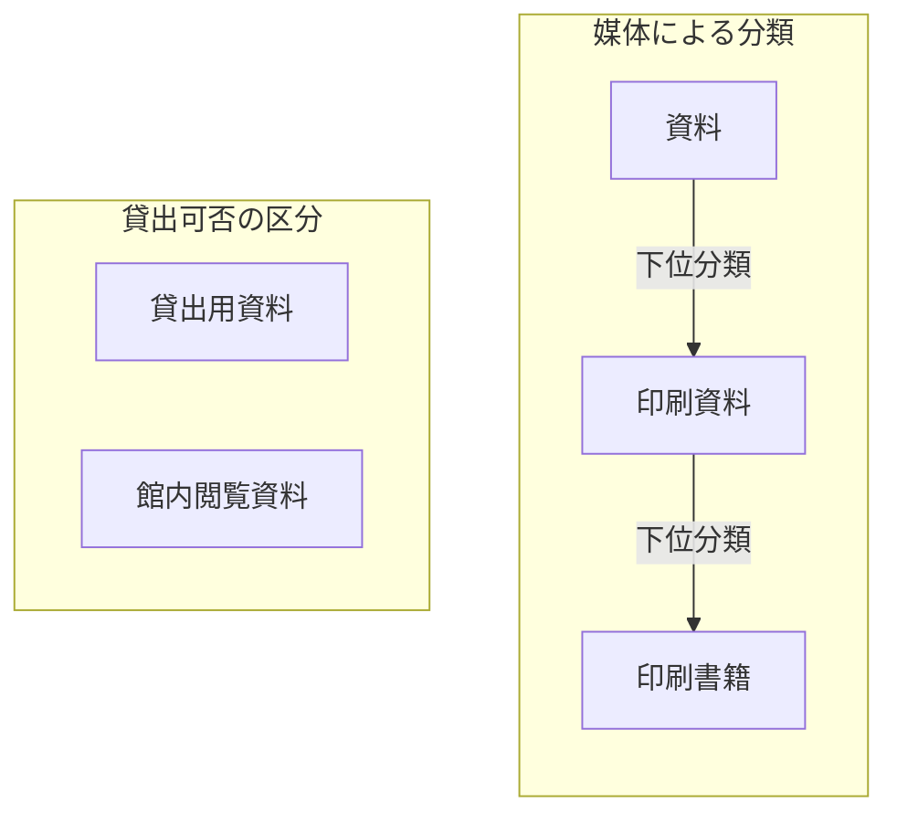

# 第2章：知識を整理するさまざまな方法

更新日：2026-10-04。執筆とレビューの状況は[README](../../README.md)で確認できる。

## この章の到達点

知識の整理には、言葉をそろえる方法、対象を分類する方法、関係や意味を定める方法がある。図書室の例でそれぞれの役割を比べ、目的に合う方法を選べるようになる。貸出可否を確認する場合には、関係図・条件表・手順をどう組み合わせるかも考える。

## 用語集と統制語彙：言葉をそろえる

担当者によって「貸出用資料」の意味が違うと、同じ言葉で話していても認識がずれる。**用語集**は、こうした言葉の意味を説明するために使う。この図書室では「貸出用資料」を「利用者が所定の手続きで館外へ借り出せる資料」と定めることにしよう。

意味が同じでも、担当者によって「貸出資料」「貸出用資料」と違う表記を使うことがある。**統制語彙**は、登録や検索に使う名称を決め、別名との対応を管理する。例えば、登録には「貸出用資料」を使い、「貸出資料」でも検索できるようにする。

| 概念ID | 登録に使う名称 | 検索に使える別名 | この図書室での定義 |
|---|---|---|---|
| K-01 | 貸出用資料 | 貸出資料 | 所定の手続きで館外へ借り出せる資料 |
| K-02 | 館内閲覧資料 | 閲覧専用資料 | 館内で読むための資料。館外へは貸し出さない |

K-01とK-02は概念のIDであり、特定の一冊を表す蔵書IDとは違う。この表は教材用に作った語彙表である。運用では、同じ意味かどうかを担当者が確認してから別名を対応付ける。「参考資料」は用途を示す名称かもしれず、似た言葉というだけで「館内閲覧資料」の別名にはできない。

用語集と統制語彙は併用できる。用語集で意味を定め、統制語彙で登録・検索に使う名称をそろえる。ただし、どちらも特定の蔵書が今貸出中かどうかは示さない。個別の状態は台帳などで確認する。

## 分類体系：対象を分けて探す

**分類体系**は、対象を分ける区分と、その基準を整理したものである。例えば資料を媒体で分けるなら、「資料」の中に「印刷資料」があり、その中に「印刷書籍」があるという階層を作れる。こうした階層的な分類は**タクソノミー**とも呼ばれる。

図は分類体系の一部を示している。「下位分類」は、より範囲の狭い分類を表す。印刷書籍は印刷資料の一種である。一方、貸出可否は別の分類基準である。同じ印刷書籍でも、館外へ貸せる本と館内でしか読めない本がある。一冊を「印刷書籍」と「館内閲覧資料」の両方に分類してもよい。

分類と、本の構成や操作の順番も区別する。

| 表す関係 | 例 | 意味 |
|---|---|---|
| 分類 | 印刷書籍は印刷資料の一種 | 印刷書籍に属する本は印刷資料にも属する |
| 構成 | 目次は本の一部 | 本には目次という部分がある |
| 操作の順番 | 貸出申込みの次に受付内容を確認する | 申込みの後に確認の操作を行う |

「一部」と「一種」を混ぜると、目次まで印刷資料の一種だと扱うおそれがある。図の矢印には、何の関係を表すかを付ける。

## シソーラス：関連する言葉から検索を広げる

**シソーラス**は、検索や索引に使う用語・概念を、階層や関連関係で整理したものである。別名だけでなく、検索を広げるための関係も扱う。例えば「資料保存」で調べる人に、関連する概念として「修復」を示せる。修復は関連する活動だが、資料保存の別名ではない。

**SKOS**（Simple Knowledge Organization System）は、このような概念や名称、上位・下位・関連の関係を機械で共有するための標準的な語彙である。序章で紹介したRDFを使い、主語・述語・目的語の組で表す。[W3C SKOS Primer §2](https://www.w3.org/TR/skos-primer/#secskosessentials)

SKOSの上位・下位関係には、「一種」の関係だけでなく「一部」の関係を使う場合もある。例えば「印刷書籍は印刷資料の一種」は分類を表す。一方、「目次は本の一部」は本の構成を表し、目次を本の一種に分類する意味ではない。どちらも階層として整理できるが、関係の意味は違う。検索用の階層から対象を分類したいときは、その階層が「一種」の関係を表しているか確認する。[W3C SKOS Primer §2.3](https://www.w3.org/TR/skos-primer/#secsemanticrelations)

## 概念モデル・DBスキーマ・オントロジー

概念モデルもオントロジーも、概念や関係の意味を定める。DBスキーマにも、どのデータが何を表すかという意味がある。三つを「意味があるかどうか」で分けることはできない。ここでは、貸出業務の認識を共有する場合、DBの構造を設計する場合、用語や定義を複数の用途で共有する場合を比べる。目的は重なることがあり、同じ設計を複数の方法で表してもよい。

### 概念モデル：何を扱い、どう結ぶか

**概念モデル**は、業務や領域にどのような対象・出来事があり、それらがどう関係するかを表す。図書室の貸出業務を例にすると、蔵書・利用者・貸出の関係を考えられる。「貸出で貸した本」「貸出で本を借りた人」のように、関係が何を意味するかも決める。

第1章では、一冊の本を一人に貸してから返却されるまでを一回の貸出とした。その考え方に沿って、貸出L-08を蔵書A-017と利用者U-03に対応付けている。概念モデルは、この個別例に共通する「貸出には、貸した本と借りた人が対応する」という構造を表す。

貸出業務の概念モデルを作るときは、何を一回の貸出と数えるかも決める。一冊ごとに分ける方法と、複数冊の申込みを一回にまとめる方法では、本と貸出の対応が変わる。担当者は、どちらの意味で「貸出」を使うかをモデルで共有する。

### 関係モデルとDBスキーマ：表と項目で表す

概念モデルで考えた蔵書・利用者・貸出を、DBで扱える構造へ表す方法の一つが**関係モデル**（リレーショナルモデル）である。関係モデルは、データを行と列からなる表として捉え、データの操作や整合性の規則も定める。ここでいう「関係」は数学的な用語で、表として表現できるデータの集合を指す。「蔵書と利用者のつながり」という日常語の関係とは区別する。[Oracle Database Concepts：Relational Model](https://docs.oracle.com/en/database/oracle/oracle-database/19/cncpt/introduction-to-oracle-database.html)

概念モデルと関係モデルは同じものではない。概念モデルでは業務上の対象と関係を考える。関係モデルを使ったDB設計では、それらをどの表・列で表すかを考える。概念モデルの内容は、表以外にグラフなどの構造でも表せる。

**データベース（DB）のスキーマ**は、個々のDBの構造を定めたものである。例えば、関係モデルを使うDBなら「蔵書・利用者・貸出という表を作り、次の列を設ける」と決める。関係モデルという共通の枠組みと、その枠組みで設計した具体的なスキーマを区別する。

| 表 | 列の例 |
|---|---|
| 蔵書 | 蔵書ID、書名 |
| 利用者 | 利用者ID、氏名 |
| 貸出 | 貸出ID、蔵書ID、利用者ID、開始日、返却日 |

貸出の行には、貸した本と借りた人のIDを入れる。どの列で一行を識別するか、返却前は返却日を空欄にできるか、蔵書の表に存在するIDだけを参照できるようにするかも定める。このような、データに必要な項目や値の条件を**データ制約**と呼ぶ。表・列・制約の定義は、スキーマの設計に含まれる。[Oracle Database Concepts：Tables](https://docs.oracle.com/en/database/oracle/oracle-database/19/cncpt/introduction-to-oracle-database.html)

### オントロジー：概念や関係の意味を定める

**オントロジー**は、概念や関係について明示した定義を、共有・再利用できるようにまとめる。例えば、複数の図書室で資料の分類を共有するために「印刷書籍は印刷資料の一種」と定義する。この定義を使えば、印刷書籍に分類した蔵書A-017は印刷資料でもあると判断できる。

「印刷書籍」「印刷資料」の意味と両者の関係は、概念モデルでも定められる。オントロジーを、概念モデルの内容を共有するための表現として使うこともある。両者に一律の境界があるというより、どの範囲で定義を共有し、どのように解釈・利用するかを確認する必要がある。

このように対象を分類する区分を**クラス**、区分に属する特定の対象を**個体**と呼ぶ。この例では「印刷書籍」がクラスで、蔵書A-017が個体である。

**OWL**（Web Ontology Language）は、オントロジーを表すための言語である。OWLでは「印刷書籍は印刷資料の一種」のような決まりを**公理**として記述できる。言語の仕様が公理の解釈を定めるので、対応する機械の仕組みは、公理と個別の事実からA-017が印刷資料に属することを導ける。これを推論と呼ぶ。自然言語で定義を共有することに加え、OWLでは定義から何を導けるかも仕様に従って決まる。オントロジーを作るすべての場合にOWLや自動推論が必要というわけではない。[W3C OWL 2 Primer §2・§3](https://www.w3.org/TR/owl2-primer/#What_is_OWL_2.3F)

例えば同じ分類の知識でも、概念モデルでは「印刷書籍と印刷資料をどう区別するか」を担当者と共有できる。DBスキーマでは、蔵書の分類を保存する列や参照先を定める。OWLで表したオントロジーでは、「印刷書籍に属するなら印刷資料にも属する」という解釈を機械でも共有できる。関係の意味を持つ点は共通であり、設計・共有する内容と利用する仕組みに注目して比べる。詳しい定義は第4章、推論の仕組みと限界は第5章で学ぶ。

SKOSで検索用の概念どうしを結ぶことと、OWLで個体の分類を導くことは役割が違う。SKOSの上位・下位関係を登録しただけで、この例のクラスの定義と同じ推論ができると考えない。[W3C SKOS Primer §5.2](https://www.w3.org/TR/skos-primer/#secskosowl)

### 分類・データの検査・業務上の判断

「定義に従って分類する」「データの不足を検査する」「申込みを受け付けるか決める」は、何を確かめるかが違う。

| 作業 | 確かめること | 例 |
|---|---|---|
| 分類の推論 | 定義から、対象がどのクラスに属するかを導く | 印刷書籍のA-017は印刷資料でもある |
| データの検査 | 保存したデータが必要な条件を満たすか調べる | 貸出の行に利用者IDが入っているか |
| 業務上の判断 | 申込みが業務規則を満たすか確認する | 現在の冊数と今回の冊数の合計が上限以内か |

定義を使う推論と、記載されたデータを検査する処理では、情報が欠けているときの扱いにも違いがある。例えばOWLで「どの貸出にも借り手がいる」と定義しても、借り手のIDが書かれていないだけでは、その定義に反するとは限らない。借り手はいるが、誰なのかまだ書かれていない可能性が残るからである。「貸出の行に利用者IDが記載されているか」を確かめたいなら、その記載を検査する条件と処理を用意する。[W3C OWL 2 Primer §2](https://www.w3.org/TR/owl2-primer/#What_is_OWL_2.3F)

貸出上限の確認では、さらに現在の冊数と今回借りる冊数を使う。何を分類したいのか、何の記載を検査したいのか、どの業務条件を確認したいのかを決め、それぞれに必要な定義・データ・処理を用意する。

## 関係図・条件表・手順を組み合わせる

貸出上限の確認では、必要なデータの対応、上限の条件、受付作業の順番を説明する。

- **関係図**は、対象どうしがどのようにつながるかを図で表す。第1章の図は、貸出・本・利用者の対応を示している。
- **条件表**は、判断に使う値と、条件ごとの結果を対応付けた表である。
- **手順**は、誰が何をどの順番で行うかを示す。

第1章の上限3冊の規則を条件表にすると、次のようになる。

| 確認する値 | 条件 | 上限の確認結果 |
|---|---|---|
| 貸出確定直前に借りている冊数＋今回借りる冊数 | 合計が3冊を超える | 上限を超えるので、今回の申込みを受け付けない |
| 貸出確定直前に借りている冊数＋今回借りる冊数 | 合計が3冊以下 | 上限以内。借りたい本の貸出状況など、ほかの条件も確認する |

関係図では、どの貸出で誰がどの本を借りたかを示す。条件表では、冊数の合計によって結果がどう変わるかを示す。手順では、受付担当者が「申込者を確認する → 必要な冊数を取得する → 確定前に上限を確認する」という順序で作業することを示す。

序章の画面フローでは、C/Dの業務規則は、その処理に渡されたデータに対する条件として記述できる。テスト作成者は、そのデータがどこから来るかを、受け渡しの設計や入力項目の対応からたどる。Aで生まれた値でも、C/Dの設計書での項目名がAと同じとは限らない。途中で値が変換されるなら、その変換も確認する。

関係図で整理したいのは、入力項目、受け渡すデータ項目、業務規則の対応である。設計書から確認した対応をたどり、C/Dのエラー条件を満たすためにAで何を入力する必要があるか考える。条件表には、Bの遷移先を選ぶ条件やC/Dでエラーになる条件を示す。手順には、ログインから画面操作までの順番を示す。具体的なデータの受け渡し、分岐・エラー条件、ログイン後の経路は未定なので、今は実行できるテスト手順を完成させられない。

関係や規則を定義した後には、それを使う検索・判定・操作の仕組みが必要になる。また、定義した手順どおりにシステムが動くかは、実際に操作して確認する。

## 目的に応じて整理方法を選ぶ

表現や意味の決まりを明示し、機械でも扱える形にしていくことを**形式化**と呼ぶ。どこまで細かく定めるかは、知りたいことや任せたい処理に合わせて決める。

本章で説明した方法を、整理する内容と用途で一覧にする。方法ごとに一つの用途へ限定する表ではなく、選ぶときの目安である。

| 方法 | 整理する内容 | 図書室での用途の例 |
|---|---|---|
| 用語集 | 言葉の意味 | 「貸出用資料」が何を指すか説明する |
| 統制語彙 | 登録名と別名の対応 | 「貸出資料」でも「貸出用資料」でも検索できるようにする |
| 分類体系・タクソノミー | 分類基準と区分・階層 | 印刷書籍などの分類から資料を探す |
| シソーラス | 検索に使う用語・概念の階層や関連 | 「資料保存」から「修復」にも検索を広げる |
| 概念モデル | 業務上の対象・出来事と、関係の意味 | 何を一回の貸出と数え、本・人とどう対応付けるか共有する |
| 関係モデル | 表として表せるデータの構造・操作・整合性の規則 | 蔵書・利用者・貸出を表で扱う設計の基礎にする |
| DBスキーマ | 個々のDBの表・列・制約などの定義 | 貸出の表にどのIDや日付の列を設けるか決める |
| データ制約 | 必須項目や値・参照先の条件 | 貸出の行に利用者IDが必要と定め、欠落を検査する |
| オントロジー | 共有・再利用する概念や関係の定義 | 資料の分類を共有する。OWLで表せば、仕様に従った分類の推論に使える |
| 関係図 | 対象どうしの対応 | どの貸出で、誰がどの本を借りたか示す |
| 条件表 | 判断に使う値と、条件ごとの結果 | 冊数の合計による上限の確認結果を示す |
| 手順 | 作業の担当者・内容・順番 | 利用者を確認し、確定直前の冊数で上限を確認する |

例えば貸出業務では、概念モデルで本・人・貸出の意味を共有し、DBスキーマで保存する構造を決め、条件表と手順で受付作業を説明できる。分類の定義を複数のシステムで共有し、機械にも推論させたいなら、オントロジーをOWLで表す方法も検討できる。何を共有したいか、何を機械に任せたいかに合わせて組み合わせる。

## 復習

- 用語集と統制語彙は、それぞれ何をそろえるために使うか。
- 「印刷書籍」と「館内閲覧資料」の両方に一冊を分類できるのはなぜか。
- 概念モデルとオントロジーに共通することは何か。関係モデルとDBスキーマはどう違うか。
- 分類の推論、データの検査、業務上の判断では、それぞれ何を確かめるか。
- 関係図・条件表・手順は、貸出上限の確認でどのように役割を分担するか。

## 演習と解答例

次の要求に合う整理方法を選び、追加で確認することを挙げる。

1. 「閲覧専用資料」でも「館内閲覧資料」でも検索したい。
2. 印刷書籍として登録した蔵書を、印刷資料としても扱いたい。
3. 利用者IDがない貸出データを見つけたい。
4. 今回の申込みによって、利用者が借りている本の合計が上限を超えるか確認したい。

解答例：

1. 統制語彙で別名を対応付ける。二つの名称がこの図書室で同じ意味かを確認する。
2. 分類体系で「印刷書籍は印刷資料の一種」と定める。機械に分類を導かせるなら、その定義を処理できる表現と推論の仕組みを用意する。
3. 「貸出データには利用者IDが必要」というデータ制約を設け、検査する。どの貸出データを検査するかも決める。
4. 利用者と貸出の対応から現在の冊数を調べ、今回の冊数と合わせて条件表で上限を確認する。貸出確定の直前の値を使い、ほかの貸出条件も確認する。

前：[第1章](01-knowledge-representation.md) ／ 続き：第3章「ナレッジグラフの基礎」（未執筆。計画は[編集計画](../EDITORIAL_PLAN.md)を参照）
