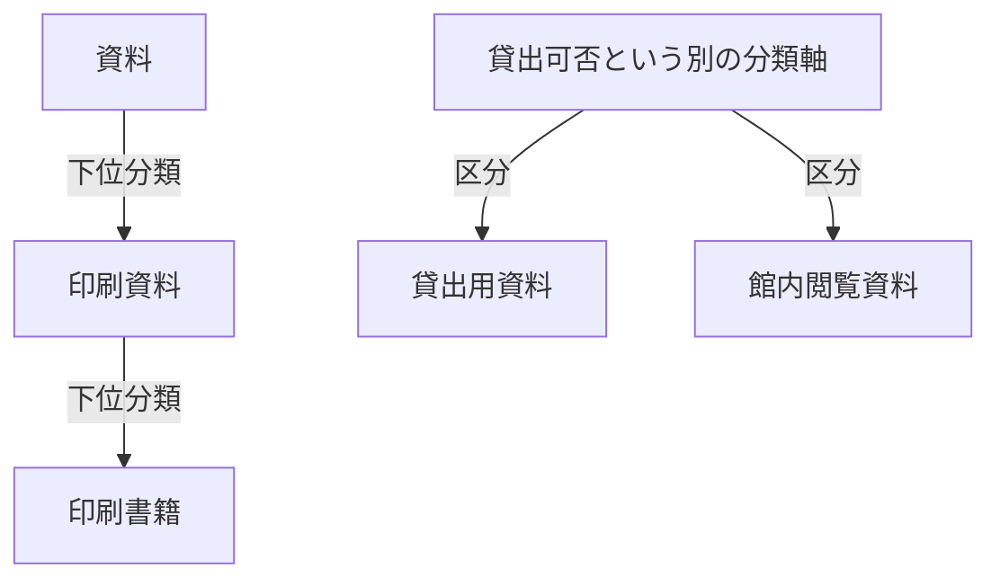

# 第2章：知識を整理するさまざまな方法

更新日：2026-10-01。本文の確認状況は[README](../../README.md)に記録する。

## この章の到達点

用語集、統制語彙、分類体系、シソーラス、概念モデル、データベースのスキーマ、オントロジーの役割を比べ、目的に合う整理方法を選べるようになる。条件や操作順を扱う場合に、これらと条件表・手順をどう組み合わせるかも考える。比較は本資料の整理であり、互いに排他的な分類ではない。

## 用語集と統制語彙

**用語集**は言葉の意味を説明する。例えば「貸出用資料：利用者が所定の手続きで館外へ持ち出せる資料」と定義すれば、会話の前提を合わせられる。

**統制語彙**は、記録や検索に使う語をそろえる。「貸出資料」と「貸出用資料」の意味がこの図書室では同じと確認できれば、優先して使う名称と別名を決める。似た語を無条件に統合しない。「参考資料」と「貸出用資料」は用途と貸出可否という別の観点かもしれない。

| 概念ID | 優先する名称 | 別名 | 定義・注記 |
|---|---|---|---|
| K-01 | 貸出用資料 | 貸出資料 | 館外貸出の対象となる資料 |
| K-02 | 館内閲覧資料 | 閲覧専用資料 | この図書室では館外貸出しない資料 |

これは教材独自の語彙表である。名称を統一しても、特定の一冊が現在貸出中かどうかや、利用者が借りられるかは分からない。言葉の定義と、個別の状態や可否の判断を分ける。

## 分類体系・タクソノミー

**分類体系**は、対象を分類する区分と基準を整理する。**タクソノミー**は階層的な分類を指して使われることが多い。媒体で資料を整理するなら「資料 → 印刷資料 → 印刷書籍」という階層を考えられる。

左側の矢印は、上位から下位へ階層を読む方向である。右側の「貸出可否」は分類軸を示す見出しであり、「区分」の矢印はその軸で使う区分を示す。貸出用資料が分類軸の一種という意味ではない。一冊が媒体別と貸出可否別の両方の分類に属してよい。「印刷書籍だから貸出用資料である」と、異なる分類軸の対応を勝手に補わない。

「印刷書籍は印刷資料の一種」という分類と、「目次は印刷書籍の一部」という構成も異なる。両方を「下位」として混ぜると、目次も印刷資料の一種だと誤解しかねない。

分類の階層は、手順の順番とも異なる。「貸出申込み → 確認 → 貸出確定」は操作の流れであり、申込みが確認の一種という意味ではない。矢印を使う図でも、何の関係かを明示する。

## シソーラスと概念間の関係

**シソーラス**は、用語・概念を階層や関連関係などで整理し、検索や索引に使う。「資料保存」と「修復」のように、一種という階層だけでは表せない関連もある。単なる類義語一覧より広い役割を持つ。

こうした整理を機械で共有するための語彙に、**SKOS（Simple Knowledge Organization System）**がある。序章で紹介したRDF、すなわち主語・述語・目的語の組による表現を使い、概念の識別、名称、上位・下位・関連の関係を記録する。[W3C SKOS Primer §2](https://www.w3.org/TR/skos-primer/#secskosessentials)

検索用の上位・下位関係は、必ず「一種」を意味するとは限らない。SKOSでは、解釈によって全体と部分の関係にも使い得る。[W3C SKOS Primer §2.3](https://www.w3.org/TR/skos-primer/#secsemanticrelations)

分類された対象について「下位に属するなら上位にも属する」と判断したい場合は、次節で扱うクラスの関係として意味を定める。検索のための概念と、論理的な分類で使うクラスを区別する。[W3C SKOS Primer §5.2](https://www.w3.org/TR/skos-primer/#secskosowl)

## 概念モデル・DBスキーマ・オントロジー

**概念モデル**は、扱う領域の概念と関係を、目的に合わせて整理する。例えば「貸出は蔵書と利用者を結び、開始日と返却日を持つ」と表す。最初は図と定義表でもよい。第1章で貸出を独立した対象にした整理も、この出発点になる。

**データベース（DB）のスキーマ**は、保存するデータの構造を定める。例えば、蔵書の一覧で各行を識別する項目、貸出記録から蔵書を参照する項目、返却日を未記入にできるかなどを決める。データ構造を通じて意味も反映できるが、スキーマに業務規則のすべてが含まれるとは限らない。

**オントロジー**は、共有する概念と関係、その意味を明示する。分類を表す「印刷書籍」は**クラス**、それに属する特定の一冊は**個体**と呼ぶ。「印刷書籍は印刷資料の一種」と定義すれば、印刷書籍に属する蔵書は印刷資料にも属すると導ける。

このような定義を機械で扱うための言語に、**OWL（Web Ontology Language）**がある。意味を定める前提や決まりを**公理**として記述し、それに基づく推論に使う。クラス・個体・公理は第4章、推論の仕組みと限界は第5章で詳しく学ぶ。[W3C OWL 2 Primer §4](https://www.w3.org/TR/owl2-primer/#Basic_Notions)

一方、「すべての貸出記録に借り手の記録が必要」という検査は、記録の欠落を調べるデータ制約である。また、「合計3冊を超えたら貸出を受け付けない」は業務判断の規則である。クラスの意味、データに記載が必要なこと、業務上の可否は、目的と評価方法を区別して設計する。

## 関係図に条件表と手順を組み合わせる

知識を整理する形式は、一つに統一しなくてよい。関係図で何と何が結び付くかを示し、条件表で判断を、手順で操作の順番を示す方法がある。ここでいう**条件表**は、判断に使う値・条件・結果を対応付けた表である。

第1章の貸出上限の例を、条件表にすると次のようになる。

| 判断に使う値 | 条件 | この規則から分かる結果 |
|---|---|---|
| 判定時点の現在の貸出冊数＋今回借りる冊数 | 3冊を超える | 今回の貸出を受け付けない |
| 同上 | 3冊以下 | この上限の拒否条件には該当しない。他の条件は別途確認する |

関係図には、利用者・貸出・蔵書の対応と、どの規則がどの値を使うかを記録する。条件表には上限の判定内容を記す。手順には、対象利用者を確認し、必要な値を取得して、確定前に判定する順序を記す。規則の定義と、処理が実際にその順に動くことも別に確認する。

この分担は序章の業務フローにも当てはまる。関係図は「Bの分岐とC/Dの業務判断がAの入力を参照する」ことを示し、条件表は分岐・エラーの具体的な条件を示す。手順は、入力を引き継いで目的の画面へ到達する順序を示す。具体的な規則は未定なので、現段階では表の値や結果を埋めた完成済みの手順にはできない。

オントロジーで意味を定義すること、グラフに関係を保存すること、規則を評価すること、画面を操作することの役割を対応付ける。形式を一つ選ぶだけで、これらがすべて完成するわけではない。

## 目的に応じた形式化の深さ

**形式化**とは、機械でも扱えるように、表現や意味の決まりを明示していくことである。どこまで厳密にするかは、答えたい問いによって決める。

| 困っていること | 出発点の候補 | 追加で確認すること |
|---|---|---|
| 人によって言葉の意味が違う | 用語集 | 定義の範囲と合意する担当者 |
| 表記ゆれで検索できない | 統制語彙 | 本当に同じ意味か |
| 多数の対象を区分して探したい | 分類体系 | 分類軸と重複の扱い |
| 階層と関連語から検索を広げたい | シソーラス | 関連の種類と検索での使い方 |
| 複数対象の対応を共有したい | 概念モデル・関係図 | 関係の意味、向き、対象の細かさ |
| 保存や参照先の整合を決めたい | DBスキーマ・データ制約 | 更新規則と欠落の扱い |
| 定義から分類などを導きたい | 形式的なオントロジー | 公理の妥当性と推論の対応範囲 |
| 条件による結果や操作順を整理したい | 条件表・手順と、上記のモデルの組み合わせ | 条件の重複・欠落、値の時点、前提と結果 |

これは成熟度の順位ではない。用語集と対応表で目的を満たせるなら、その形から始めてよい。形式化を深めるほど、定義・レビュー・更新に必要な作業も増える。まず問いを決め、何を人が解釈し、何を機械に判定させるかを選ぶ。

## 復習

- 別名をそろえることと、分類を定めることはどう違うか。
- 「一種」「一部」「次の操作」の矢印は、なぜ区別する必要があるか。
- クラスの定義、記録の必須条件、業務上の拒否条件は、何を確かめるものか。
- 関係図、条件表、手順を組み合わせると、それぞれ何が分かるか。

## 演習と解答例

次の要求ごとに整理方法と、追加で確認すべき内容を挙げる。

1. 「閲覧専用資料」でも「館内閲覧資料」でも検索したい。
2. 印刷書籍として登録した蔵書を、印刷資料としても扱いたい。
3. 借り手の記録がない貸出を見つけたい。
4. 利用者ごとの現在の貸出冊数を使い、今回の申込みが上限を超えるか確認したい。

解答例：1は統制語彙と別名対応を使い、この領域で意味が一致するか確認する。2は分類の定義を決め、機械で導くならクラス階層と対応する推論処理を用意する。3はデータ制約と検証処理を使い、対象記録と借り手の必須条件を決める。4は利用者と貸出の対応、判定時点の値、条件表を組み合わせる。上限に違反しないことだけで、ほかの条件も満たしているとは判断しない。

前：[第1章](01-knowledge-representation.md) ／ 続き：第3章「ナレッジグラフの基礎」（未執筆。計画は[編集計画](../EDITORIAL_PLAN.md)を参照）
