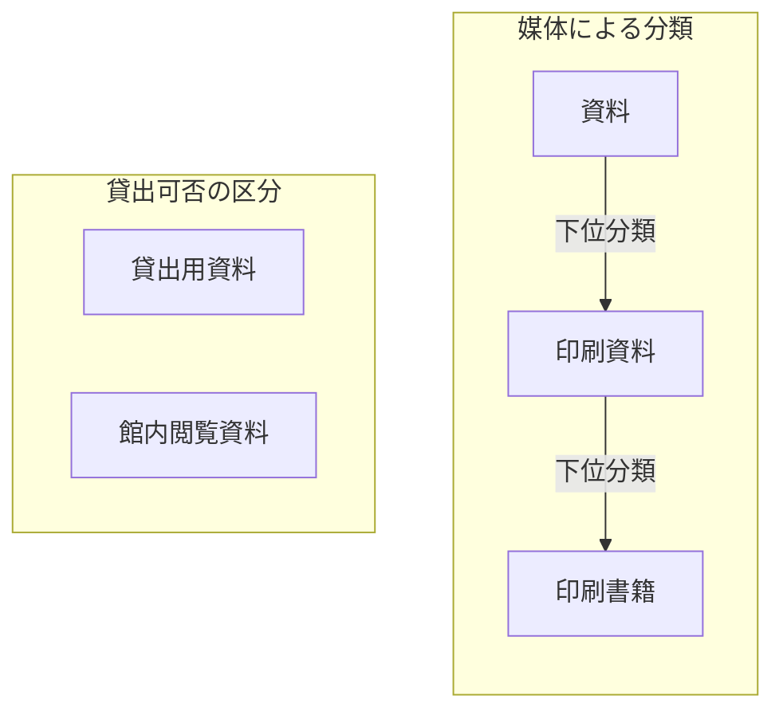

# 第2章：知識を整理するさまざまな方法

更新日：2026-10-02。執筆とレビューの状況は[README](../../README.md)で確認できる。

## この章の到達点

知識の整理には、言葉をそろえる方法、対象を分類する方法、関係や意味を定める方法がある。図書室の例でそれぞれの役割を比べ、目的に合う方法を選べるようになる。貸出可否を確認する場合には、関係図・条件表・手順をどう組み合わせるかも考える。

## 用語集と統制語彙：言葉をそろえる

担当者によって「貸出用資料」の意味が違うと、同じ言葉で話していても認識がずれる。**用語集**は、こうした言葉の意味を説明するために使う。この図書室では「貸出用資料」を「利用者が所定の手続きで館外へ借り出せる資料」と定めることにしよう。

意味が同じでも、担当者によって「貸出資料」「貸出用資料」と違う表記を使うことがある。**統制語彙**は、登録や検索に使う名称を決め、別名との対応を管理する。例えば、登録には「貸出用資料」を使い、「貸出資料」でも検索できるようにする。

| 概念ID | 登録に使う名称 | 検索に使える別名 | この図書室での定義 |
|---|---|---|---|
| K-01 | 貸出用資料 | 貸出資料 | 所定の手続きで館外へ借り出せる資料 |
| K-02 | 館内閲覧資料 | 閲覧専用資料 | 館内で読むための資料。館外へは貸し出さない |

K-01とK-02は概念のIDであり、特定の一冊を表す蔵書IDとは違う。この表は教材用に作った語彙表である。運用では、同じ意味かどうかを担当者が確認してから別名を対応付ける。「参考資料」は用途を示す名称かもしれず、似た言葉というだけで「館内閲覧資料」の別名にはできない。

用語集と統制語彙は併用できる。用語集で意味を定め、統制語彙で登録・検索に使う名称をそろえる。ただし、どちらも特定の蔵書が今貸出中かどうかは示さない。個別の状態は台帳などで確認する。

## 分類体系：対象を分けて探す

**分類体系**は、対象を分ける区分と、その基準を整理したものである。例えば資料を媒体で分けるなら、「資料」の中に「印刷資料」があり、その中に「印刷書籍」があるという階層を作れる。こうした階層的な分類は**タクソノミー**とも呼ばれる。

図は分類体系の一部を示している。「下位分類」は、より範囲の狭い分類を表す。印刷書籍は印刷資料の一種である。一方、貸出可否は別の分類基準である。同じ印刷書籍でも、館外へ貸せる本と館内でしか読めない本がある。一冊を「印刷書籍」と「館内閲覧資料」の両方に分類してもよい。

分類と、本の構成や操作の順番も区別する。

| 表す関係 | 例 | 意味 |
|---|---|---|
| 分類 | 印刷書籍は印刷資料の一種 | 印刷書籍に属する本は印刷資料にも属する |
| 構成 | 目次は本の一部 | 本には目次という部分がある |
| 操作の順番 | 貸出申込みの次に受付内容を確認する | 申込みの後に確認の操作を行う |

「一部」と「一種」を混ぜると、目次まで印刷資料の一種だと扱うおそれがある。図の矢印には、何の関係を表すかを付ける。

## シソーラス：関連する言葉から検索を広げる

**シソーラス**は、検索や索引に使う用語・概念を、階層や関連関係で整理したものである。別名だけでなく、検索を広げるための関係も扱う。例えば「資料保存」で調べる人に、関連する概念として「修復」を示せる。修復は関連する活動だが、資料保存の別名ではない。

**SKOS**（Simple Knowledge Organization System）は、このような概念や名称、上位・下位・関連の関係を機械で共有するための標準的な語彙である。序章で紹介したRDFを使い、主語・述語・目的語の組で表す。[W3C SKOS Primer §2](https://www.w3.org/TR/skos-primer/#secskosessentials)

検索用の上位・下位関係は、常に「一種」を表すわけではない。SKOSでは、全体と部分の関係を表す用途も想定されている。分類の判断にも使うなら、その関係が何を意味するかを別途明らかにする必要がある。[W3C SKOS Primer §2.3](https://www.w3.org/TR/skos-primer/#secsemanticrelations)

## 概念モデル・DBスキーマ・オントロジー

この三つは、いずれも対象や関係を整理するために使える。ただし、主に決める内容が違う。第1章の蔵書A-017、利用者U-03、貸出L-08を使って比べよう。

### 概念モデル：何を扱い、どう結ぶか

**概念モデル**は、扱うものや出来事の種類と、その関係を整理したものである。図書室なら、蔵書・利用者・貸出を扱う。「一回の貸出には、貸した本と借りた人が対応する」と定め、第1章のようにL-08をA-017とU-03に結ぶ。

この整理では、貸出という出来事をどこまで分けて扱うかも決める。例えば、一回の貸出が一冊を扱うのか、複数冊をまとめて扱うのかで関係の設計が変わる。概念モデルは、こうした認識を担当者どうしで共有するために使う。

### DBスキーマ：データをどう保存するか

**データベース（DB）のスキーマ**は、保存するデータの構造を定める。例えば蔵書・利用者・貸出をそれぞれ表に保存するなら、次のような項目を決める。

| 表 | 保存する項目の例 |
|---|---|
| 蔵書 | 蔵書ID、書名 |
| 利用者 | 利用者ID、氏名 |
| 貸出 | 貸出ID、蔵書ID、利用者ID、開始日、返却日 |

貸出の行には、貸した本と借りた人のIDを保存する。どの項目で一行を識別するか、返却前は返却日を空欄にできるか、実在する蔵書IDだけを参照できるようにするか、といった決まりも設ける。データの構造には概念モデルを反映できるが、貸出上限の確認手順まで自動的に決まるわけではない。

### オントロジー：概念や関係の意味を定める

**オントロジー**では、共有する概念や関係の意味を明示する。例えば「印刷書籍は印刷資料の一種」と定義する。この定義があれば、印刷書籍に分類した蔵書A-017は印刷資料でもあると判断できる。

このように対象を分類する区分を**クラス**、区分に属する特定の対象を**個体**と呼ぶ。この例では「印刷書籍」がクラスで、蔵書A-017が個体である。

**OWL**（Web Ontology Language）は、こうした定義を機械で扱うための言語である。OWLでは「印刷書籍は印刷資料の一種」のように、意味の前提となる決まりを**公理**として記述できる。機械は公理と個別の事実を使い、A-017が印刷資料に属することなどを導く。これを推論と呼ぶ。詳しい定義は第4章、推論の仕組みと限界は第5章で学ぶ。[W3C OWL 2 Primer §3](https://www.w3.org/TR/owl2-primer/#Basic_Notions)

SKOSで検索用の概念どうしを結ぶことと、OWLで個体の分類を導くことは役割が違う。SKOSの上位・下位関係を登録しただけで、この例のクラスの定義と同じ推論ができると考えない。[W3C SKOS Primer §5.2](https://www.w3.org/TR/skos-primer/#secskosowl)

### 分類・データの検査・業務上の判断

「定義に従って分類する」「データの不足を検査する」「申込みを受け付けるか決める」は、何を確かめるかが違う。

| 作業 | 確かめること | 例 |
|---|---|---|
| 分類の推論 | 定義から、対象がどのクラスに属するかを導く | 印刷書籍のA-017は印刷資料でもある |
| データの検査 | 保存したデータが必要な条件を満たすか調べる | 貸出の行に利用者IDが入っているか |
| 業務上の判断 | 申込みが業務規則を満たすか確認する | 現在の冊数と今回の冊数の合計が上限以内か |

データに必要な項目や値の条件は、**データ制約**と呼ぶ。例えば「貸出の行には利用者IDが必要」はデータ制約である。実装ではこれらの仕組みを組み合わせることもあるが、分類ができることだけでデータの欠落や貸出可否まで確認できるわけではない。

## 関係図・条件表・手順を組み合わせる

一つの方法ですべてを表す必要はない。貸出上限の確認には、関係図・条件表・手順を組み合わせられる。**条件表**は、判断に使う値と、条件ごとの結果を対応付けた表である。

第1章の上限3冊の規則を条件表にすると、次のようになる。

| 確認する値 | 条件 | 上限の確認結果 |
|---|---|---|
| 貸出確定直前に借りている冊数＋今回借りる冊数 | 合計が3冊を超える | 上限を超えるので、今回の申込みを受け付けない |
| 同じ二つの冊数の合計 | 合計が3冊以下 | 上限以内。借りたい本の貸出状況など、ほかの条件も確認する |

関係図では、どの貸出で誰がどの本を借りたかを示す。条件表では、冊数の合計によって結果がどう変わるかを示す。手順では、受付担当者が「申込者を確認する → 必要な冊数を取得する → 確定前に上限を確認する」という順序で作業することを示す。

序章の画面フローでも同じ分担を考えられる。関係図には、Bの分岐とC/Dの業務判断がAのどの入力を使うかを示す。条件表には、C/Dを選ぶ条件やエラーになる条件を書く。手順には、ログインから画面操作までの順番を書く。ただし、具体的な分岐・エラー条件とログイン後の経路は未定なので、今は実行できるテスト手順を完成させられない。

関係や規則を定義した後には、それを使う検索・判定・操作の仕組みが必要になる。また、定義した手順どおりにシステムが動くかは、実際に操作して確認する。

## 目的に応じて整理方法を選ぶ

表現や意味の決まりを明示し、機械でも扱える形にしていくことを**形式化**と呼ぶ。どこまで細かく定めるかは、知りたいことや任せたい処理に合わせて決める。

| 困っていること | 出発点にする方法 | 設計で確認すること |
|---|---|---|
| 人によって言葉の意味が違う | 用語集 | 定義する範囲と、内容に合意する担当者 |
| 表記の違いで検索から漏れる | 統制語彙 | 別名として扱う語が同じ意味か |
| 多数の資料を分類して探したい | 分類体系 | 分類基準と、一つの資料が複数の分類に属してよいか |
| 関連する概念へ検索を広げたい | シソーラス | どんな関係を検索に使うか |
| 本・人・貸出の対応を共有したい | 概念モデル・関係図 | 何を一つの対象や出来事として扱うか |
| 保存する項目と参照の決まりを設けたい | DBスキーマ・データ制約 | 必須項目、参照先、更新時の扱い |
| 定義を使って対象の分類を導きたい | OWLなどで表したオントロジー | 定義の妥当性と、使う仕組みが行える推論 |
| 条件ごとの結果と操作順を整理したい | 関係図・条件表・手順 | 使う値、確認するタイミング、条件ごとの結果 |

これらは併用でき、後ろの方法ほど優れているという順序でもない。担当者が用語集と対応表を見れば作業できるなら、その形から始めてよい。機械に任せる処理を増やすときには、処理に必要な定義と確認方法を追加する。

## 復習

- 用語集と統制語彙は、それぞれ何をそろえるために使うか。
- 「印刷書籍」と「館内閲覧資料」の両方に一冊を分類できるのはなぜか。
- 分類の推論、データの検査、業務上の判断では、それぞれ何を確かめるか。
- 関係図・条件表・手順は、貸出上限の確認でどのように役割を分担するか。

## 演習と解答例

次の要求に合う整理方法を選び、追加で確認することを挙げる。

1. 「閲覧専用資料」でも「館内閲覧資料」でも検索したい。
2. 印刷書籍として登録した蔵書を、印刷資料としても扱いたい。
3. 利用者IDがない貸出データを見つけたい。
4. 今回の申込みによって、利用者が借りている本の合計が上限を超えるか確認したい。

解答例：

1. 統制語彙で別名を対応付ける。二つの名称がこの図書室で同じ意味かを確認する。
2. 分類体系で「印刷書籍は印刷資料の一種」と定める。機械に分類を導かせるなら、その定義を処理できる表現と推論の仕組みを用意する。
3. 「貸出データには利用者IDが必要」というデータ制約を設け、検査する。どの貸出データを検査するかも決める。
4. 利用者と貸出の対応から現在の冊数を調べ、今回の冊数と合わせて条件表で上限を確認する。貸出確定の直前の値を使い、ほかの貸出条件も確認する。

前：[第1章](01-knowledge-representation.md) ／ 続き：第3章「ナレッジグラフの基礎」（未執筆。計画は[編集計画](../EDITORIAL_PLAN.md)を参照）
