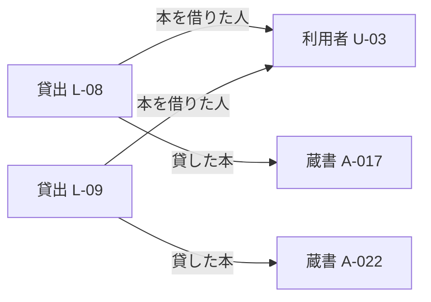
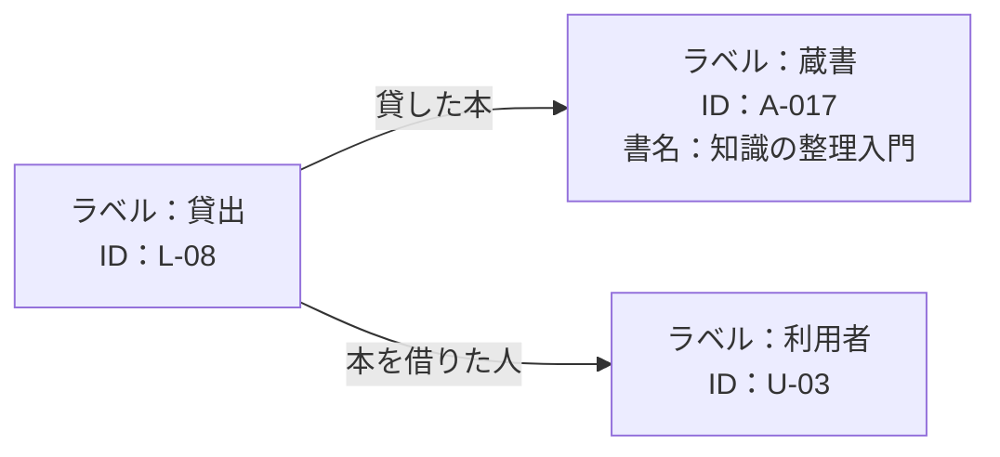
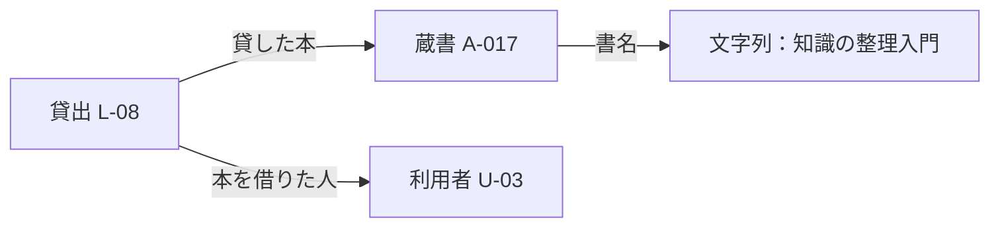
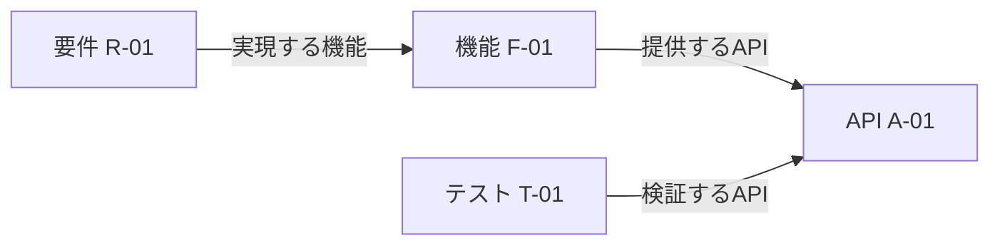

# 第3章：ナレッジグラフの基礎

更新日：2026-10-05。執筆とレビューの状況は[README](../../README.md)で確認できる。

## この章の到達点

関係の種類と向きを確かめながら、複数の対象をたどって問いに答えられるようになる。同じ貸出の記録をプロパティグラフとRDFで表し、対象・関係・値をどこに置くかを比べる。さらに、別々の記録を結ぶときに必要な確認と、表や文書検索で十分な場合を説明できるようになる。

## 点と線で知識を表す

第1章では、一回の貸出を本や利用者と区別した。貸出L-08では利用者U-03に蔵書A-017を貸した。ここではもう一件、U-03に蔵書A-022を貸した出来事をL-09として加える。いずれも架空の図書室Aの台帳にある記録である。

この図の点に当たるものを**ノード**、点を結ぶ線を**エッジ**と呼ぶ。ノードには本や人だけでなく、貸出のような出来事も置ける。ここではエッジに矢印と関係の名前を付けている。「貸出L-08 → 本を借りた人 → 利用者U-03」と読めば、その線が述べる内容が分かる。

点と線でつながりを表す構造が**グラフ**である。この章のグラフは、数値の増減を示す折れ線グラフとは用途が違う。対象間のつながりを表している。ノードとエッジという呼び方は[Neo4jのグラフ概説](https://neo4j.com/docs/getting-started/appendix/graphdb-concepts/)でも使われている。

本資料では、対象を識別し、意味の定まった関係で結んだ知識の集合を**ナレッジグラフ**と呼ぶ。図書室の例なら、一冊の蔵書、一人の利用者、一回の貸出を区別し、「どの貸出で誰にどの本を貸したか」を記録する。関係をたどると、離れた記録を組み合わせて問いに答えられる。

ナレッジグラフは図として眺めるだけでなく、機械で問い合わせる形にもできる。本文の図は説明用の表示であり、図の配置そのものを保存する必要はない。機械で使う場合は、対象のIDと関係などをデータとして記録する。表現方式や問い合わせに加えて、対象の同一性や文脈も重要な論点となる。[Hoganらの概説論文「Knowledge Graphs」](https://arxiv.org/abs/2003.02320)

## 関係の種類と向きを選んでたどる

「この台帳でU-03に貸した本はどれか」という問いを考える。図にはU-03から本へ直接向かう線がない。それでも、貸出を経由すれば本を探せる。

1. 「本を借りた人」の線がU-03に向かっている貸出を探す。該当するのはL-08とL-09である。
2. 二つの貸出から「貸した本」の線をたどる。A-017とA-022に着く。
3. この台帳に記録された該当の本として、A-017とA-022を答える。

複数の線をたどってつながる道筋を**経路**と呼ぶ。U-03からL-08を経由してA-017へ進む経路では、最初の線を矢印と逆向きにたどり、次の線を矢印の向きにたどっている。探索する向きと、関係を記述した矢印の向きは分けて考える。

逆向きに探しても、線の意味は変わらない。「L-08で本を借りた人がU-03」という記録を使って、U-03に対応する貸出を探している。第2章のOWLによる推論のように、新しい関係を導いて追加する作業はこの探索に必要ない。

探索では、どの関係を何回たどるかを決める。線があるという理由だけですべての関係をたどると、問いと無関係な対象も結果に混ざる。「本を借りた人」から貸出を探し、「貸した本」から蔵書を探すという手順が、この問いに対応する。

なお、この図には返却状況や日時を載せていない。「U-03が現在借りている本」を知りたい場合は、各貸出の返却状況と確認日時も必要になる。過去の貸出も含む台帳と、現在の貸出だけを集めた結果は区別する。

## 関係とともに残す情報

知識を再利用するには、線をつなぐほかにも準備が必要である。図書室の例では、次の情報をそろえる。

| 残す情報 | 図書室の例 | 必要な理由 |
|---|---|---|
| 対象のID | 図書室Aの蔵書A-017、利用者U-03、貸出L-08 | 名前が似ていても別の対象を区別する |
| 対象の種類 | 蔵書、利用者、貸出 | 本のIDと出来事のIDを取り違えない |
| 関係の意味と向き | 貸出から、その貸出で借りた利用者へ結ぶ | 「誰が何をしたか」を同じ読み方で解釈する |
| 属性の値 | A-017の書名は「知識の整理入門」 | 本の特徴を表示したり条件に使ったりする |
| 状態が表す日時 | L-08は10月1日10時現在、返却未確認 | 古い状態を現在の状態として使わない |
| 出典 | 図書室Aの貸出台帳の該当行 | 誤記や更新漏れを元の記録で確認する |

「本を借りた人」「貸した本」の定義は第2章で扱った。定義は、個別の記録を書くときの共通の言葉になる。オントロジーで定義を共有することと、その言葉を使って個別の貸出を記録することを組み合わせられる。すべてのナレッジグラフにOWLでの記述が必須という意味ではない。

出典や日時は、グラフの中に記録する方法も、別の管理表と対応付ける方法もある。どの線や値がどの記録に基づくかを取り出せることが大切である。具体的な管理方法は第8章で扱う。

## 対象の同一性を確かめて情報を結ぶ

別々の台帳を合わせるときは、二つの記録が同じ対象を指すかを確かめる。書名の一致だけでは、一冊の本を特定できない。

例えば、図書室Aと図書室Bに次の記録があるとする。

| 記録元 | 蔵書ID | 書名 | この例で分かっていること |
|---|---|---|---|
| 図書室Aの蔵書台帳 | A-017 | 知識の整理入門 | 図書室Aが所蔵する一冊 |
| 図書室Bの蔵書台帳 | A-017 | 知識の整理入門 | 図書室Bが所蔵する別の一冊 |
| 図書室Aの貸出台帳 | A-017 | 知識の整理入門 | IDは図書室Aの蔵書台帳を参照する決まり |

最初の二行は書名もIDの文字列も同じだが、別々の本を記録している。一つのノードにまとめると、図書室Aの貸出を図書室Bの本にも結び付けてしまう。

一行目と三行目は同じ一冊に対応付けられる。貸出台帳の蔵書IDがどの台帳を参照するかが決まっているためである。共通のノードを使えば、蔵書台帳の書名と貸出台帳の貸出状況を、その一冊の情報として組み合わせられる。

IDを持たない文書や、別のIDを使うシステム間では、対応表や担当者の確認などが必要になる。対応を確かめられない記録は、同じ対象だと決めつけずに残す。また、作品そのものと物理的な一冊は別の対象である。同じ作品の情報を共有したくても、二冊の貸出状況まで一つにまとめることはできない。

統合後も記録元を残す。例えば同じ貸出について二つの記録が「返却済み」と「返却未確認」に分かれていれば、出典と日時を比べて確認する。つながる形に整理するだけでは、どちらの記録が正しいかは決まらない。

## 同じ貸出をPGとRDFで表す

序章で紹介したプロパティグラフとRDFを、貸出L-08の例で比べる。今回は構造を比べるため、次の内容だけを表す。日時や返却状況は図から省く。

- L-08は貸出の出来事であり、A-017は一冊の蔵書、U-03は一人の利用者である。
- L-08で貸した本はA-017、本を借りた人はU-03である。
- A-017の書名は「知識の整理入門」である。

### プロパティグラフ：ノードやエッジに属性を持たせる

**プロパティグラフ**（Property Graph、PG）では、ノードとエッジで対象間のつながりを表し、名前や数値などの属性も持たせる。ここではNeo4jのモデルに沿い、ノードに種類を示す**ラベル**、エッジに関係の種類を付ける。[Neo4jのPG概説](https://neo4j.com/docs/getting-started/appendix/graphdb-concepts/)

この表し方では、書名は蔵書ノードの属性である。書名のために別のノードを作る必要はない。図には使っていないが、PGではエッジにも属性を持たせられる。例えば関係を確認した日をエッジの属性に置く方法がある。

ノードにどのラベルを付けるか、IDや書名をどの属性に置くかは設計で決める。ラベルに「蔵書」と付けるだけで、第2章のOWLの公理と同じ推論が行われるわけではない。利用する仕組みと、そこに与えた定義を確認する。

### RDF：一つずつの文を主語・述語・目的語で表す

**RDF**（Resource Description Framework）は「主語・述語・目的語」の三つ組で記述する方式である。三つ組を**トリプル**と呼ぶ。述語は「貸した本」「書名」など、その文が述べる関係を表す。対象間の関係だけでなく、対象と文字列などの値の対応も同じ形で書く。[W3C RDF 1.1 Primer §3.1](https://www.w3.org/TR/rdf11-primer/#section-triple)

| 主語 | 述語 | 目的語 |
|---|---|---|
| 貸出L-08 | 種類 | 貸出 |
| 蔵書A-017 | 種類 | 蔵書 |
| 利用者U-03 | 種類 | 利用者 |
| 貸出L-08 | 貸した本 | 蔵書A-017 |
| 貸出L-08 | 本を借りた人 | 利用者U-03 |
| 蔵書A-017 | 書名 | 文字列「知識の整理入門」 |

表は読み方を示す教材用の表記であり、実行用の構文ではない。「種類」の行は、RDFでは標準の関係 `rdf:type` を使って表せる。第2章で学んだクラスと個体の対応に当たる。

RDFのトリプルもグラフとして読める。次の図では、種類を示す三行を省き、本・利用者・書名へのつながりを描いている。

文字列や数値などの値はRDFでは**リテラル**と呼ぶ。図の書名はリテラルであり、同じ書名を持つ二冊を識別するIDではない。リテラルはトリプルの目的語に置く。[W3C RDF 1.1 Primer §3.3](https://www.w3.org/TR/rdf11-primer/#section-literal)

実際のRDFでは、名前を付けて識別する対象や述語に**IRI**（Internationalized Resource Identifier）を使う。WebのURLもIRIの一種である。例えば図書室Aの蔵書を `https://example.org/library-a/copy/A-017` と識別すれば、別の記録からもその識別子を使える。これは架空のIDの例であり、実在する本のページではない。IRIを付けても、別のIRIが同じ対象を指すかの確認は引き続き必要になる。[W3C RDF 1.1 Primer §3.2](https://www.w3.org/TR/rdf11-primer/#section-IRI)、[IRIの定義元：RFC 3987](https://www.rfc-editor.org/rfc/rfc3987)

### 二つの方式で、何が変わったか

| 比べる内容 | このPGの例 | このRDFの例 |
|---|---|---|
| 貸出・蔵書・利用者 | 三つのノードとして置く | 識別された対象としてトリプルに登場する |
| 対象の種類 | ノードのラベルに置く | `rdf:type` のトリプルで表す |
| 貸出から本・利用者への関係 | 種類付きのエッジで表す | 主語・述語・目的語で表す |
| 書名 | 蔵書ノードの属性に置く | 蔵書を主語、書名を述語、文字列を目的語にする |

どちらでも「L-08で貸した本の書名は何か」という問いに必要な情報を表せる。L-08からA-017を探し、書名を取り出せば「知識の整理入門」と分かる。

この小例を対応付けられることと、任意のPGをそのままRDFに変換できることは別である。例えばエッジに付けた属性をRDFへ移す場合は、その関係についての情報をどう表すかを決める必要がある。対応の設計は第6章、具体的な構文や問い合わせ言語は第9章で扱う。

## 開発の記録でも、関係を経由して探せる

図書室の例を開発の記録に置き換える。**API**（Application Programming Interface）は、ほかのソフトウェアから機能を呼び出すための窓口であり、呼び出し方の決まりを含む。ここでは、機能を利用する窓口をAPIとして区別し、そのAPIを呼び出して結果を確かめるテストを考える。[MDNのAPI解説](https://developer.mozilla.org/ja/docs/Glossary/API)

次の図では、要件R-01を機能F-01が実現し、機能F-01をAPI A-01が提供する。テストT-01はAPI A-01を検証する。IDはこの教材内で対象を区別するために付けたものである。

R-01を変更するときに見直すテストの候補を探すなら、R-01からF-01、A-01へ進む。その後、A-01を検証するテストを逆向きに探す。この記録からT-01が候補として見つかる。

T-01を候補にする理由は、R-01に対応する機能のAPIを検証しているためである。実際にT-01の期待結果を書き換えるかは、要件の変更内容とテストの検証内容を読んで決める。記録にないテストや対応の漏れもあり得る。経路は見直し候補を集める根拠になるが、候補の網羅性やテストの十分さは別に確かめる。

## 文書リンク・RDB・検索インデックスと比べる

同じ問いに答える方法はグラフだけではない。「U-03に貸した本の書名を調べたい」という問いで、整理の仕方を比べる。

| 整理の仕方 | 主に記録するもの | この問いに答える方法 |
|---|---|---|
| 文書とリンク | 説明文と参照先 | 利用者の記録から貸出の記録を開き、蔵書の記録で書名を読む |
| リレーショナルDB（RDB） | 表の行・列とIDによる参照 | 貸出表でU-03の行を選び、蔵書IDで蔵書表の行と組み合わせる |
| 全文検索インデックス | 文書中の語と、その語がある文書の対応 | U-03が書かれた文書を探し、貸出の記述と書名を確認する |
| ナレッジグラフ | 識別された対象、属性、意味付きの関係 | U-03に対応する貸出を探し、蔵書へ進んで書名を取り出す |

RDBは、データを表の形で扱うデータベースである。複数の表の行を条件に従って組み合わせる操作を**結合**と呼ぶ。貸出表と蔵書表も結合できるので、RDBでも対象間の関係を使って答えられる。[PostgreSQL 18の結合の説明](https://www.postgresql.org/docs/18/tutorial-join.html)

**検索インデックス**は、検索に使う対応を事前に整理したものである。ここでは全文検索を例にしており、文書に含まれる語から該当文書を探す。U-03という文字がある文書を見つけても、その文書が現在の貸出を述べるのか、過去の貸出を述べるのかは内容を確かめる必要がある。検索方式によっては、語以外の特徴も検索に使う。[PostgreSQL 18の全文検索の説明](https://www.postgresql.org/docs/18/textsearch-intro.html)

この表は、各方式が主に何を整理するかの比較である。文書リンクにも「検証対象」のような意味を持たせられる。ナレッジグラフのデータをRDBの表に保存することもできる。文書検索で出典を見つけ、グラフで対象間の対応を調べる組み合わせも考えられる。ナレッジグラフを採用することと、専用のグラフDBを採用することは同じ決定ではない。

## グラフを使う理由を、問いから考える

異なる種類の対象を何段階もたどる問いが繰り返し現れるなら、グラフとして整理する理由がある。例えば要件の変更から機能・API・テストへ進む問いと、テストの不具合から関連するAPI・機能・要件へ戻る問いを、共通の記録で扱いたい場合である。

一方、書名と棚番号の一覧から置き場所を探すだけなら、一つの表で答えられる。少数の文書を担当者が読み、参照リンクで必要箇所に進める場合も、その形で始められる。

グラフを維持するには、対象のIDをそろえ、関係の意味を定め、変更された記録を更新する作業が必要になる。まず答えたい問いを具体的に書き、手元の表や文書で答えてみる。そのうえで、どの対応付けを何度も手作業で行っているかを調べると、グラフへ整理する範囲を決めやすい。

問い合わせの速さや作業時間が改善するかは、実際のデータと処理で比較する。図が描けることだけを導入効果の証明にはしない。比較評価は第16章で扱う。

## 復習

- U-03に対応する本を探すとき、どの関係をどの向きにたどったか。
- 同じ書名とIDの文字列を持つ二つの記録でも、別々のノードにするのはどのような場合か。
- PGとRDFでは、書名と対象の種類をそれぞれどこに置いたか。
- 要件からテストへの経路が見つかった後、テストの修正を決めるには何を確認するか。
- グラフの採用と専用グラフDBの採用を分けて考えられるのはなぜか。

## 演習と解答例

### 演習1：要件からテストを探す

要件R-02を機能F-02が実現し、F-02をAPI A-02とA-03が提供している。テストT-02はA-02を、T-03はA-03を検証する。T-04は別のAPI A-04を検証しており、R-02からA-04につながる記録はない。

R-02を変更するとき、本文と同じ探索方法で見直し候補に入るテストを挙げなさい。たどる関係と向きも説明し、候補が見つかった後に確認すべきことを一つ挙げなさい。

解答例：候補はT-02とT-03である。R-02から「実現する機能」でF-02へ進み、「提供するAPI」でA-02とA-03へ進む。次に「検証するAPI」の線を逆向きにたどると、T-02とT-03が見つかる。T-04はこの経路では見つからない。候補のテストを修正するかは、要件の変更内容と各テストの検証内容を読んで判断する。T-04についても、対応の記録が漏れている可能性まで否定できるわけではない。

### 演習2：書名の一致と対象の一致

図書室Aの台帳に蔵書A-021、図書室Bの台帳に蔵書A-021がある。書名はどちらも『分類の基礎』だが、二冊はそれぞれの図書室が別々に所蔵している。図書室Aの貸出台帳には「蔵書A-021を利用者U-07に貸した」とあり、貸出台帳の蔵書IDは図書室Aの蔵書台帳を参照する決まりである。

二つの蔵書台帳と貸出台帳を合わせるとき、蔵書のノードはいくつ必要か。貸出の記録をどの蔵書へ結ぶか、理由とともに説明しなさい。

解答例：蔵書のノードは二つ必要である。二冊は書名とIDの文字列が同じでも、別々の物理的な本だからである。貸出は図書室AのA-021へ結ぶ。参照する台帳が決まっているため、その貸出を図書室BのA-021へ結ぶ根拠はない。

### 演習3：書名を取り出すための表現

貸出L-10では利用者U-07に蔵書A-021を貸した。A-021の書名は『分類の基礎』である。返却状況や日時はこの演習では扱わない。

「L-10で貸した本の書名は何か」に答えるために、PGのノード・エッジ・属性を挙げなさい。RDFでは同じ問いに必要な内容を、日本語の主語・述語・目的語の組で書きなさい。対象の種類を示す記述は省略してよい。

解答例：PGではL-10とA-021をノードにし、L-10からA-021へ「貸した本」のエッジを結ぶ。A-021の属性に書名「分類の基礎」を置く。RDFでは「貸出L-10・貸した本・蔵書A-021」と「蔵書A-021・書名・文字列『分類の基礎』」を記述する。どちらも貸出から蔵書を特定し、その書名を取り出せる。U-07の情報は今回の問いの答えには使わないが、貸出記録全体を表すなら借りた人との関係も加える。

### 演習4：表で十分か、グラフを検討するか

担当者が行う作業を二つ考える。一つ目は、100冊の本の書名から棚番号を調べる作業である。書名・蔵書ID・棚番号は一つの表にそろっている。二つ目は、要件の変更ごとに関連する機能・API・テストを探す作業である。逆にテストの不具合から要件へ戻る調査も繰り返している。

それぞれ、まずどのような整理で始めるかを説明しなさい。二つ目でグラフを検討する場合、採用前に確認したいことも一つ挙げなさい。

解答例：一つ目は既存の表から始める。必要な値が一つの表にあり、蔵書を特定して棚番号を読めば答えられる。二つ目は意味付きの関係を共通に記録するグラフを検討する。異なる種類の対象を複数段階でたどる調査を繰り返すためである。ただし、既存の対応表とRDBの問い合わせで十分か、関係の更新を誰が担うかなどを確認してから決める。

前：[第2章](02-knowledge-organization.md) ／ 続き：第4章「オントロジーの基礎」（未執筆。計画は[編集計画](../EDITORIAL_PLAN.md)を参照）
