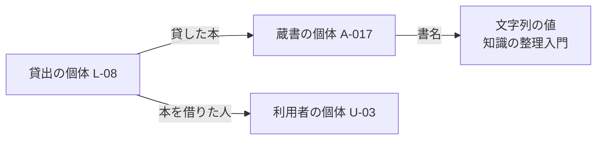
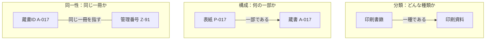
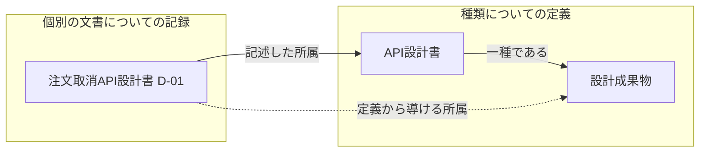

# 第4章：オントロジーの基礎

更新日：2026-10-06。執筆とレビューの状況は[README](../../README.md)で確認できる。

## この章の到達点

クラスと個体を区別し、属性や関係の意味を説明できるようになる。図書室の例を使い、「ある種類に属する」「全体の一部である」「同じ対象である」の違いを確かめる。さらに、定義と個別の事実から何が導けるかを考え、オントロジーをどこまで詳しく記述するか判断する。

## オントロジーで何を定義するか

第2章では、図書室の「蔵書」「利用者」「貸出」と、それらを結ぶ関係を定義した。例えば「貸出」は一冊を一人に貸してから返却されるまでの一回の出来事である。この定義を共有すれば、三冊をまとめて借りる申込みでも、貸出は三回として数えることが分かる。

**オントロジー**は、ある領域の知識を記述するために、概念・属性・関係の意味と、それらについて成り立つ決まりを明示したものである。本資料では第2章と同じ広い定義を使う。人が読む言葉による説明から、論理的な意味を定めた言語による記述までを扱う。[Gruberによるオントロジーの定義](https://tomgruber.org/writing/definition-of-ontology.pdf)

図書室のオントロジーなら、次のような内容を定義できる。

| 定義すること | 図書室での例 | 定義を使って確かめられること |
|---|---|---|
| 何を一つとして扱うか | 蔵書は図書室が所蔵する物理的な一冊 | 同じ書名でも二冊あれば別々に扱う |
| 属性や関係は何を表すか | 「貸した本」は貸出の出来事と、そのとき貸した蔵書を結ぶ | 貸出IDからどの一冊を貸したかを調べる |
| 種類どうしはどう関係するか | 印刷書籍は印刷資料の一種 | 印刷書籍に属する蔵書は印刷資料にも属する |

概念モデルを作るときにも、蔵書や貸出、関係の意味を定める。概念モデルとオントロジーは内容が重なる。本章では両者を分ける境界を探すより、定義に何を含め、その定義をどう利用するかを具体化する。

## クラスと個体：種類と、個別のもの

「印刷書籍」は本の種類を表す。「蔵書A-017」は図書室Aにある特定の一冊を表す。第2章で紹介した**クラス**と**個体**は、この区別に使う言葉である。

| 用語 | 表すもの | この章での例 |
|---|---|---|
| クラス | 対象を分類する区分 | 印刷書籍、印刷資料、利用者、貸出 |
| 個体 | 個別に扱うものや出来事 | 蔵書A-017、利用者U-03、貸出L-08 |

個体は物や人に限らない。貸出L-08のような出来事も個体として表せる。L-08は、U-03にA-017を貸した一回の出来事を識別する。

「A-017は印刷書籍に属する」は個体の分類である。「印刷書籍は印刷資料の一種」はクラスどうしの関係である。後者の関係では、印刷書籍を印刷資料の**下位クラス**、印刷資料を印刷書籍の**上位クラス**と呼ぶ。

実線は記述した所属と定義を表す。点線は、その二つから導ける所属を表す。A-017が印刷書籍に属し、印刷書籍が印刷資料の一種なら、A-017は印刷資料にも属する。クラスと個体をこのように使う考え方はOWLにもある。[W3C OWL 2 Primer §4.1–4.2](https://www.w3.org/TR/owl2-primer/#Classes_and_Instances)

一冊が複数のクラスに属する場合もある。例えば、印刷された本を館内閲覧専用にするなら、その一冊は「印刷書籍」と「館内閲覧資料」の両方に属する。媒体による分類と貸出用途による分類を併用しているためである。

「館内閲覧資料」という名前は、館内で読む用途を示している。しかし、名前だけでは館外への貸出を認めるかどうかまでは明確にならない。この図書室では館外へ貸し出さない資料をこのクラスに分類するため、定義にも「館内で読むための資料であり、館外へは貸し出さない」と明記する。名前から読み取れる用途に加え、貸出を認めない条件まで定義に含めることで、モデルを使う人が同じ基準で分類できる。

## プロパティ：属性や関係を記述する

第1章では、蔵書の書名を属性、貸出と蔵書のつながりを関係として説明した。OWLでは、個体どうしの関係や、個体と値の対応を表すために**プロパティ**を使う。次の二種類を区別する。[W3C OWL 2 Structural Specification §5.3–5.4](https://www.w3.org/TR/owl2-syntax/#Object_Properties)

| OWLでの呼び方 | 結ぶもの | 例 |
|---|---|---|
| オブジェクトプロパティ | 個体と個体 | 貸出L-08 → 貸した本 → 蔵書A-017 |
| データプロパティ | 個体と文字列・数値などの値 | 蔵書A-017 → 書名 → 「知識の整理入門」 |

書名の文字列は一冊の本そのものではない。同じ文字列を持つ二冊もある。貸出でどの一冊を貸したかを示すには、書名の値ではなく蔵書の個体を結ぶ。

プロパティを定義するときは、名前だけでなく、何と何をどちらの向きに結ぶかも説明する。「貸した本」なら、貸出の出来事から、その貸出で貸した蔵書へ向かう。逆に蔵書から過去の貸出を調べるときは、第3章のように関係を逆向きにたどれる。

第3章のPGで「プロパティ」と呼んだのは、点や線に付ける書名などの属性だった。OWLのプロパティには、個体どうしを結ぶ関係も含まれる。同じ言葉でも、表現方式に応じて使われる範囲が違う。

## 分類・構成・同一性を分ける

「印刷書籍は印刷資料の一種」と「表紙は本の一部」は違う関係である。さらに「二つのIDが同じ一冊を指す」は、種類や構成とは別の話である。次の図で比べる。

図の「表紙P-017」はA-017の表紙を指す教材用の個体である。「管理番号Z-91」は、別の台帳でA-017と同じ一冊に付けた番号とする。

| 関係 | この例から言えること | この例からは言えないこと |
|---|---|---|
| 分類 | 印刷書籍に属するものは印刷資料にも属する | 印刷資料がすべて印刷書籍である |
| 構成 | P-017はA-017を構成する部分である | 表紙が印刷書籍の一種である |
| 同一性 | A-017とZ-91についての記録を同じ一冊の記録として照合できる | 同じ書名のほかの蔵書も、その一冊と同じである |

分類の関係は、あるクラスに属するものが別のクラスにも属することを述べる。構成の関係は、部分と全体を結ぶ。例えば「表紙は本の一部」という定義から、表紙を本として数えることはできない。

同一性は、二つの呼び方や識別子が同じ対象を指すという主張である。書名の一致だけではその根拠にならない。台帳の対応記録や現物の管理番号などを確認して判断する。

OWLでも、個体が同じであることと、別々であることを明示できる。異なるIDを使っているだけで、OWLが必ず別の個体だと判断するわけではない。同じ個体だと記述すれば、片方についての事実はもう片方についても成り立つ。同一性の記述は、単に「関連がある」と結ぶより強い主張になる。[W3C OWL 2 Primer §4.7](https://www.w3.org/TR/owl2-primer/#Equality_and_Inequality_of_Individuals)

## 公理と形式的な意味

### 成り立つとする内容を明示する

第2章で紹介した**公理**は、モデルの中で成り立つとする文である。OWLでは「印刷書籍は印刷資料の一種」という一般的な定義も、「A-017は印刷書籍に属する」という個別の事実も、公理として記述できる。[W3C OWL 2 Structural Specification §9](https://www.w3.org/TR/owl2-syntax/#Axioms)

ここでは次の二つを前提にする。

1. 印刷書籍に属するものは、すべて印刷資料にも属する。
2. 蔵書A-017は印刷書籍に属する。

この二つが成り立つなら、A-017が印刷資料に属することも成り立つ。一方、「印刷資料に属する」という事実だけから、印刷書籍に属するとまでは言えない。印刷資料には書籍以外も含められるからである。

### 「一種」を対象の集合として読む

**形式的な意味**とは、記述をどう解釈するかを、決められた規則で明確にしたものである。例えばOWLで下位クラスを記述するときは、クラスを個体の集合として読む。「印刷書籍は印刷資料の下位クラス」は、「印刷書籍に属する個体の集合が、印刷資料に属する個体の集合に含まれる」という意味になる。[W3C OWL 2 Direct Semantics §2.3.1](https://www.w3.org/TR/owl2-direct-semantics/#Class_Expression_Axioms)

この意味は、現在登録されている蔵書だけについての説明ではない。後から印刷書籍として追加した蔵書にも適用する。人やプログラムが「一種」という線をどう読むかを、そのつど推測する必要がなくなる。

図で二つの箱を線でつないだだけでは、その線が分類なのか構成なのか分からない。関係名と定義を添えれば人が理解しやすくなる。さらにOWLなどで記述すれば、下位クラスの関係としてどんな結論が成り立つかも、言語の仕様に従って扱える。

### 定義と事実から導く

**推論器**は、記述された公理から論理的に導ける内容を求めるソフトウェアである。第2章のOWLの例では、「貸出で本を借りた人」と「利用者が本を借りた貸出」を互いに逆向きの関係として定義した。本章の分類も、定義と事実から新しい所属を導く例である。

推論器が分類を導いたとき、その前提となった定義や事実も確認できるようにする。例えばA-017を誤って印刷書籍に分類した場合、定義どおりに印刷資料だと導いても、元の分類は訂正が必要になる。公理は、現実について調査して正しさを保証したという意味ではない。

本章の図と文章は、公理の意味を説明するための表記である。実行用のOWL構文は第9章、推論とデータ検査の違いは第5章で扱う。

## オントロジーとナレッジグラフを組み合わせる

図書室の例から、開発成果物の分類に移ろう。教材では、設計内容を記した成果物を「設計成果物」と呼ぶ。「API設計書」はAPIの仕様を記した設計成果物の一種と定義する。「注文取消API設計書D-01」は特定の一つの文書であり、API設計書に分類して登録したとする。

オントロジーに分類の定義を置き、ナレッジグラフにD-01などの文書の所属を記録すれば、両者を組み合わせてD-01が設計成果物であると導ける。「設計成果物を探す」という問いに、API設計書として登録したD-01も含められる。

種類の定義をナレッジグラフの一部として記録する構成もある。また、第2章で説明したように、OWLのオントロジーには個別の事実も含められる。上の図は定義と個別の記録の役割を分けて見せているが、別々のファイルや製品に保存する指定ではない。

グラフに「API設計書 → 設計成果物」という線を登録するだけでは、使っている検索処理がD-01を設計成果物として含めるとは限らない。定義に沿って推論する仕組みや、下位の分類までたどる問い合わせが必要になる。どの方法で答えを得たかも区別して説明する。

## 目的に合わせて定義の詳しさを選ぶ

定義を共有する目的によって、必要な記述は変わる。図書室の担当者どうしで貸出の数え方をそろえたい場合と、複数のシステムで蔵書の分類を自動的に導きたい場合を比べよう。

| 利用したいこと | 用意する記述の例 | 確認すること |
|---|---|---|
| 担当者が同じ意味で貸出を数える | 用語の定義、関係図、一冊ごとの一回の貸出にIDを付ける例 | 三冊を借りる申込みを三回の貸出として数えるか |
| 登録や検索で名称をそろえる | 概念ID、登録名、別名の対応 | 別名が同じ意味を表しているか |
| プログラムが分類を導く | クラスへの所属と下位クラスの関係を、処理できる言語で記述 | 定義した意味に沿って必要な所属を導けるか |
| 複数のIDの記録を統合する | 各IDが何を指すかと、同じ個体であるという対応 | 同じ対象だと判断した根拠があるか |

定義を詳しくすると、それだけ説明・合意・保守の作業も増える。担当者が定義表を読んで仕事を進められるなら、その形から始められる。機械に分類を任せるなら、機械が扱える記述と、その記述を処理する仕組みを追加する。

例えば「貸出データに利用者IDが必ず書かれているか」を調べたいなら、記載を検査する条件を用意する。分類の公理を増やすこととは、用意する内容が違う。次章では、推論する内容とデータを検査する条件を同じ例で比べる。

## 復習

- 「貸出」というクラスと「貸出L-08」という個体は、それぞれ何を表すか。
- 「貸した本」と「書名」は、何と何を結ぶプロパティか。
- 「一種」「一部」「同じ対象」を混同すると、どのような誤りが起こるか。
- 下位クラスの定義と個体の所属から、何を導けるか。逆向きにも導けるか。
- 定義と個別の記録を同じグラフに保存しても、その役割を区別するのはなぜか。

## 演習と解答例

### 演習1：種類・一冊・部分を区別する

図書室では「印刷書籍は印刷資料の一種」と定義している。蔵書A-030は印刷書籍に属し、表紙P-030はA-030の一部である。

この説明に出てくるクラスと個体を挙げてみよう。A-030が印刷資料に属することは導けるか。また、P-030が印刷書籍に属することは導けるか。それぞれの理由を説明しよう。

解答例：クラスは印刷書籍と印刷資料である。個体は蔵書A-030と表紙P-030である。A-030は印刷書籍に属するため、下位クラスの定義から印刷資料にも属すると導ける。一方、P-030とA-030の関係は部分と全体の関係である。P-030がA-030の一部という説明だけでは、P-030を印刷書籍に分類できない。

### 演習2：関係を結ぶ相手を選ぶ

利用者U-12が蔵書A-030を借りた。その一回の貸出をL-20とする。A-030の書名は『分類の基礎』である。図書室には同じ書名の別の一冊もある。

L-20で貸した本、L-20で本を借りた人、A-030の書名を、OWLのオブジェクトプロパティとデータプロパティに分けてみよう。「L-20で貸した本は『分類の基礎』」と書名の文字列だけを記録すると、何が分からなくなるかも考えよう。

解答例：「貸した本」はL-20とA-030という個体を結ぶため、オブジェクトプロパティで表す。「本を借りた人」もL-20とU-12という個体を結ぶ。「書名」はA-030と文字列『分類の基礎』を対応付けるため、データプロパティで表す。貸した本を文字列だけで記録すると、同じ書名のどちらの一冊を貸したか区別できない。

### 演習3：定義から言える範囲を確かめる

教材の文書管理では「API設計書は設計成果物の一種」と定義している。D-01はAPI設計書に属する。別の文書D-02については、設計成果物に属することだけが分かっている。

この定義と事実から、D-01とD-02をそれぞれどのクラスに分類できるか考えよう。また、二つとも設計成果物なら同じ文書だと言えるか、理由を説明しよう。

解答例：D-01はAPI設計書に属し、下位クラスの定義から設計成果物にも属する。D-02は設計成果物に属するが、API設計書に属するとは限らない。設計成果物には別の種類の文書も含められる。同じクラスに属する二つの記録が、同じ個体を指すとも限らない。文書の同一性は、分類とは別に確認する必要がある。

### 演習4：何を共有し、何を機械に任せるか

二つの図書室が貸出件数を集計して比較しようとしている。一方の担当者は三冊を一度に借りる申込みを一件と数え、もう一方は一冊ごとの貸出を一件と数えていた。まずは両方の担当者が同じ数え方で集計できるようにしたい。将来は、印刷書籍として登録した蔵書を、プログラムが印刷資料としても分類する予定である。

今の集計のために何を定義すればよいか説明しよう。将来の自動分類には、どんな記述と仕組みを追加すればよいだろうか。

解答例：まず「貸出一件」が一冊ごとの貸出なのか、一度の申込みなのかをそろえる。一冊ごとに数えると合意したなら、貸出の定義と三冊の申込みを三件として数える例を共有する。担当者の集計には、定義表と具体例を使える。将来の自動分類には、蔵書のクラスへの所属と「印刷書籍は印刷資料の下位クラス」という定義を、プログラムが処理できる形で記述する。OWLを使う場合は、その公理から所属を導く推論器などを用意する。

前：[第3章](03-knowledge-graphs.md) ／ 続き：第5章「推論・制約・不確実性」（未執筆。計画は[編集計画](../EDITORIAL_PLAN.md)を参照）
