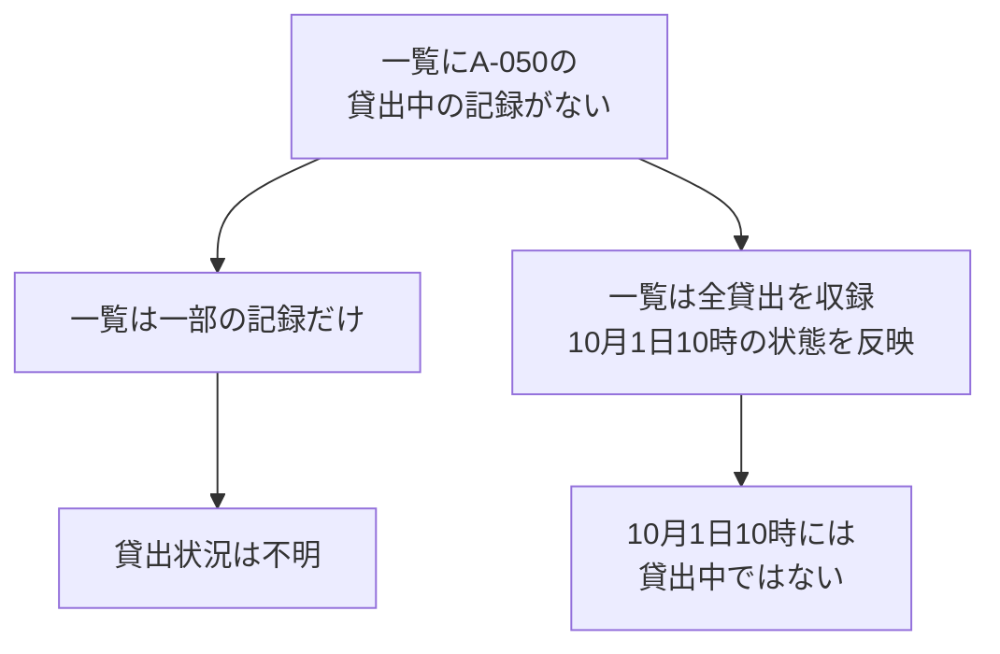
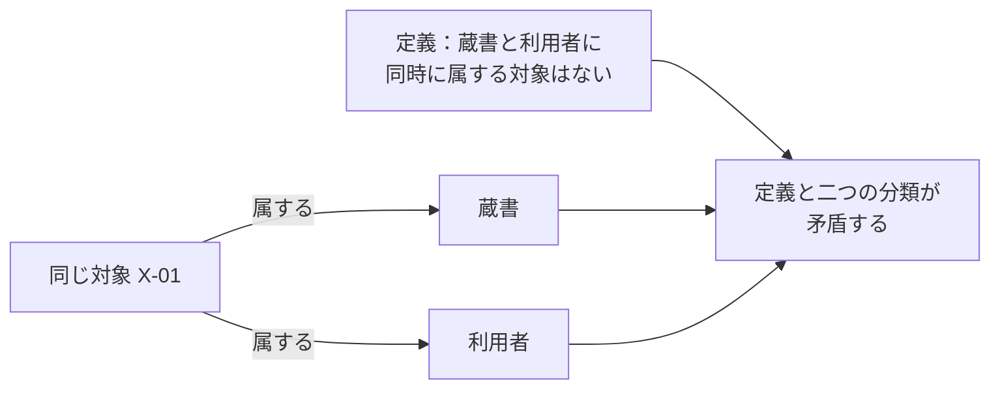
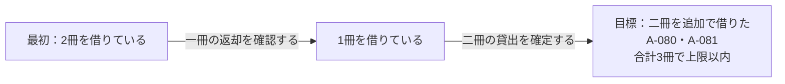

# 第5章：推論・制約・不確実性

更新日：2026-10-06。執筆とレビューの状況は[README](../../README.md)で確認できる。

## この章の到達点

記録から関係を探すこと、定義から結論を導くこと、データを検査すること、実行手順を組み立てることを区別する。記録が見つからないときに何を判断できるかも考える。図書室の例を使い、不明・否定・矛盾の違いと、値の日時や規則の適用条件を確認する。

## 同じ知識でも、答えたい問いによって仕事が変わる

第3章では貸出の関係をたどり、第4章では定義と個別の事実から分類を導いた。どちらも知識を使う仕事だが、答えている問いが違う。

| 仕事 | 答えたい問い | 図書室での例 |
|---|---|---|
| 関係探索 | 記録された関係をたどると何が見つかるか | U-03に対応する貸出L-08を探し、L-08で貸した蔵書A-017を調べる |
| 推論 | 定義と事実から何が導けるか | A-017は印刷書籍であり、印刷書籍は印刷資料の一種なので、A-017は印刷資料でもあると導く |
| データの検証 | 検査対象の記録が必要な条件を満たすか | 貸出記録に、借りた人を示す利用者IDが記載されているか調べる |
| 計画 | 目標を達成するには何をどの順に行うか | 上限を守ってさらに二冊借りるために、先に一冊を返却する手順を組み立てる |

本章の「検証」は、指定したデータを条件に照らして検査することを指す。実際のシステムを操作して動作を確かめるテストとは、確認する対象が違う。

関係探索と推論は組み合わせられる。例えば、推論で「印刷資料」に属すると分かった蔵書も検索結果に含める方法がある。計画にもグラフを使えるが、その場合は本と人の対応だけでなく、操作によって状態がどう変わるかを表す必要がある。

## 記録が見つからないとき、「不明」と「存在しない」を分ける

蔵書A-050の貸出状況を調べたいとする。10月1日10時の貸出一覧を検索したが、A-050を貸出中だと示す記録は見つからなかった。

この結果だけで「A-050は貸出中ではない」と言えるだろうか。答えは、一覧に何が収録されているかによって変わる。

一覧が一部の記録なら、A-050の貸出が収録されていない可能性がある。受付担当者は追加の情報を確認する必要がある。

一覧が当該図書室の貸出をすべて収録し、その日時の状態を正しく反映しているなら、受付担当者は「その日時には貸出中ではない」と判断できる。ただし、館内閲覧専用かどうかなど、貸出を認めるほかの条件は別に確認する。

**開世界仮定**は、記述された知識がすべてとは限らないという前提である。記述がなく、ほかの知識からも肯定や否定を導けなければ、その事柄は不明のまま残す。OWLはこの前提を採る。

**閉世界仮定**は、対象とする範囲の知識をそろえたものとして扱い、成立すると確認できない事柄を成立しないものとして扱う前提である。貸出一覧の例なら、図書室と日時を限定して「この一覧に全貸出がある」とみなすことが前提になる。この二つの仮定は、未記載の事実の扱いに関する違いである。[W3C OWL 2 Primer §2](https://www.w3.org/TR/owl2-primer/#What_is_OWL_2.3F)

開世界・閉世界のどちらを使うかは、データを表に保存するかグラフに保存するかだけでは決まらない。また、閉世界仮定を使う仕組みでも、元の一覧に漏れがあれば現実と違う結論になる。収録範囲と更新状況を確認する理由はここにある。

不明なときの対応も業務として決める。例えば、この図書室では貸出状況を確認できるまで申込みを保留すると定められる。「確認できないので保留する」という対応と、「貸出中だと確認できた」という事実は区別して記録する。

## 「借りた人がいる」と「借りた人が記載されている」は違う

第2章では、OWLによる推論と必須項目の検査を分けた。貸出L-30を使って、その違いを確かめよう。L-30は蔵書A-060を貸した一回の出来事である。データには次の二点だけが記載されているとする。

- L-30は貸出である。
- L-30で貸した本は蔵書A-060である。

借りた人の記載はない。このデータに、次の二つの決まりをそれぞれ使う。

| 決まり | 確かめること | 借りた人の記載がない場合 |
|---|---|---|
| すべての貸出には、少なくとも一人の借りた人がいる | 貸出と借りた人について、どんな状態が成り立つか | 記載されていない借りた人がいる状態も考えられる |
| 検査対象の貸出記録には、借りた人を示す関係を一つ以上記載する | 記録に必要な関係が実際にあるか | 必要な記載がないので、検査に違反する |

一つ目の決まりをOWLの公理として表すと、L-30には誰かが対応すると導ける。しかし、その人がU-03なのか、別の人なのかは分からない。この公理と上の二点だけなら、借りた人が未記載でも矛盾にはならない。存在を述べる公理は、特定の人のIDがデータに書かれていることまでは要求しない。[W3C OWL 2 Direct Semantics §2.2.3](https://www.w3.org/TR/owl2-direct-semantics/#Class_Expressions)

二つ目は、第2章で紹介したデータ制約である。**SHACL**（Shapes Constraint Language）は、RDFのデータを制約に照らして検査するための言語である。例えば、借りた人を示す関係が最低一つ必要という制約を記述できる。推論による補完を行わず、上の二点だけを検査対象にすれば、この制約への違反が見つかる。[W3C SHACL §4.2.1](https://www.w3.org/TR/shacl/#MinCountConstraintComponent)

この検査結果が示すのは、必要な関係の記載が足りないことである。現実に借りた人がいないと判明したわけではない。担当者は元の貸出台帳を調べ、対応する利用者を確かめてからデータを補う。利用者IDを推測で埋めてはいけない。

同じ区別はテストの根拠にも使える。「テストには検証する要件がある」と定義することと、「各テストのデータに要件IDを記載する」という制約を設けることは別である。後者を検査すれば、根拠をたどるための記載が足りないテストを見つけられる。

## 未知・否定・矛盾を区別する

蔵書A-071が印刷書籍かどうかを考える。同じ問いでも、次の四つの状態がある。

| 状態 | 得られた知識 | 判断できること |
|---|---|---|
| 肯定 | A-071は印刷書籍だと記載されている | 印刷書籍として扱う根拠がある |
| 否定 | A-071は印刷書籍ではないと明示されている | 印刷書籍に属さないとする根拠がある |
| 未知 | 印刷書籍かどうかの記載がなく、ほかの定義からも導けない | 開世界仮定では、肯定も否定も決まらない |
| 矛盾 | 同じA-071について、印刷書籍であることと、印刷書籍ではないことを同時に主張している | 二つの主張を同時には成立させられない |

この表の各行は、それぞれ別のデータの状態を比較している。否定も主張の一つであり、正しいかどうかは出典で確かめる。OWLには、あるクラスに属さないことや、特定の二者にある関係が成立しないことを明示する表現がある。[W3C OWL 2 Primer §4.4・§5.1](https://www.w3.org/TR/owl2-primer/#Object_Properties)

クラス名が違うだけでは、同時に属せないとは限らない。第2章の「印刷書籍」と「館内閲覧資料」には、同じ一冊が属せる。

同時に属せないことを使って矛盾を検出したいなら、その決まりも定義する。例えば、本章の図書室では「蔵書」は物理的な一冊、「利用者」は人と定め、両クラスに同時に属する対象はないと宣言する。この決まりを**排他性**と呼ぶ。次の図では、X-01を両方に分類してしまっている。

OWLでは、両クラスに共通する個体がないことを公理にできる。この公理とX-01の二つの分類を同時に満たす状態はない。[W3C OWL 2 Direct Semantics §2.3.1](https://www.w3.org/TR/owl2-direct-semantics/#Class_Expression_Axioms)

前提となる公理をすべて満たせる状態が少なくとも一つあれば、知識は論理的に整合している。どの状態でも前提をすべて満たせなければ、矛盾している。矛盾が見つかったら、担当者はIDの取り違え、分類の入力ミス、定義の誤りなどを調べる。[W3C OWL 2 Direct Semantics §2.5](https://www.w3.org/TR/owl2-direct-semantics/#Inference_Problems)

整合していることは、記載内容が現実と一致することを保証しない。A-071を実際には印刷書籍でないのに印刷書籍とだけ記録した場合、反対の主張がなくても記録は誤っている。

## 値の日時と、規則を適用する条件をそろえる

第1章の上限3冊の規則は、貸出を確定する直前の冊数で判断するものだった。利用者U-03が今回さらに一冊借りる場合を考えよう。

| 日時 | U-03の状態や操作 | 借りている冊数 |
|---|---|---|
| 10月1日10時 | 二冊を借りている | 2冊 |
| 10月1日10時30分 | 別の一冊の貸出が成立した | 3冊 |
| 10月1日11時 | 今回の一冊の貸出を確定しようとしている | 確定前は3冊 |

11時に10時の値を使うと、2＋1＝3冊になる。しかし、確定直前の値を使えば3＋1＝4冊である。受付担当者は、上限3冊の規則に従って今回の申込みを受け付けない。

「10時には二冊だった」と「10時30分には三冊だった」は矛盾しない。二つの記録は違う日時の状態を述べている。日時を省いて「U-03は二冊借りている」「U-03は三冊借りている」とだけ記録すると、担当者はどちらを使うべきか分からなくなる。

取得した日時と、値が表す日時も区別する。11時に取得したファイルでも、中身が10時の集計値なら、確定直前の冊数を表しているとは言えない。

規則にも適用条件がある。例えば、通常利用者の上限が3冊で、別の利用者区分には異なる上限があるなら、担当者はU-03の区分を確認する必要がある。規則が改訂された場合は、今回の貸出にどの版を適用するかも確認する。

| 確認すること | 確認が必要な理由 |
|---|---|
| 値は誰のものか | 別の利用者の冊数を混ぜないため |
| 値はいつの状態を表すか | 規則が要求する日時の値を使うため |
| 規則は誰に、いつ適用するか | 利用者区分や改訂前後で条件が変わる場合があるため |
| 値と規則はどこから得たか | 古い記録や誤った対応を調べ直せるようにするため |

この整理は、図書室の規則を正しく適用するための条件である。システムで冊数を取得してから確定するまでに別の貸出が成立する場合は、確定時にも上限を守れる実装が必要になる。具体的な実装方法は、本章の知識の整理とは分けて検討する。

## 計画には、操作の条件と状態の変化が必要になる

別の場面として、U-03が二冊を借りている状態から、蔵書A-080とA-081を追加で借りる手順を考える。上限は3冊である。U-03は今借りている本のうち一冊を持参しており、返却できるものとする。A-080とA-081は貸出可能で、上限以外の条件も満たしているとする。

そのまま二冊を追加すると合計4冊になる。先に一冊の返却を確認すれば、貸出中の冊数は一冊になる。その後に二冊の貸出を確定すると合計3冊である。

本章では一冊ごとの貸出を別の出来事として扱うため、最後の操作では二冊分の貸出が成立する。

計画を組み立てるには、目標、最初の状態、各操作を行える条件、操作後の変化を用意する。この例では「返却できる本を持参している」が返却操作の条件であり、「返却確認後に貸出中の冊数が一冊減る」が変化である。操作の列によって目標の状態へ進むという考え方は、自動計画の研究でも使われる。[Fikes・Nilsson, STRIPS（1971）](https://ai.stanford.edu/~nilsson/OnlinePubs-Nils/PublishedPapers/strips.pdf)

返却できる本がなければ、同じ手順は使えない。計画は、操作の条件を満たすかまで確かめて組み立てる。また、手順を組み立てただけでは返却も貸出も実行されない。実行時には各操作の結果を確認し、予定と違えば状態を調べ直す。

序章の画面フローでも、関係を集めた後に操作と条件を組み合わせる必要がある。C/Dの設計書にある条件は、通常はC/Dが受け取るデータについて書かれる。Aで入力した値との対応は、画面間の受渡しや加工を調べて確認する。その対応と条件が分かって初めて、必要な入力や操作経路を考えられる。

## 形式的推論とLLMの推測を区別する

第4章のOWLによる分類のように、明示した前提と定められた論理の意味に従って結論を導くことを**形式的推論**と呼ぶ。前提が整合している場合、その前提を満たすすべての状態で成り立つ結論を**論理的な帰結**という。[W3C OWL 2 Direct Semantics §2.5](https://www.w3.org/TR/owl2-direct-semantics/#Inference_Problems)

一方、**LLM**（Large Language Model、大規模言語モデル）は、多量の文章などを学習して文章を生成するモデルである。LLMは定義の案を作ったり、文書から分類候補を見つけたりする用途に使える。ただし、生成した答えが前提から論理的に導けるかは、答えの文章だけでは確かめられない。

| 判断の材料 | 判断の例 | 確認すること |
|---|---|---|
| 「API設計書は設計成果物の一種」と「D-01はAPI設計書」という前提 | D-01は設計成果物でもあると導く | 前提が正しく登録されているか、推論の仕組みがその表現を扱えるか |
| D-02のタイトルが「注文取消APIについて」であること | LLMが「API設計書ではないか」と提案する | D-02の内容が、この資料で定めたAPI設計書の基準を満たすか |

二行目では、タイトルだけからD-02の種類を確定できない。APIの紹介記事や利用説明かもしれない。担当者は本文と分類基準を照合し、確認した結果を事実として登録する。生成AIは、誤った内容でも確信のある表現で出力することがある。[NIST AI 600-1 §2.2](https://nvlpubs.nist.gov/nistpubs/ai/NIST.AI.600-1.pdf)

LLMが推論ツールやデータ検査ツールを呼び出す構成も考えられる。その場合は、LLMが提案した内容と、ツールが実際に確認した結果を分けて記録する。「推論を使った」という説明だけでなく、どの前提をどの仕組みで確認したかを残す。

形式的推論にも、前提の正しさを確認する仕事が残る。誤った分類を前提にすれば、その分類から論理的に導ける結論も現実に合わないことがある。さらに、正しく分類できたとしても、貸出を受け付ける条件やシステムの動作を確認したことにはならない。それぞれの結論を、何について何を確認した結果なのかと合わせて扱う。

## 復習

- 関係探索・推論・データの検証・計画は、それぞれどんな問いに答えるか。
- 貸出中の記録がないとき、貸出中ではないと判断するにはどんな前提が必要か。
- 借りた人が存在することと、その人がデータに記載されていることはどう違うか。
- 未知の情報と、矛盾している情報では何を調べ直すか。
- 論理的に導ける結論と、現実に合う結論を分けて確認するのはなぜか。

## 演習と解答例

### 演習1：貸出の記録がない

担当者が蔵書A-090の貸出状況を検索したところ、貸出中の記録は見つからなかった。次の二つの場合について、担当者が判断できることを説明しよう。

1. 検索したファイルは、貸出台帳から一部の行だけを取り出したものである。
2. 検索した一覧は、その図書室の全貸出を収録し、10月1日10時の状態を正しく反映している。

また、どちらかの場合にA-090を必ず貸せると言えるだろうか。

解答例：1では、A-090の記録が抽出されなかった可能性があるため、貸出状況は不明である。2では、10月1日10時には貸出中ではないと判断できる。ただし、館内閲覧専用かどうかなどの条件は分からない。どちらの場合も、この検索結果だけで必ず貸せるとは言えない。

### 演習2：借りた人が未記載の貸出

データには「L-31は貸出である」「L-31で貸した本はA-091である」という二点だけが記載されている。借りた人を示す関係は記載されていない。

OWLでは「すべての貸出には少なくとも一人の借りた人がいる」という公理を使う。それとは別に、借りた人を示す関係が最低一つ必要というSHACLの制約で、上の二点だけを検査する。推論によるデータの補完は行わない。

OWLの公理とデータは矛盾するだろうか。SHACLの検査では何が見つかるだろうか。また、担当者は借りた人をどう補うべきだろうか。

解答例：この公理と二点のデータは矛盾しない。記載されていない借りた人がいる状態も成り立つためである。一方、SHACLの検査では必要な関係の記載がないことが見つかる。担当者は元の台帳などで借りた人を特定してから、確認した関係を登録する。存在が導けることだけを根拠に、利用者IDを決めてはいけない。

### 演習3：二つの分類

次の二つのデータを、別々に検討しよう。

1. A-092は「印刷書籍」と「館内閲覧資料」に属している。
2. X-02は「蔵書」と「利用者」に属している。「蔵書」と「利用者」に共通する個体はないという公理もある。

どちらに矛盾があるだろうか。矛盾がある場合は、担当者が確認することを一つ挙げよう。

解答例：1の二つの分類は両立する。印刷書籍でも館内閲覧専用の本はある。2は、共通する個体がないという公理とX-02の二つの分類が両立せず、矛盾している。担当者は、例えば本と人に誤って同じIDを割り当てていないかを調べる。根拠を確かめず、片方の分類を削除して済ませるべきではない。

### 演習4：日時と操作の順番

利用者U-10は10時に二冊を借りていた。10時30分に別の一冊を借り、11時にさらに一冊借りようとしている。貸出上限は3冊で、貸出確定の直前に上限を確認する。U-10は今借りている本のうち一冊を持参しており、返却できる。今回借りたい本は貸出可能で、ほかの条件も満たしている。

11時の判断に使う冊数はいくつか。また、今回の一冊を借りるためには、どんな順番で操作すればよいか。

解答例：確定直前の冊数は3冊である。そのまま追加すると4冊になるため受け付けられない。先に一冊の返却を確認すれば2冊になる。その後に今回の一冊の貸出を確定すれば3冊で上限以内になる。担当者は、返却が実際に確認できたことと、その後の冊数を確認してから貸出を進める。

### 演習5：LLMが提案した分類

LLMは、D-03という文書のタイトル「支払APIの利用例」を見て「D-03はAPI設計書だ」と提案した。しかし、D-03の本文はまだ確認していない。登録済みの公理には「API設計書は設計成果物の一種」とある。

この段階で、D-03を設計成果物だと形式的に導けるだろうか。分類を登録する前に何を確認すべきだろうか。

解答例：登録済みの公理とタイトルだけでは、D-03がAPI設計書だという前提がないため、設計成果物だとは導けない。LLMの提案は分類候補として扱う。担当者はD-03の本文を読み、API設計書の定義に合うかを確認する。合うと確認して分類を登録した後なら、その分類と公理から設計成果物への分類を導ける。

前：[第4章](04-ontologies.md) ／ 続き：第6章「問いからモデルを設計する」（未執筆。計画は[編集計画](../EDITORIAL_PLAN.md)を参照）
