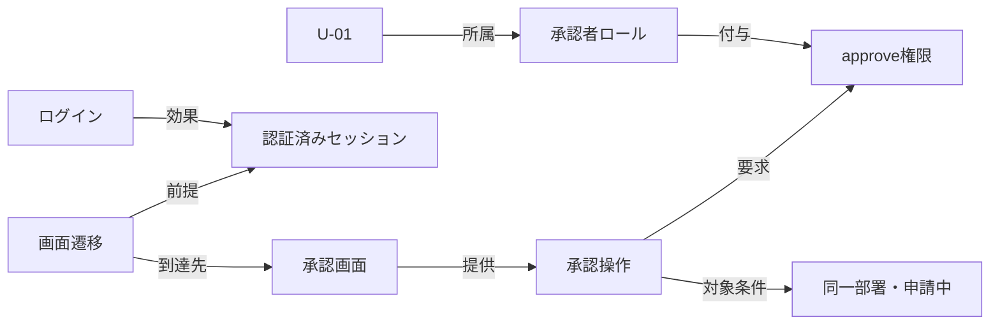

# 応用例：権限・ログイン・画面操作を結ぶ

## この題材の適切さと限界

ユーザー提示の例は、複数設計に分散する前提条件を探す題材として適している。一方、権限の意味、認証状態、操作順、テストデータを同時に扱うため、オントロジー入門の唯一の題材には複雑である。基礎には[題材別ミニ例](learning-examples.md)を使い、本章を応用例とする。

ナレッジグラフが役立つのは、権限・ユーザ・操作・設計根拠を結ぶ部分。実行順の生成には状態と操作のモデルが必要で、結果確認には仕様に由来するテストオラクルが必要である。以下の名称、ルール、ユーザ、結果はすべて説明用に追加した架空の設定であり、ユーザーの実環境の仕様ではない。

## 分散した四つの設計

| 架空文書ID | 明記された仕様 |
|---|---|
| AUTH-01 | 有効なユーザはログイン可能。承認者ロールはapprove権限を持つ。承認APIは権限がなければ403で拒否する |
| SCREEN-01 | ログイン後のメニューから承認画面へ進める。approve権限がある場合に承認操作を表示する |
| FLOW-01 | 同一部署の申請中の案件だけ承認可能。成功時は承認済みとなり監査記録を作る。別部署・承認済み案件への操作は拒否し状態を変えない |
| FIXTURE-01 | 検証環境に、有効な承認者U-01と、approve権限を持たない有効な閲覧者U-02がある。両者は部署D-01に所属する |

ここでは明記された許可・拒否規則だけを使う。実システムでは直接の権限付与、ロール継承、明示的拒否などがあり得るため、ロール名だけで可否を決めない。

## 関係を見つけてから、手順を組み立てる

目標「REQ-01を承認済みにする」から逆算する。

1. FLOW-01から、申請中・同一部署という対象条件を得る。
2. SCREEN-01とAUTH-01から、approve権限と認証状態が必要とわかる。
3. FIXTURE-01から、U-01を候補に選ぶ。
4. 申請中で部署D-01のREQ-01を作るfixtureが必要とわかる。
5. 認証方式と画面遷移仕様を使って実行順を組む。

4のfixtureを作る方法は、上の四文書だけでは不足している。テスト環境の準備APIなどの仕様が得られるまでは、実行可能なテストの完成とはしない。設計間をつないでも埋まらない穴を、明示できることにも価値がある。

## 状態と操作のモデル案

| 操作 | 前提条件 | 成功時の効果 |
|---|---|---|
| fixture作成 | 検証環境・準備手段が利用可能 | REQ-01が部署D-01・申請中で存在 |
| U-01でログイン | 有効なU-01、認証手段が利用可能 | U-01の認証済みセッション |
| 承認画面へ遷移 | 認証済み、遷移仕様を満たす | 対象画面が開いている |
| REQ-01を承認 | 画面・権限・部署・状態の条件を満たす | 承認済み、監査記録あり |

fixture作成方法と認証情報の取得方法が未確定なので、この表は計画モデルであって実行スクリプトではない。

## テスト案

| ID | 観点 | 前提と実行 | 期待結果・根拠 |
|---|---|---|---|
| TC-01 | 許可された正常系 | U-01でログイン→画面→同一部署の申請中案件を承認 | 承認済み・監査記録、FLOW-01 |
| TC-02 | UIの権限制御 | U-02でログイン→承認画面 | 承認操作を表示しない、SCREEN-01 |
| TC-03 | APIの権限制御 | U-02のセッションで承認APIを直接呼ぶ | 403、AUTH-01 |
| TC-04 | 部署制約 | U-01で別部署の申請中案件を承認しようとする | 拒否・状態不変、FLOW-01 |
| TC-05 | 状態制約 | U-01で承認済み案件を承認しようとする | 拒否・状態不変、FLOW-01 |

各ケースで独立したデータを使うか状態を初期化する。TC-01で変えた状態を次の正常系に流用しない。TC-04/05の具体的なエラーコードや画面表示、拒否時の監査記録については未定義なので追加確認事項となる。

## 何を検証すれば仮説を評価できるか

画面設計だけを与えた生成と、全文検索で関連文書を与えた生成と、グラフで条件を集めた生成を比較する。ログイン、ユーザ選択、対象データ、期待結果の欠落率を測る。グラフが常に優位とは仮定しない。

## 復習

「必要権限を持つユーザを見つける」ことと、「そのユーザで実行可能なテストを完成させる」ことは別。後者には認証、遷移、データ準備、期待結果が必要である。
