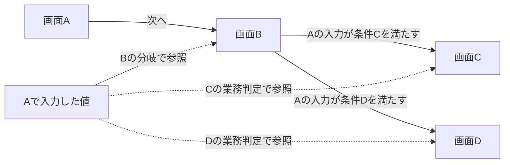

# 応用題材：権限・画面をまたぐ条件分岐・業務エラー

更新日：2026-10-01。状態：題材の整理案。独立レビュー・実機検証は未実施。

## この題材で考える問題

画面へのアクセスに必要な権限、前の画面で入力した値による後続の分岐、到達先での業務エラー条件を、複数の設計から組み立てる。権限を持つユーザと目的の画面を結ぶだけでなく、「どの入力を、どの処理が、どの時点で参照するか」を押さえる題材である。

基礎編では引き続き分類・要件追跡・制約検証の小例を使い、この題材は第13〜15章の応用に置く。以前の[承認操作の例](authorization-testing.md)は別の初期草稿として残す。

## ユーザーから提示された設定

| 項目 | 提示された内容 |
|---|---|
| 画面 | ログイン画面、画面A、画面B、画面C、画面D |
| 権限 | 権限X、権限Yが存在する |
| 必要権限 | 画面A・B・C・Dはいずれも権限Yが必要 |
| ユーザ | ログインするユーザによって、持つ権限が異なる |
| 遷移 | 画面Aの次は画面B。画面Bの次は、画面Aの入力に応じて画面Cまたは画面D |
| 業務エラー | 画面Cまたは画面Dで、画面Aで入力した値によっては業務上のエラーが発生する |

権限Yは各画面に必要な条件であり、それだけでアクセス可能と確定する十分条件とは扱わない。権限Xの用途、Yとの継承・包含関係、ログイン成功後の遷移先は未提示である。XだけでYが必要な画面へアクセスできる、という規則は補わない。

## 三つの依存関係を分ける

アクセスの依存関係は「ユーザ → 保有権限 → 各画面の必要権限」である。分岐の依存関係は「画面Aの入力 → 画面Bで使う分岐条件 → 画面CまたはD」である。業務判定の依存関係は「画面Aの入力 → 画面C/Dで使う業務規則 → 正常な処理または業務エラー」である。

画面に到達できることと、その画面で業務処理が正常に進むことを分ける。Yを持つユーザが正しい経路で到達しても、Aの入力が業務規則に反すればエラーになり得る。分岐に使う項目と業務判定に使う項目は、同じとは限らない。

「条件C」「条件D」は未確定の条件に付けた仮の名前であり、具体的な業務規則ではない。図の点線は値の参照、実線は画面遷移である。ログイン後の経路は未提示なので図では省略し、Aに直接遷移できると断定しない。図に権限を省略しても、A〜DにYが必要という条件は保持する。

C/D双方に値の参照を描いているが、両方の画面でエラーが発生する具体的な条件が確定したわけではない。判定が画面表示時なのか、画面内の操作時なのかも未提示である。

## 複数設計に分かれた場合に結びたい情報

次の文書分担は教材用の案であり、実在する設計書の調査結果ではない。

| 設計の種類 | 記載する情報の例 | 他の設計と結ぶもの |
|---|---|---|
| ユーザ・権限設計 | ユーザごとのX・Yの保有と有効条件 | ユーザ、権限 |
| 画面アクセス設計 | A〜Dの必要権限Y | 画面、権限 |
| 画面Aの入力設計 | 分岐・業務判定に使う項目、値の範囲、未入力の扱い | 入力項目、値 |
| 画面遷移設計 | A→B、B→C/D、分岐条件 | 画面、入力項目、判定規則 |
| C/Dの業務処理設計 | Aの値を使う業務規則、判定時点、エラー時の結果 | 入力項目、業務規則、処理、結果 |
| 状態・データ設計 | Aの値をB・C・Dに渡す方法と、再入力・取消時の扱い | 一連の操作、入力の版、保持する状態 |
| テスト環境の資料 | 利用可能なユーザと入力データの準備方法 | ユーザ、環境、テストデータ |

入力項目の名前が同じでも別項目かもしれない。Aで入力した値と、B・C・Dが参照する値を同じものと確認する対応が必要になる。異なるユーザや異なる一連の操作の値を混ぜないことも重要である。

## この題材で答えたい問い

- 画面Cに到達するには、どのユーザを選び、Aに何を入力し、どの順で操作する必要があるか。
- 画面Dに到達するため、同じ手順のどの入力を変える必要があるか。
- BからCへ進む条件を変えたとき、Aの入力設計とどのテストを見直すべきか。
- CまたはDで特定の業務エラーを再現するには、Aで何を入力し、どの分岐を通る必要があるか。
- C/Dの業務規則を変えたとき、Aの入力条件と正常系・エラー系のどのテストを見直すべきか。
- Yを持たないユーザについて、どの画面でどのようにアクセスを拒否すべきか。その根拠はどこにあるか。

最後の問いの具体的な拒否動作は、現時点の設定だけでは答えられない。エラー表示、画面への到達可否、直接アクセス時の扱いなどを設計で確認する。

## 分岐を具体化する教材用の追加案

説明を進めるための候補として、「Aの申請区分が通常ならB→C、特別ならB→D」を置くことができる。これはユーザーが提示した確定仕様ではなく、追加案である。別の業務条件へ置き換えても、Aの入力がBの遷移判断に影響する構造は同じである。

業務エラーの追加案には「Aの申請金額をC/Dで業務上の上限と照合する」が考えられる。申請区分が経路、申請金額が処理結果を決める例である。上限額、画面ごとの規則、判定時点は未定であり、この案を確定仕様とは扱わない。数値の形式誤りや必須項目の欠落と、値の形式は正しくても業務規則で受け付けられない場合を分けて考える。

| テスト観点 | 必要な準備 | 現時点で期待できること・不足 |
|---|---|---|
| Cへの分岐 | Yを持つ有効なユーザ、C向けのAの入力 | A→B→Cを候補とする。分岐条件とAへの到達方法は要定義 |
| Dへの分岐 | Yを持つ有効なユーザ、D向けのAの入力 | A→B→Dを候補とする。分岐条件とAへの到達方法は要定義 |
| Cでの正常処理・業務エラー | Cへ進む入力と、Cの業務規則を満たす／違反する入力 | 到達先と処理結果を別々に確認する。各条件を同時に満たす入力の存在、結果・観測方法は要定義 |
| Dでの正常処理・業務エラー | Dへ進む入力と、Dの業務規則を満たす／違反する入力 | 同上。CとDの規則やエラー内容が同じとは仮定しない |
| 権限不足 | Yを持たないユーザを確認 | Yが必要な画面への許可条件を満たさない。拒否方法は要定義 |
| 入力の保持 | 一連の操作を特定し、Aの値とB・C・Dの参照値を観測する | 別ユーザ・別操作の値を混ぜない仕様と確認方法は要定義 |
| 入力の変更・欠落 | Aへ戻って変更する操作や未入力を用意する | 再判定・保持・入力エラーの期待結果は要定義 |

これらはテスト設計の観点であり、現状の情報だけで実行できる完成済みテストではない。入力の変更・欠落や状態の分離は、題材を発展させる候補であって、提示済みの業務仕様とは区別する。

## 次に定めること

1. 権限Xの役割。今回の経路に無関係でもよい。無理に分岐の条件にしない。
2. Aのどの項目・値がC/Dへの分岐を決めるか。条件が重なる場合、どちらにも当てはまらない場合の扱い。
3. ログイン成功後にAへ到達する方法と、認証済みであることの確認方法。
4. Aの値をBが参照する時点と、保存・保持の範囲。戻る・再入力・取消などを題材に含めるか。
5. 権限不足時の動作と、テストで結果を確認する方法。
6. C/Dのどの業務規則がAのどの値を使うか。正常・エラーとなる条件と判定時点。
7. 業務エラー時のメッセージ、画面遷移、入力の保持、データ更新の扱いと、それらを観測する方法。エラーなら更新されない、と未定義のまま決めつけない。

業務エラーを再現するテストでは「目的の画面への分岐条件」と「その画面の業務エラー条件」を同時に満たすAの入力が必要になる。全条件の組み合わせが実現可能とは限らないため、C/Dそれぞれで正常系・エラー系の入力を作れるか確認する。

## グラフで整理することと、実行すること

グラフには、ユーザ・権限・画面・入力項目・分岐規則・業務規則・エラー・根拠の関係を記録する設計が考えられる。ただし「BからCへつながる」という関係だけでは、必要なAの入力値を求めたり、正しい操作の状態で条件を評価したりする手順は完成しない。分岐条件と業務条件の判定、値の受け渡し、実行順と期待結果を別に明示する。

この題材で検証したい仮説は「複数の設計から、権限と画面をまたぐ入力依存を拾うことで、テスト前提・分岐・業務エラー条件の欠落を減らせる」である。全文検索や対応表でも解ける可能性を含めて比較し、グラフの優位性を先に結論にしない。
