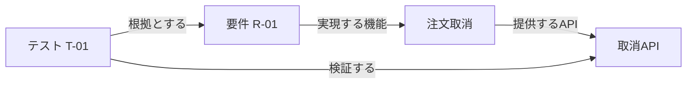

# 学ぶ概念に応じた三つのミニ例

権限の応用例をすべての説明に当てはめず、学ぶ目的によって題材を変える。以下は本資料で作成した架空の例である。

## 1. 関係探索：要件からテストをたどる



問いは「R-01を変更したとき、見直すAPIとテストは何か」。経路とトレーサビリティの入門に向く。ただし経路が存在しても、テストが要件を十分カバーするとは限らない。見直し候補の抽出と網羅性評価を分ける。

RDFで最小限に表すと次のようになる。語彙はこの教材独自のものである。

```turtle
@prefix ex: <https://example.org/kg/> .
ex:R-01 ex:realizedBy ex:CancelOrder .
ex:CancelOrder ex:exposedBy ex:CancelAPI .
ex:T-01 ex:verifies ex:CancelAPI ; ex:justifiedBy ex:R-01 .
```

対応するSPARQLの学習用例：

```sparql
PREFIX ex: <https://example.org/kg/>
SELECT DISTINCT ?api ?test WHERE {
  ex:R-01 ex:realizedBy/ex:exposedBy ?api .
  ?test ex:verifies ?api .
}
```

期待される組はCancelAPIとT-01。構文と経路パターンの背景は[SPARQL 1.1仕様](https://www.w3.org/TR/sparql11-query/)を参照。本例はDB上では未実行。

## 2. 意味と推論：成果物の分類

「API設計書は設計成果物の一種」「取消API設計はAPI設計書」であれば、対応するRDFS推論によって「取消API設計は設計成果物」と導ける。

```turtle
@prefix ex: <https://example.org/kg/> .
@prefix rdfs: <http://www.w3.org/2000/01/rdf-schema#> .
ex:APIDesign rdfs:subClassOf ex:DesignArtifact .
ex:CancelAPIDesign a ex:APIDesign .
```

クラス（APIDesign）と個体（CancelAPIDesign）の違いを理解する題材に向く。「API設計書は設計成果物の一部」としてpartOfにすると意味が変わる。分類と構成を区別する。[RDF Primer](https://www.w3.org/TR/rdf11-primer/)

別名の統一も同一性と区別する。「顧客」と「契約者」は似た語でも、同じ対象・概念とは限らない。名称だけで強い同一性を宣言しない。

## 3. 検証：テストに根拠があるか

「各テストケースは要件への参照を一つ以上持つ」というデータ品質条件を考える。SHACLなら、TestCaseを対象にjustifiedByの最小件数を検査する形で表現できる。

```turtle
@prefix ex: <https://example.org/kg/> .
@prefix sh: <http://www.w3.org/ns/shacl#> .
ex:TestCaseShape a sh:NodeShape ;
  sh:targetClass ex:TestCase ;
  sh:property [ sh:path ex:justifiedBy ; sh:minCount 1 ] .
```

これは参照の存在を検証するだけで、その参照が妥当か、テストの期待結果が正しいかは別に評価する。上のT-01をこの検証の対象にするには、`ex:T-01 a ex:TestCase .` という型情報も必要である。[SHACL仕様](https://www.w3.org/TR/shacl/)

## 題材の使い分け

| 題材 | 学べること | それだけでは扱えないこと |
|---|---|---|
| 要件→API→テスト | 関係探索・変更影響 | 振る舞いの正しさ |
| 成果物の分類 | 語彙・クラス・推論 | 操作順序 |
| テストの必須参照 | データ品質の検証 | 根拠の意味上の妥当性 |
| 権限・ログイン | 多文書の前提統合 | グラフだけでの実行計画完成 |
